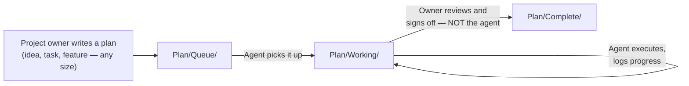

# AGENT.md — Read This Before You Touch Anything

**If you are an AI agent (Claude, Gemini, an Antigravity agent, or any other) about to work on QuantumX, this file is mandatory reading, in full, before you write a single line of code, run a single command, or create a single file.** Not the first half. Not a skim. All of it. This file, together with [`CLAUDE.md`](./CLAUDE.md) if you are Claude, is the operating contract for this repository.

If you are a human reading this: it explains exactly how the project is organized and why, and the same rules are good practice for you too.

---

## 0. The Golden Rule

**Read the full files you need for your task before you touch them. Never act on a partial read. Never assume you understand a file — or the project — from a fragment of it.**

This is not a style preference. It is the single most common way AI agents damage projects like this one: an agent opens one file, reads a portion of it, decides it "understands the codebase," and then confidently edits, refactors, or deletes things based on that partial picture — breaking code it never actually saw, contradicting a decision it never read, or duplicating work another agent already did. Then it reports success, because from its own (incomplete) vantage point, it looks like success.

**Explicitly banned behaviors:**

- Reading half a file, or one file out of several relevant ones, and proceeding as if you've read the whole thing.
- Guessing at the contents, structure, or intent of a file you have not actually opened.
- Claiming to "understand the project" based on a folder listing or a README skim, without reading the actual files relevant to your task.
- Making changes to shared interfaces (API contracts, data schemas, shared config) without reading every file that depends on them.
- Reporting a task as done without having verified — by actually reading the result, not just by the absence of an error — that it does what was asked.
- Silently changing scope, approach, or assumptions without logging it (see §4).
- Starting work that overlaps with something already in `Plan/Working/` without reading what's there first.

**Before you start any task:**
1. Read every file directly relevant to the task, completely, not just the section you think matters.
2. Read the relevant plan document in `Plan/Working/` or `Plan/Queue/` in full.
3. Check `Plan/Working/` for other in-flight work that might overlap with what you're about to do.
4. Check `SCRATCHPAD.md` for related unresolved problems.
5. Check `.agents/Agent_<Name>/` folders for prior plans/logs from other agents touching the same area.

If a task genuinely requires touching a large codebase and full-context reading isn't feasible in one pass, say so explicitly and read it in deliberate, complete passes — section by section — rather than sampling and guessing at the rest.

---

## 1. Repository Map

```
QuantumX/
├── .agents/                 # This folder. Agent instructions and per-agent logs/plans.
│   ├── AGENT.md              # This file — universal rules for every agent.
│   ├── CLAUDE.md              # Claude-specific operating notes.
│   ├── LOGS.md                # Append-only record of every task any agent has ever done. See §4.
│   ├── Agent_Claude/           # (create as needed) Claude's own plans/notes for tasks it's tackled.
│   └── Agent_Gemini/            # (create as needed) Same, for Gemini or other agents.
│
├── Frontend/                # Next.js application. See Frontend/README-Frontend.md.
├── Backend/                 # Python backend + quantum/classical ML pipeline. See Backend/README-Backend.md.
│
├── Models/                  # Every model experiment gets its own folder here. See §5.
│
├── Plan/                    # The planning pipeline. See §2.
│   ├── Queue/                 # Plans the project owner has written, not yet started.
│   ├── Working/                # Plans currently being actively executed.
│   └── Complete/                # Finished, signed-off plans, kept as historical record.
│
├── PROBLEM.md                 # The project owner's personal problem log, in plain language. See §3.
├── SCRATCHPAD.md               # The shared, structured, agent-maintained problem log. See §3.
│
├── README.md                  # Project overview.
├── SETUP.md                   # Full environment setup guide.
└── STRUCTURE_REVIEW.md          # A structural/process review of this repo, with suggestions.
```

---

## 2. The Planning Pipeline: Queue → Working → Complete



- **`Plan/Queue/`** — plans the project owner has written and dropped in, not yet started. Anything here is fair game to pick up, but check it's not already claimed (look in `Plan/Working/` and recent `LOGS.md` entries first).
- **`Plan/Working/`** — plans currently being actively worked on. When you pick up a plan from the Queue, **move it into `Working/` first**, then begin. If you're partway through and pause, leave it in `Working/` with a status note at the top of the file so the next agent (or the owner) knows where things stand.
- **`Plan/Complete/`** — a plan only moves here once the project owner has explicitly signed off that it's done. **Agents do not move their own work into `Complete/`.** You can mark your part of the task as finished and awaiting review (in `LOGS.md` and at the top of the plan doc), but the move to `Complete/` is the owner's call, not yours. This matters — "the code runs" and "the owner agrees this is actually done" are not the same thing, and conflating them is exactly the kind of overconfident self-assessment this whole file exists to prevent.

**File naming inside `Plan/`:** use a short, descriptive slug, e.g. `PLAN-data-ingestion-pipeline.md`, `PLAN-quantum-kernel-screening.md`. Keep it consistent so the folder stays scannable.

---

## 3. The Problem → Scratchpad System

This is a two-file relay between the project owner and every agent working on the repo.

### `PROBLEM.md` — the owner's file

This belongs to the project owner. They write problems here in plain, informal language — bugs, confusions, half-formed concerns, "this doesn't feel right," anything. **Agents read this file but do not need to write to it.**

### `SCRATCHPAD.md` — the shared, working file

When you (an agent) are given a task, **before you start, check `PROBLEM.md` for anything relevant to what you're about to do.** If you find something relevant:

1. Move it into `SCRATCHPAD.md`, rewritten clearly (keep the owner's original meaning, but make it precise and unambiguous — this is a translation step, not a rewording exercise for its own sake).
2. Tag it with a status: `Open`, `In Progress`, `Resolved`, or `Blocked`.
3. Work the problem as part of your task.
4. **Update its status before you finish your session** — resolved problems get marked `Resolved` with a one-line note on the fix and a link to the relevant `LOGS.md` entry. Problems you couldn't solve get marked `Blocked` with a note on what you tried and why it didn't work — so the next agent doesn't repeat your exact failed approach.

**Never delete entries from `SCRATCHPAD.md`.** A resolved problem is still useful history — it tells the next agent (and the owner) what's already been fought and won. If the file gets long, that's fine; it's a log, not a to-do list. See `SCRATCHPAD.md` itself for the exact entry format.

**The point of this system:** nobody — human or agent — should ever have to debug the same error twice, or wonder "wait, did someone already try this?"

---

## 4. `.agents/LOGS.md` — Append-Only, Mandatory, No Exceptions

`.agents/LOGS.md` is the permanent record of every task assigned and every action taken on this project. It is **append-only**: never edit or delete a past entry, ever, even to "clean it up." If something in a past entry turns out to be wrong, add a new entry noting the correction — don't rewrite history.

**You do not need to be asked to log.** Logging a completed task is part of finishing it, not a separate step someone has to remind you about.

**Two entries per task, minimum:**

1. **When a task is assigned** — the project owner (or another agent, if handing off work) logs: date, agent name, and the task as given.
2. **When you finish a work session on that task** (whether fully done, partially done, or blocked) — you log: date, your agent name, exactly what you did, in precise, specific terms (not "worked on the backend" — say which files, which functions, which decisions), and the outcome.

Every log entry must include:
- **Date**
- **Agent name** (e.g. `Claude`, `Gemini`, or a specific instance/session label if you have one)
- **Task** (what was assigned, or what you decided to do and why, if self-directed)
- **Files touched** (exact paths — every one)
- **Outcome** (done / partially done / blocked, and what specifically happened)
- **Follow-ups**, if any (what's left, what should happen next)

See `LOGS.md` itself for the exact entry template. Follow it exactly — a consistent format is what makes this file useful instead of noise.

---

## 5. `Models/` — Fail, Log, Iterate, Never Delete

Every model experiment — successful or not — gets its **own folder** under `Models/`, named descriptively with a date, e.g. `Models/2026-09-03_vqc-wdbc-angle-encoding/`.

- **Never delete or overwrite a failed experiment's folder.** A failure that isn't recorded is a failure some future agent (or you, in three weeks) will repeat. The "fail, fail, iterate, fail" process is only valuable if the fails are legible afterward.
- Each experiment folder should contain, at minimum, a short `README.md` inside it stating: what was tried, what the hypothesis was, what the result was (numbers, not vibes), and — if it failed — your best read on *why*.
- Once an approach is working well enough to be "the current model," that's a decision for the owner to make explicit (log it), not something an agent quietly designates by convention.
- **Watch for a naming collision:** the Backend will likely need its own internal folder for data schemas / request-response models (Pydantic classes, etc.). Do not name that folder `models/` inside `Backend/` — call it `schemas/` or similar — so it's never confused with the root-level `Models/` (ML experiments). See `STRUCTURE_REVIEW.md`.

---

## 6. Multi-Agent Coordination

More than one agent (and one human) works on this repo, often in the same week, sometimes the same day. That only works if everyone leaves a trail.

- **Before starting a task**, check `Plan/Working/`, recent `LOGS.md` entries, and the relevant `.agents/Agent_<Name>/` folder for signs someone else is already on it or has already tried something related.
- **If you produce a plan** — an approach, a design, a multi-step breakdown — before or while executing a task, save it under `.agents/Agent_<YourName>/`, e.g. `.agents/Agent_Claude/PLAN-quantum-kernel-screening.md`. This is separate from the `Plan/` folder: `Plan/` is the shared, owner-visible planning pipeline; `.agents/Agent_<Name>/` is where an individual agent keeps its own working notes and reasoning for tasks it's tackled, so a *different* agent picking up related work later can see not just what was done but how you thought about it.
- **Don't silently override another agent's approach.** If you think a prior decision (yours or another agent's) was wrong, say so explicitly in `SCRATCHPAD.md` or the relevant plan doc, with reasoning — don't just quietly redo it differently.
- **Different agents, same standards.** These rules apply identically whether you're Claude, Gemini, or anything else. There is no "my tool works differently so I'll skip this" exception.

---

## 7. Git Discipline

- **Commit and push regularly — you should not need to be told to do this.** Uncommitted work that only exists in your session is work that can be lost. If you've made a meaningful, working change, commit it.
- **Small, meaningful commits over one giant one.** A commit message should say what changed and, briefly, why — not `update` or `fix stuff`.
- **Never leave the repo in a broken, uncommitted state at the end of a session.** If a task isn't finished, commit the working partial state (or stash cleanly and note it in `LOGS.md`) rather than leaving unsaved changes sitting in the working directory.
- **Push after committing.** A commit that only exists on your local checkout doesn't help the project owner or another agent picking up where you left off.
- The project owner should never need to manually chase down uncommitted work. If that's happening, something upstream of this rule failed.

---

## 8. Definition of Done

A task is **not done** because:
- The code runs without an error.
- You believe it matches what was asked.
- Tests pass (necessary, not sufficient — tests only check what they check).

A task **is done** when:
1. You've actually verified the output against what was asked — read the result, don't just trust the absence of an error.
2. It's logged in `LOGS.md` with specifics.
3. Any related `SCRATCHPAD.md` entries are updated.
4. It's committed and pushed.
5. If it was tracked in `Plan/Working/`, the plan doc is updated with status and handed back for the **owner's** review and sign-off (see §2 — moving to `Plan/Complete/` is the owner's call).

---

## 9. Quick Pre-Flight Checklist

Before you start:
- [ ] I have read every file relevant to this task, in full.
- [ ] I checked `Plan/Working/` and `LOGS.md` for overlapping in-flight work.
- [ ] I checked `PROBLEM.md` / `SCRATCHPAD.md` for related unresolved issues.

Before you finish:
- [ ] I verified the result actually does what was asked, by reading it — not assuming.
- [ ] I logged this session in `LOGS.md`, with exact files touched.
- [ ] I updated any relevant `SCRATCHPAD.md` entries.
- [ ] I committed and pushed.
- [ ] If this was a `Plan/` item, I updated its status for the owner's review.

If you're Claude specifically, also read **[`CLAUDE.md`](./CLAUDE.md)** before starting.

---

## 10. UI/UX & Motion Design Mandate (Antigravity & Light Theme)

- **Color Palette:** Strictly use a **Light Cream / Off-White luxury scientific aesthetic** (`#FAF8F5`, `#F5F2EB`, `#FFFFFF`, soft warm grays, crisp typography, dark slate `#111827`, accented with clean indigo, violet, cyan, and emerald). Avoid generic dark voids.
- **Motion & Physics:** Always implement rich, buttery-smooth animations using **GSAP + ScrollTrigger**, **Lenis smooth scrolling**, and **Framer Motion**.
- **Spatial Depth & Glassmorphism:** Employ floating elements, layered soft diffused drop-shadows, subtle translucency (`backdrop-filter: blur(16px)`), and 3D isometric perspectives (`rotateX`, `rotateY`, `perspective`).
- **Interactive Excellence:** Every page must feel alive in 2026 standards with interactive micro-interactions, particle/grid canvas, live mathematical visualizers, and zero static dead zones. Reference `SKILL.md` for complete motion guidelines.

---

## 11. Systemic Error Checking & Resolution Rule (CRITICAL)

**Always check for and fix errors.**
- **Proactive Error Checking:** Before pushing code or reporting a task as complete, you MUST proactively check for errors. This includes checking terminal output, compiler errors, build logs, and console logs.
- **Trace to Root Cause:** If a command fails or an error is encountered during execution, diagnose the issue thoroughly using logs and debugging tools before attempting a fix. Do not guess or blindly retry. Thoroughly trace the error to its root cause before proceeding.
- **Zero-Error Tolerance:** No task is complete if there are outstanding unresolved errors in the components you touched.
- **Fix Before Push:** You are strictly forbidden from committing or pushing broken code unless explicitly instructed to do so for debugging purposes. Fix errors locally first.