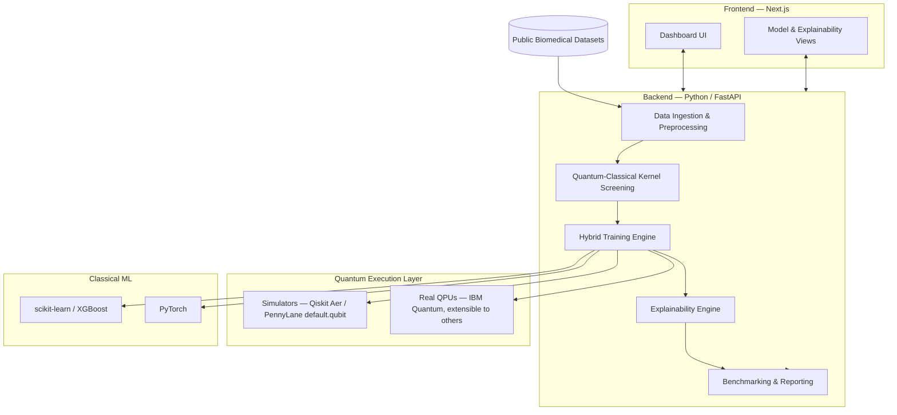

<div align="center">

# QuantumX

**A hybrid quantum–classical machine learning platform for early disease detection.**

Built for **Smart India Hackathon 2026 — Problem Statement SIH26139** (Organization: **Egreen Quanta**, Theme: MedTech/BioTech/HealthTech).

[]()
[]()
[]()
[]()
[]()
[](LICENSE)

</div>

---

## Table of Contents

- [What is QuantumX?](#what-is-quantumx)
- [The Problem We're Solving](#the-problem-were-solving)
- [Our Approach](#our-approach)
- [Architecture](#architecture)
- [Tech Stack](#tech-stack)
- [Real Quantum Hardware — Our Strategy](#real-quantum-hardware--our-strategy)
- [Repository Structure](#repository-structure)
- [Getting Started](#getting-started)
- [Documentation Map](#documentation-map)
- [How This Project Is Run](#how-this-project-is-run)
- [Problem Statement Reference](#problem-statement-reference)
- [Roadmap](#roadmap)
- [License](#license)
- [Acknowledgements](#acknowledgements)

---

## What is QuantumX?

QuantumX is a **research-grade software platform** that applies hybrid quantum-classical machine learning to the early detection of disease from biomedical data — starting with structured data such as genomic panels, electronic health records, and clinical tabular datasets, with a path toward imaging and multi-modal data as the platform matures.

Classical ML already does well on many diagnostic tasks. Where it struggles is high-dimensional, noisy, non-linear biomedical data — the kind where feature *interactions* matter as much as the features themselves. Quantum machine learning (QML) offers a theoretically interesting way to represent those interactions, through superposition and entanglement, but it's an open research question whether that theoretical promise translates into a practical diagnostic edge on real-world data with today's hardware.

**QuantumX doesn't assume the answer. It's built to find it out, honestly, and to be useful either way.**

Rather than a single notebook that trains one quantum model on one dataset and reports one accuracy number, QuantumX is a platform: a repeatable pipeline that ingests biomedical data, trains classical baselines and hybrid quantum-classical models side by side under identical conditions, benchmarks them with proper statistical rigor, and explains *why* each model made the prediction it made — for clinicians, judges, and future contributors alike.

## The Problem We're Solving

Classical machine learning models have achieved notable success in medical diagnosis, but they face real limitations on high-dimensional, noisy, complex biomedical data — genomics, medical imaging, electronic health records. Quantum machine learning offers a theoretically different way to represent that complexity via superposition and entanglement. Given current hardware constraints, a **hybrid quantum-classical approach** is the practical way to explore that potential while remaining runnable on today's simulators and near-term quantum devices.

That framing — direct from the SIH26139 problem statement — is also the honest research consensus: on standard tabular medical benchmarks, well-tuned classical models (XGBoost, tuned SVMs, deep nets) are hard to beat, and a fair few published QML results underperform their classical baselines. **The teams that pretend otherwise are the ones judges will see through first.** QuantumX's differentiator is treating "does quantum help, and where?" as the actual research question the platform is built to answer — with instrumentation, not assertion.

## Our Approach

At a conceptual level, the platform is organized around five stages. These are the **design intent**, not a locked implementation — the exact module boundaries will firm up as we build (see [`Plan/`](./Plan) for the live design process).

1. **Data ingestion & quantum-aware preprocessing** — load biomedical data, clean it, and prepare it for quantum encoding without destroying the non-linear structure quantum models are meant to exploit.
2. **Quantum representation selection** — rather than bolting on a fixed textbook circuit, evaluate how well a quantum feature space actually differs from the best classical kernel *before* committing compute to training one. If quantum and classical kernels are functionally equivalent on a given dataset, the platform should say so, not paper over it.
3. **Parallel hybrid training** — classical baselines (SVM, Random Forest, XGBoost, a feed-forward net) and quantum-enhanced models (quantum kernel SVM, variational quantum classifier, hybrid CNN→quantum head) trained on identical data splits, so comparisons are apples-to-apples.
4. **Explainability, for both sides** — standard SHAP/LIME for the classical models, plus quantum-native interpretability (which gates/qubits/feature-interactions actually drove a prediction) for the quantum models, shown side by side.
5. **Rigorous, honest benchmarking** — accuracy, sensitivity, specificity, AUC-ROC, and friends, with statistical significance testing (not "94.2% vs 93.8%, we win") and a plain report of where quantum helped, where it didn't, and why.

## Architecture



The frontend never talks to quantum hardware directly — it talks to the backend API, which owns the entire ML/quantum pipeline. This keeps the quantum execution layer swappable (simulator today, a different QPU vendor tomorrow) without touching the UI.

## Tech Stack

| Layer | Choice | Why |
|---|---|---|
| **Frontend** | Next.js 16 (App Router) + TypeScript | Modern, well-supported full-stack React framework; App Router is the current standard. See [`Frontend/README-Frontend.md`](./Frontend/README-Frontend.md). |
| **Styling / UI** | Tailwind CSS + shadcn/ui | Fast to build with, consistent, doesn't fight a hackathon timeline. |
| **Backend** | Python 3.12+ with FastAPI | Every serious quantum ML library is Python-native. One language end-to-end avoids cross-language serialization overhead. See [reasoning below](#why-python-only-not-a-hybrid-language-stack). |
| **Quantum ML** | PennyLane (primary) + Qiskit / Qiskit Machine Learning | PennyLane gives hardware-agnostic, autodiff-friendly hybrid training; Qiskit gives mature IBM hardware access and quantum-kernel tooling. Used together via the `pennylane-qiskit` plugin. |
| **Real hardware access** | IBM Quantum (Qiskit Runtime) | Free tier with real QPU access — see [below](#real-quantum-hardware--our-strategy). |
| **Classical ML** | scikit-learn, XGBoost, PyTorch | Industry-standard baselines; PyTorch pairs naturally with PennyLane's autodiff interface for hybrid models. |
| **Explainability** | SHAP, plus custom quantum-circuit attribution | Model-agnostic classical explainability; bespoke methods for interpreting quantum circuits. |
| **Data handling** | pandas, NumPy | Standard, boring, reliable. |
| **Testing** | pytest (backend) | Quantum correctness needs unit tests against known statevectors, not just "it ran." |

### Why Python-only, not a hybrid language stack?

This project is a **hybrid quantum-classical machine learning platform** — the "hybrid" describes the *algorithms* (part of the computation happens on a quantum circuit, part on classical hardware), not the *codebase*. Those are two different kinds of "hybrid," and it's worth being precise about which one we mean.

Every serious quantum computing SDK — Qiskit, PennyLane, Amazon Braket SDK, Cirq — is Python-first. There's no quantum ML ecosystem in another language that comes close for this kind of work. Introducing a second backend language (say, a Node.js API layer calling out to a Python quantum microservice) would add real complexity — two runtimes, network calls, serialization — for no benefit on a hackathon timeline, since FastAPI already gives us a modern, async, auto-documented API layer directly in the same language as the quantum/ML code. **One language, one process, less to break.** If the platform later needs to scale that way, splitting a service is a much easier problem to solve once the ML core actually works.

## Real Quantum Hardware — Our Strategy

We are committed to this platform genuinely executing on **real quantum hardware**, not simulators pretending to be quantum computers. That's a deliberate differentiator — most teams tackling this problem statement will stop at a simulator, because it's easier. But "real hardware" and "reliable live demo" pull in different directions, and it's worth being upfront about how we reconcile them:

- **Real QPUs have queue times and noise.** A live judging demo that depends on an IBM backend being free at that exact moment is a demo that can fail for reasons that have nothing to do with our work.
- **So: simulators (Qiskit Aer, PennyLane's `default.qubit`) are the fast, deterministic loop for development, debugging, and any live/interactive part of the demo** — training, iterating, showing a judge a prediction on the spot.
- **Real hardware runs are a first-class, documented part of the benchmarking pipeline** — pre-executed on actual QPUs, with results captured, versioned, and shown in the platform's benchmarking dashboard alongside noise-model simulations. This is what proves the "real quantum machine" claim: verifiable results from actual hardware, not a live click that might time out in front of a judge.

**Access path:** the [IBM Quantum Open Plan](https://quantum.cloud.ibm.com/) is free, requires no credit card, and currently gives access to real superconducting QPUs (systems ranging up to 127+ qubits) with a monthly runtime allowance. IBM also offers free **Classroom Accounts** for student teams — worth applying for as a team, since it gives coordinated access and a higher runtime ceiling than individual Open Plan accounts. Full setup steps are in [`SETUP.md`](./SETUP.md); architecture details are in [`Backend/README-Backend.md`](./Backend/README-Backend.md). Quantum cloud access tiers change over time — always sanity-check current limits at the provider's site before relying on a number from this doc.

## Repository Structure

```
QuantumX/
├── .agents/          # Instructions every AI agent must read before touching this repo
│   └── LOGS.md        # Append-only record of every task any agent has done
├── Frontend/         # Next.js application
├── Backend/          # Python backend + quantum/classical ML pipeline
├── Models/           # Every model experiment — successful or failed — with its own folder
├── Plan/             # The project's living planning system (Queue / Working / Complete)
├── PROBLEM.md         # Personal problem log (project owner)
├── SCRATCHPAD.md       # Shared, agent-maintained problem-solving log
├── SETUP.md           # Full environment setup guide for new contributors
├── STRUCTURE_REVIEW.md # Review of this repo's structure, with suggested refinements
└── README.md          # You are here
```

Each folder that needs deeper explanation has its own README — see the [documentation map](#documentation-map) below.

## Getting Started

New to this repo? Everything you need — prerequisites, account setup (including getting real quantum hardware access), running the frontend and backend, and verifying it all works — is in **[`SETUP.md`](./SETUP.md)**. It's written to be followed step by step with no prior context.

Short version, once set up:

```bash
# Backend
cd Backend && source .venv/bin/activate && uvicorn app.main:app --reload

# Frontend (separate terminal)
cd Frontend && npm run dev
```

## Documentation Map

| Document | What it's for |
|---|---|
| [`SETUP.md`](./SETUP.md) | Full local environment setup for new contributors |
| [`Frontend/README-Frontend.md`](./Frontend/README-Frontend.md) | Frontend structure, conventions, and how it talks to the backend |
| [`Backend/README-Backend.md`](./Backend/README-Backend.md) | Backend structure, the quantum/classical ML architecture, and API surface |
| [`.agents/AGENT.md`](./.agents/AGENT.md) | Mandatory reading for **every** AI agent working on this repo |
| [`.agents/CLAUDE.md`](./.agents/CLAUDE.md) | Claude-specific operating notes (read alongside `AGENT.md`) |
| [`STRUCTURE_REVIEW.md`](./STRUCTURE_REVIEW.md) | An honest review of this repo's structure and process, with suggested refinements |
| [`PROBLEM.md`](./PROBLEM.md) | Where the project owner logs problems in plain language |
| [`SCRATCHPAD.md`](./SCRATCHPAD.md) | Shared, structured problem-solving log agents maintain |
| [`.agents/LOGS.md`](./.agents/LOGS.md) | Append-only log of every task every agent has done |

## How This Project Is Run

QuantumX is built collaboratively by a human project owner and multiple AI coding agents (Claude, Gemini, and others working through tools including Antigravity). To keep that from turning into chaos, the project runs on a few simple, strictly enforced systems:

- **A planning pipeline** (`Plan/Queue` → `Plan/Working` → `Plan/Complete`) so it's always clear what's being worked on, what's next, and what's actually finished and signed off — not just "probably done."
- **A shared problem-and-logging system** (`PROBLEM.md` → `SCRATCHPAD.md` → `.agents/LOGS.md`) so no error gets solved twice, and no agent starts a task blind to what's already been tried.
- **Mandatory full-context reading** before any agent writes a line of code — see [`AGENT.md`](./.agents/AGENT.md) for the exact rules. Partial reads and confident guessing are the single most common way AI coding agents break projects like this one, and this repo is set up explicitly to prevent it.

Full details are in [`AGENT.md`](./.agents/AGENT.md) — required reading for any agent, and useful background for any human contributor too.

## Problem Statement Reference

| Field | Value |
|---|---|
| PS Number | SIH26139 |
| Title | Hybrid Quantum Machine Learning Platform for Early Disease Detection |
| Organization | Egreen Quanta |
| Theme | MedTech / BioTech / HealthTech |
| Category | Software |
| Idea submission deadline | 20 September 2026 |
| Dataset | Public / Open (no dataset mandated — sourced from public repositories) |

Full official text is preserved in `Plan/Working/SIH26139.md`.

## Roadmap

- [ ] Finalize dataset(s) and disease target(s) for the MVP
- [ ] Data ingestion + preprocessing pipeline
- [ ] Classical baseline models trained and benchmarked
- [ ] Quantum-classical kernel screening implemented
- [ ] First hybrid quantum model trained (simulator)
- [ ] Explainability layer (classical)
- [ ] Explainability layer (quantum-native)
- [ ] Real QPU validation run, results captured and documented
- [ ] Frontend dashboard (data → training → results → explainability)
- [ ] End-to-end demo rehearsal
- [ ] SIH submission

This list will drift as the plan does — the live version of what's being worked on right now lives in [`Plan/Working/`](./Plan/Working).

## License

This project is licensed under the **Apache License 2.0**. This allows for permissive use, modification, and distribution while providing explicit patent protections, in alignment with Smart India Hackathon 2026 guidelines.

## Acknowledgements

- **Egreen Quanta** — for posing this problem statement.
- **Smart India Hackathon 2026** — sih.gov.in
- The **Qiskit** and **PennyLane** open-source communities.
- Public dataset providers: UCI Machine Learning Repository, PhysioNet, TCGA/NCI GDC, Kaggle, and others cited as they're used.

---

*Built by Team QuantumX for SIH26139.*
