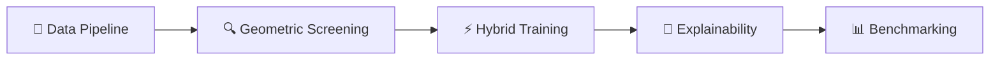
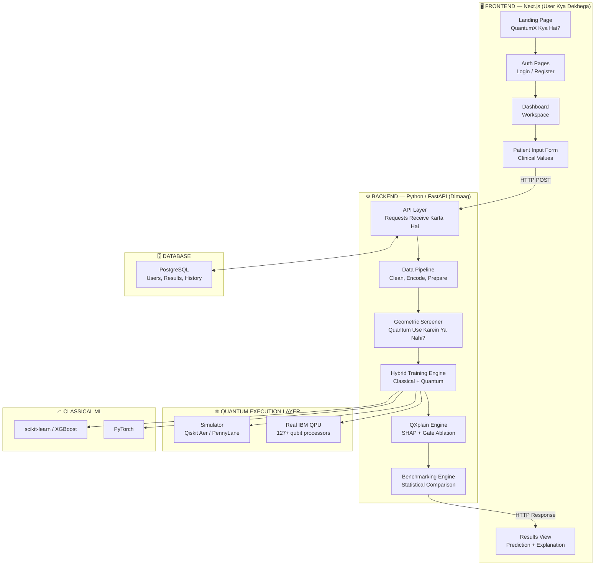
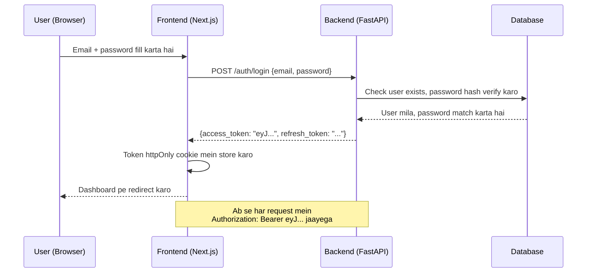
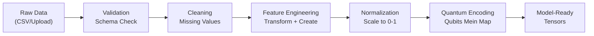

# QuantumX — Poori Explanation (Hinglish Mein)

**Hybrid Quantum-Classical Machine Learning Platform for Early Disease Detection**
*SIH26139 | Team QuantumX | Smart India Hackathon 2026*


---

> **Ye document kiske liye hai?**
> Team QuantumX ke har ek member ke liye. Agar tum is team mein ho, toh ye poora document padho — start se end tak. Ye document assume karta hai ki tumhe quantum computing ka zero knowledge hai. Har technical term ko pehli baar use hone par define kiya gaya hai. Document ke end tak tumhe samajh aa jayega ki hum kya bana rahe hain, kyun bana rahe hain, har piece kaise connect hota hai, tumhara role kya hai, aur sabse pehle kya karna hai.

---

## Table of Contents

1. [Problem — Aaj Kya Hai Aur Kyun Fail Hota Hai](#1-problem--aaj-kya-hai-aur-kyun-fail-hota-hai)
2. [Humara Solution — QuantumX Actually Hai Kya](#2-humara-solution--quantumx-actually-hai-kya)
3. [Hum Kyun Jeetenge? — Doosri Teams Se Kya Alag Hai](#3-hum-kyun-jeetenge--doosri-teams-se-kya-alag-hai)
4. [Kaun Si Diseases Target Kar Rahe Hain](#4-kaun-si-diseases-target-kar-rahe-hain)
5. [Kaun Se Datasets Use Karenge](#5-kaun-se-datasets-use-karenge)
6. [Poora System — Bird's Eye View](#6-poora-system--birds-eye-view)
7. [Part 1: Frontend — User Kya Dekhega](#7-part-1-frontend--user-kya-dekhega)
8. [Part 2: Authentication — Kaun Andar Aayega](#8-part-2-authentication--kaun-andar-aayega)
9. [Part 3: Dashboard — Workspace](#9-part-3-dashboard--workspace)
10. [Part 4: User Input — User Kya Type Karega](#10-part-4-user-input--user-kya-type-karega)
11. [Part 5: Backend API — Bridge](#11-part-5-backend-api--bridge)
12. [Part 6: Data Pipeline — Safai Aur Taiyari](#12-part-6-data-pipeline--safai-aur-taiyari)
13. [Part 7: Quantum Layer — Jahan Magic Hota Hai](#13-part-7-quantum-layer--jahan-magic-hota-hai)
14. [Part 8: Classical ML Layer — Benchmark](#14-part-8-classical-ml-layer--benchmark)
15. [Part 9: Hybrid Training Engine — Dono Saath Chalana](#15-part-9-hybrid-training-engine--dono-saath-chalana)
16. [Part 10: Explainability — Model Ne Aisa Kyun Bola?](#16-part-10-explainability--model-ne-aisa-kyun-bola)
17. [Part 11: Benchmarking — Honest Comparison](#17-part-11-benchmarking--honest-comparison)
18. [Part 12: Output — User Ko Kya Milega](#18-part-12-output--user-ko-kya-milega)
19. [Part 13: Database — Sab Kahan Save Hoga](#19-part-13-database--sab-kahan-save-hoga)
20. [Part 14: Real Quantum Hardware — IBM QPU Strategy](#20-part-14-real-quantum-hardware--ibm-qpu-strategy)
21. [Simulator vs Real Hardware Problem — Aur Humara Solution](#21-simulator-vs-real-hardware-problem--aur-humara-solution)
22. [Problem Statement Ke Har Objective Ko Kaise Poora Karenge](#22-problem-statement-ke-har-objective-ko-kaise-poora-karenge)
23. [Expected Solution Ko Kaise Poora Karenge](#23-expected-solution-ko-kaise-poora-karenge)
24. [Ek Simple End-to-End Example](#24-ek-simple-end-to-end-example)
25. [Technology Stack — Poori List](#25-technology-stack--poori-list)
26. [Repository Folder Structure](#26-repository-folder-structure)
27. [Team Roles — Har Member Ka Kaam](#27-team-roles--har-member-ka-kaam)
28. [Poori Task List — Day 1 Se Submission Tak](#28-poori-task-list--day-1-se-submission-tak)

---

## 1. Problem — Aaj Kya Hai Aur Kyun Fail Hota Hai

### Real Duniya Mein Kya Ho Raha Hai

Har saal India mein:
- **~14 lakh** naye cancer cases detect hote hain. 50% se zyada Stage III ya IV mein milte hain — jab survival rate 30% se neeche gir jaati hai.
- **~54 lakh** log cardiovascular disease (heart attack, stroke) se marte hain. Zyaadatar ko early detection se bacha ja sakta tha.
- **~40 lakh** log Alzheimer's ya dementia se suffer karte hain. Early biomarker detection se progression ko saalon tak slow kiya ja sakta hai, lekin aaj ke tools isse miss karte hain.

> **Jo data in logon ko bacha sakta hai, woh already exist karta hai.** Hospitals ke paas decades ka electronic health records (EHRs) hai. Labs genomic profiles produce karti hain. Clinics imaging scans generate karti hain. Early detection ke liye raw information *hai*.

**Toh phir log kyun mar rahe hain?**

Kyunki us data mein jo *patterns* hain woh incredibly complex hain. Ek patient ko cancer ka risk ek blood value se determine nahi hota — woh dozen values ke *interaction* se decide hota hai, multiple time points pe, different data types ke across. Signal noise mein chhupa hota hai, aur feature space (possible combinations ki sankhya) astronomical hai.

### Classical Machine Learning Kya Kar Sakti Hai

**Classical Machine Learning** = jo ML/AI tum pehle se jaante ho. Models jaise Random Forest, XGBoost, SVMs, aur neural networks jo regular computers (CPUs/GPUs) pe chalte hain.

In models ne medical diagnosis mein impressive kaam kiya hai:
- Breast cancer classification: **94-97% accuracy** standard benchmarks pe.
- Heart disease prediction: **85-92% accuracy** standard datasets pe.
- Skin cancer identification: Deep learning models dermatologists ke barabar.

**Lekin yahan ruk jaate hain jab:**

1. **Feature interactions explode hote hain.** Genomic data mein 20,000+ genes hain. Possible gene-gene interactions: 20,000 × 19,999 / 2 = ~200 million pairs. Classical kernels (mathematical functions jo data points ke beech similarity measure karti hain) is space ko efficiently explore nahi kar sakte.

2. **Signal bahut subtle hai.** Early-stage cancer dozens of biomarkers mein chhoti coordinated changes produce karta hai. Koi bhi single marker individually statistically significant nahi hota. Classical models jo individual feature importance ke liye optimized hain, is coordinated pattern ko miss karte hain.

3. **Rare conditions ke liye data kam hai.** Deep learning ko hazaaron examples chahiye. Rare cancers aur rare subtypes mein sirf 50-200 cases hote hain. Classical deep learning overfit karta hai (training data ko memorize kar leta hai instead of real patterns seekhne ke).

4. **Multi-modal fusion fail hota hai.** Genomic data + imaging + clinical records ko ek model mein combine karna ek unsolved problem hai. Classical concatenation-based fusion (sab features ko stack karna) cross-modal interaction information kho deta hai.

### Quantum Machine Learning Kya Promise Karta Hai

> **Quantum Computing** = computing jo quantum physics ke laws (superposition, entanglement, interference) use karti hai information process karne ke liye, fundamentally different tarike se classical computers se.

> **Quantum Machine Learning (QML)** = quantum computing use karke ML models banana. "Hybrid" part ka matlab hai ki hum *dono* quantum aur classical computers saath use karte hain — classical heavy data lifting ke liye, quantum un parts ke liye jahan quantum physics advantage de sakti hai.

Teen key quantum properties jo yahan matter karti hain:

| Quantum Property | Simple Mein Kya Hai | Disease Detection Ke Liye Kyun Important Hai |
|---|---|---|
| **Superposition** | Ek quantum bit (qubit) 0, 1, ya *dono ek saath* ho sakta hai. Matlab N qubits ka circuit 2^N states simultaneously represent kar sakta hai. | 10 qubits ke saath, hum 1,024 feature combinations *ek saath* explore kar sakte hain instead of ek ek karke. |
| **Entanglement** | Do qubits aise link ho sakte hain ki ek ki state doosre pe turant depend karti hai, chahe distance kitni bhi ho. | Hum features ke beech *correlations* encode kar sakte hain (jaise gene A aur gene B ka relationship) seedha quantum state mein — jo classical models efficiently represent nahi kar sakte. |
| **Interference** | Quantum states sahi answers ko amplify aur galat ko cancel kar sakti hain, jaise waves ek doosre ko reinforce ya cancel karti hain. | Quantum model sahi diagnosis ke signal ko amplify kar sakta hai aur noise ko suppress kar sakta hai. |

### Sachai Baat

> [!IMPORTANT]
> **Quantum ML hamesha classical ML ko nahi beat karta.** Bahut saare standard medical datasets pe, well-tuned classical models (XGBoost, SVMs) quantum models ke *barabar ya better* perform karte hain. Ye 2026 tak ka honest research consensus hai. Quantum advantage **conditional** hai — dataset, feature encoding, aur circuit architecture pe depend karta hai. Humara platform *ye pata lagane ke liye* bana hai ki quantum kahan help karta hai — andhe tarike se claim karne ke liye nahi ki hamesha karta hai.

Ye honesty khud mein ek competitive advantage hai. Problem statement (SIH26139) humse **benchmark** karne ko kehta hai quantum vs. classical — ye prove karne ko nahi ki quantum hamesha superior hai.

---

## 2. Humara Solution — QuantumX Actually Hai Kya

QuantumX ek **single model nahi** hai. Ye ek **platform** hai — ek integrated software system jismein paanch major engines hain:



**Ek line mein:** QuantumX biomedical data leta hai, quantum processing ke liye prepare karta hai, classical aur quantum dono models ko identical conditions mein train karta hai, explain karta hai ki har model ne apni prediction kyun di, aur honestly report karta hai ki kaun sa approach better kaam kiya — sab ek professional web interface ke through jo clinician ya judge use kar sake.

**Ye platform hai, sirf model nahi, kyunki:**
- Ye **multiple diseases** support karta hai (sirf ek dataset nahi).
- Ye **quantum AUR classical** dono models chalata hai same data pe, same splits, same conditions.
- Isme **explainability** hai — sirf "cancer hai" nahi balki "KYUN model ko lagta hai cancer hai, aur KAUN si features matter ki."
- Ye **statistical rigor** ke saath benchmark karta hai — sirf "94.2% vs 93.8%" nahi balki "ye difference statistically significant hai ya sirf random noise?"
- Ye **real IBM quantum hardware** pe chalata hai — sirf simulator pretending to be quantum nahi.

---

## 3. Hum Kyun Jeetenge? — Doosri Teams Se Kya Alag Hai

### 90% Teams Kya Banayengi

Chalo honestly baat karte hain ki zyaadatar competing teams SIH26139 ke liye kya submit karengi:

```
Generic Solution (jo baaki sab karenge):
1. Wisconsin Breast Cancer dataset le lo (569 samples, 30 features)
2. PCA lagao 4 features pe reduce karne ke liye
3. Ek basic VQC banao 2 layers ka
4. Simulator pe train karo
5. "93% accuracy" report karo
6. Ek SVM se compare karo
7. "Quantum better hai" claim karo (chahe na ho)
8. Koi explainability nahi
9. Koi statistical testing nahi
10. Streamlit dashboard jismein 3 buttons hain
```

**Ye kyun fail hoga:**
- PCA (ek linear dimensionality reduction technique) **non-linear feature interactions ko destroy kar deta hai** jo quantum models ko exploit karni chahiye. Tum quantum advantage ko *nikal* rahe ho quantum model ke data dekhne se pehle hi.
- Tutorial se copy kiya 2-layer circuit biomedical data geometry ke liye design nahi hua tha.
- Ek dataset se kuch prove nahi hota — Wisconsin BC itna well-separated hai ki linear SVM bhi 96% le leta hai.
- Explainability nahi toh clinicians aur judges result trust nahi kar sakte.
- Statistical testing nahi toh reported accuracy differences meaningless noise hain.
- Streamlit app jismein 3 buttons hain judges ko impress nahi karegi jo 50 teams ko Streamlit use karte dekhenge.

### QuantumX Alag Kya Karta Hai — Humare 7 Unique Differentiators

| # | Differentiator | Iska Matlab | Doosre Kyun Nahi Karenge |
|---|---|---|---|
| **1** | **Geometric Pre-Screening** | Koi bhi quantum model train karne se pehle, hum mathematically compute karte hain ki quantum kernel actually *different* structure capture karta hai ya nahi classical kernel se is specific dataset pe. Agar quantum ≈ classical is data pe, toh hum honestly bol dete hain. | Huang et al. (2021) geometric difference metric implement karna padta hai. Koi library ye out of the box nahi deti. Zyaadatar teams ne iske baare mein suna bhi nahi hai. |
| **2** | **Quantum Circuit Architecture Search (Q-CAS)** | Tutorial se ek fixed circuit copy karne ki jagah, hum multiple circuit designs evaluate karte hain aur har dataset ke geometry ke liye best wala pick karte hain. | Custom code chahiye expressibility, entangling capability, aur barren plateau risk measure karne ke liye. Zyaadatar teams pehli tutorial ka circuit use karti hain. |
| **3** | **Non-Linear Feature Preservation** | PCA ki jagah (jo data ko linearize karta hai), hum autoencoders use karte hain (neural network-based compression) jo non-linear structure preserve karti hai jo quantum models ko chahiye. | Ye samajhna padta hai ki PCA quantum models ko kyun hurt karta hai — ek subtlety jo zyaadatar teams completely miss karti hain. |
| **4** | **Multi-Disease, Multi-Dataset Evaluation** | Hum sirf ek disease classify nahi karte. Hum breast cancer, cardiovascular disease, aur chronic kidney disease pe test karte hain — dikhate hain ki quantum kahan help karta hai aur kahan nahi. | Flexible pipeline banana padta hai, one-off notebook nahi. Zyada kaam, lekin zyada impressive. |
| **5** | **Quantum-Native Explainability (QXplain)** | Standard SHAP se aage (jo quantum model ko black box treat karta hai), hum gate ablation aur entanglement attribution implement karte hain — dikhate hain *kaun si quantum operations* ne prediction drive ki. | Original research-level contribution. Koi existing library ye nahi karti. |
| **6** | **Real IBM Quantum Hardware Execution** | Hum inference aur benchmarking actual IBM QPUs (real superconducting quantum processors) pe chalate hain, sirf simulators pe nahi. | Zyaadatar teams ye try bhi nahi karengi. Hum real quantum hardware se verifiable results dikhayenge. |
| **7** | **Honest, Statistically Rigorous Benchmarking** | Hum McNemar's test aur paired t-tests use karte hain ye report karne ke liye ki *quantum aur classical ke beech ka difference statistically significant hai ya nahi*. | Statistical literacy chahiye "do accuracy numbers compare karo" se aage ki. Genuine research maturity dikhata hai. |

---

## 4. Kaun Si Diseases Target Kar Rahe Hain

### Primary Targets: Teen Major Killers

Hum **teen diseases** target kar rahe hain — ek nahi — platform ki versatility demonstrate karne ke liye aur honestly map karne ke liye ki quantum kahan help karta hai across different data types:

| Disease | Ye Kyun Chuna | Data Type | India Mein Impact |
|---|---|---|---|
| **Breast Cancer** | Sabse zyada studied QML benchmark. Credibility aur published research ke saath comparability ke liye ye RAKHNA zaroori hai. Achhe datasets available hain. | Tabular (biopsy features), Imaging (histopathology) | Indian women mein #1 cancer. ~2.1 lakh naye cases/year. |
| **Cardiovascular Disease** (Heart Attack / Heart Failure risk) | Higher-dimensional feature space (EHR + labs + vitals time ke saath). Yahan quantum models ka classical pe advantage dikhane ka *better chance* hai. | Tabular (clinical features, lab results) | India mein death ki leading cause. ~28% of all deaths. |
| **Chronic Kidney Disease (CKD)** | Clean, well-structured dataset 24 features ke saath including blood tests. Full pipeline demonstrate karne ke liye excellent. Diabetes aur heart disease ke saath common comorbidity. | Tabular (lab results, clinical indicators) | ~17% Indian population affected. Bahut late detect hota hai. |

### Teeno Kyun?

> *Question jo judge poochh sakta hai: "Ek disease pe acche se kyun nahi kiya?"*
>
> **Answer:** Kyunki problem statement specifically kehta hai "e.g., cancer, cardiovascular disorders, or neurological conditions" — "e.g." ka matlab multiple imply hota hai. Aur zyada important, *real research question* ye hai ki "KAHAN quantum ML help karta hai?" — ye sirf tab answer ho sakta hai jab alag datasets pe test karo alag geometries ke saath. Agar quantum cardiovascular data pe classical ko beat karta hai lekin breast cancer pe nahi, toh ye ek *finding* hai — genuinely valuable research contribution.

### Kya Hum Teeno Pe Classical Accuracy Exceed Kar Sakte Hain?

Honest answer: **necessarily nahi, aur ye theek hai.** Problem statement humse **benchmark** karne ko kehta hai — rigorously compare aur report karo. Agar hum pate hain ki quantum breast cancer pe classical ke barabar hai (geometric difference low hai → dono kernel types data ko similarly dekhte hain) lekin quantum cardiovascular disease pe *outperform* karta hai (higher-dimensional feature interactions jo entanglement capture karta hai), toh ye ek zyada impressive aur honest result hai falsely claim karne se ki quantum har jagah win karta hai.

---

## 5. Kaun Se Datasets Use Karenge

### Primary Datasets

| Dataset | Source | Size | Features | Disease | Ye Kyun |
|---|---|---|---|---|---|
| **Wisconsin Breast Cancer (WDBC)** | UCI ML Repository | 569 samples | 30 numeric features FNA biopsy se | Breast Cancer | Industry-standard QML benchmark. Har paper ye use karta hai. Credibility ke liye RAKHNA zaroori. |
| **Cleveland Heart Disease** | UCI ML Repository / Kaggle | 303 samples, 13 features | Age, sex, cholesterol, blood pressure, ECG, etc. | Cardiovascular | Sabse zyada cited heart disease benchmark. Clean, well-documented. |
| **Framingham Heart Study** | Kaggle | 4,240 samples, 16 features | Demographics, vitals, labs, lifestyle factors | Cardiovascular (10-year risk) | Bada dataset → zyada robust evaluation. Longitudinal risk factors included. |
| **Chronic Kidney Disease** | UCI ML Repository | 400 samples, 24 features | Blood tests (hemoglobin, albumin, etc.), vitals, urinalysis | CKD | Well-structured, multi-feature. Quantum feature interaction exploitation ke liye achha candidate. |
| **Diabetes 130-US Hospitals** | UCI ML Repository | 100,000+ encounters | 50+ features EHR se | Type 2 Diabetes / Comorbidity | Stretch dataset. Massive scale dikhata hai pipeline real-world volume handle karta hai. |

### Dataset Mismatch Ka Concern

> *"Agar user jo data input kare woh humne jis pe train kiya usse alag ho toh?"*
>
> Ye legitimate concern hai. Humara model specific datasets pe train hua hai specific feature columns ke saath. Agar user alag column names, alag scales, alag units, ya missing columns wala data input kare — model kaam nahi karega. **Hum ye handle karte hain:**
>
> 1. **Pre-defined input schemas** — Har disease ke liye exactly define hai ki kaun si clinical values chahiye (Section 10 dekho).
> 2. **Feature normalization** — Sab inputs same range pe scale hote hain jis pe model trained tha.
> 3. **Missing value handling** — Agar user ke paas sab values nahi hain, toh pipeline KNN imputation use karta hai (training data mein similar patients ke basis pe missing values fill karta hai).
> 4. **Clear guidance** — Frontend user ko exactly batata hai ki kaun si values chahiye aur kaun si units mein.

---

## 6. Poora System — Bird's Eye View

Yahan poora system hai, jab se user humari website kholta hai tab se lekar jab tak prediction with explanation milti hai:



**Flow simple bhasha mein:**

1. User humari website kholta hai → **Landing Page** dekhta hai.
2. User account banata hai ya login karta hai → **Authentication**.
3. User **Dashboard** (workspace) mein enter karta hai.
4. User disease type select karta hai aur clinical values fill karta hai → **Patient Input Form**.
5. Frontend data **Backend API** ko bhejta hai (ek POST request HTTP ke through).
6. Backend **Data Pipeline** chalata hai — data clean, normalize, encode karta hai.
7. Backend **Geometric Screening** chalata hai — check karta hai quantum actually is data pe help karega ya nahi.
8. Backend **Hybrid Training Engine** chalata hai — classical aur quantum dono models train karta hai (ya pre-trained models use karta hai inference ke liye).
9. Quantum models **Simulator** pe execute hote hain (fast, live demo ke liye) ya **Real IBM QPU** pe (benchmarking results ke liye jo dashboard mein dikhte hain).
10. **Explainability Engine** SHAP plots aur quantum gate attribution generate karta hai.
11. **Benchmarking Engine** quantum vs. classical ko statistical tests ke saath compare karta hai.
12. Results frontend pe vaapas aate hain → user **Prediction + Explanation + Comparison** dekhta hai.

---

## 7. Part 1: Frontend — User Kya Dekhega

> **Roles:** `R1-FRONTEND` `R6-LEADER`

### Frontend Kya Hai?

**Frontend** woh sab kuch hai jo user apne browser mein interact karta hai. Ye visual layer hai — website khud. Ye data process NAHI karta, models train NAHI karta, quantum computers se baat NAHI karta. Ye backend ko requests bhejta hai aur results beautifully display karta hai.

### Technology: Next.js 16 + TypeScript + Tailwind CSS

- **Next.js** = Ek React framework modern web applications banane ke liye. React tumhe UIs reusable "components" ke taur pe banane deta hai (button ek component hai, chart ek component hai, form ek component hai). Next.js React ke upar server-side rendering, routing, aur optimization add karta hai.
- **TypeScript** = JavaScript type safety ke saath. "Ye variable... kuch hai" ki jagah TypeScript enforce karta hai "ye variable ek `number` hai" — bugs ko run hone se pehle pakadta hai.
- **Tailwind CSS** = Ek utility-first CSS framework. `color: red; font-size: 16px;` likhne ki jagah, tum `className="text-red-500 text-base"` seedha HTML/JSX mein likhte ho.
- **shadcn/ui** = Pre-built, accessible UI components (buttons, modals, data tables) jinke code ki ownership humare paas hai — koi locked npm dependency nahi.

### Teen Route Groups

Frontend teen areas mein organized hai Next.js Route Groups use karke:

```
Frontend/src/app/
├── (public)/          ← Landing page, koi bhi dekh sakta hai
├── (auth)/            ← Login, register, forgot password
└── (app)/             ← Main workspace (logged in hona zaroori)
```

#### 7a. Landing Page `(public)/`

> *Landing page kaisa dikhega?*

Landing page **pehla impression** hai. Zyaadatar teams ke paas generic Streamlit page ya basic React landing hoga. Humara turant communicate karna chahiye: "Ye ek serious, research-grade platform hai."

**Kya hoga isme:**

| Section | Purpose |
|---|---|
| **Hero Section** | Badi headline: "Quantum-Enhanced Disease Detection." Subheadline hybrid approach explain karti hai. Live-demo button. |
| **Problem Statement** | Brief, visual explanation kyun classical ML complex biomedical data pe fail hoti hai. Animated diagrams. |
| **How It Works** | 3-step visual: Data In → Hybrid QML Processing → Explainable Prediction Out. |
| **Live Demo Widget** | Ek unauthenticated, rate-limited mini-demo. User kuch clinical values enter karta hai, quick prediction milti hai. Ye akela judges ko blow away kar dega — zyaadatar teams ke paas ye nahi hoga. |
| **Benchmark Results** | Scrolling comparison table: humare quantum models vs. classical baselines. Real numbers real hardware se. |
| **Technology** | Logos aur brief descriptions: PennyLane, Qiskit, IBM Quantum, Next.js, etc. |
| **Team Section** | Har team member ki photo + naam + role. |
| **Footer** | SIH26139 reference, Egreen Quanta acknowledgement, GitHub link. |

> *Landing page pe live demo widget kyun?*
>
> Kyunki judges aur visitors ko platform *use* kar lena chahiye website khulne ke 10 seconds ke andar. Koi account banana zaroori nahi. Ye turant prove karta hai system real hai, PowerPoint deck nahi. Widget ek rate-limited backend endpoint call karta hai jo pre-trained model se instant inference ke liye use hota hai.

---

## 8. Part 2: Authentication — Kaun Andar Aayega

> **Roles:** `R2-BACKEND` `R1-FRONTEND` `R6-LEADER`

### Authentication Kya Hai?

**Authentication** = verify karna ki user woh hai jo woh claim kar raha hai (login). **Authorization** = decide karna ki logged-in user ko kya karne ki permission hai.

### Kaise Kaam Karta Hai

Hum **JWT-based authentication** use karte hain (JSON Web Tokens):



> **JWT (JSON Web Token)** = Ek compact, encrypted token jo backend user ko successful login ke baad deta hai. Frontend is token ko store karta hai aur har next request ke saath bhejta hai prove karne ke liye "main logged in hoon." Backend token verify karta hai bina har baar database query kiye.

### Security

- Passwords **hashed** hote hain (irreversible scramble mein convert) bcrypt use karke store hone se pehle. Hum kabhi plain-text passwords store nahi karte.
- JWTs 1 ghante baad expire hote hain. Refresh tokens bina dobara login kiye naye access tokens lene dete hain.
- Login attempts pe rate limiting brute-force attacks rokne ke liye.

---

## 9. Part 3: Dashboard — Workspace

> **Roles:** `R1-FRONTEND` `R6-LEADER`

### Dashboard Kaisa Dikhega?

Login karne ke baad, user **Dashboard** mein enter karta hai — apna personal workspace. Ye 50 buttons wala cluttered admin panel NAHI hai. Ye ek clean, focused workspace hai clear paths ke saath.

**Chaar main tabs/sections:**

| Section | Kya Hai Isme |
|---|---|
| **Home** | Welcome message, quick stats (total predictions, recent activity), model performance ke summary cards. |
| **New Prediction** | Patient input form (Part 4 dekho). Disease type select karo → clinical values fill karo → prediction lo. |
| **Prediction History** | Sab past predictions ki table results, confidence, timestamps ke saath. Kisi pe bhi click karo toh full explainability report dikhega. |
| **Benchmarking** | Sab models ka side-by-side comparison (quantum vs. classical). Interactive charts: ROC curves, confusion matrices, SHAP plots. Real hardware results vs. simulator results. |
| **Reports** | Auto-generated benchmark reports (PDF/HTML). Downloadable. |
| **Settings** | Profile, quantum backend selection (simulator vs. real hardware), notification preferences. |

---

## 10. Part 4: User Input — User Kya Type Karega

> **Roles:** `R1-FRONTEND` `R2-BACKEND` `R3-ML` `R6-LEADER`

### Critical Design Question

> *"Main nahi chahta ki mera frontend koi bakwaas dashboard ho jo bahut saara data maange jo user ke paas ho bhi ya na ho."*

Ye real concern hai. Hum aise solve karte hain:

### Approach: Disease-Specific Smart Forms

Ek massive form jo 50 fields maange ki jagah, humare paas **disease-specific forms** hain smart defaults ke saath:

#### Heart Disease Prediction — Input Fields

| Field | Simple Mein Kya Hai | Unit / Values | Example | Zaroori? |
|---|---|---|---|---|
| Age | Patient ki age | Years | 52 | ✅ Haan |
| Sex | Biological sex | Male / Female | Male | ✅ Haan |
| Chest Pain Type | Kaisi chest pain | Typical Angina / Atypical / Non-anginal / Asymptomatic | Atypical | ✅ Haan |
| Resting Blood Pressure | Rest pe blood pressure | mmHg | 135 | ✅ Haan |
| Serum Cholesterol | Blood mein cholesterol | mg/dL | 220 | ✅ Haan |
| Fasting Blood Sugar | Fasting ke baad blood sugar | > 120 mg/dL? Haan/Nahi | Nahi | ✅ Haan |
| Resting ECG | ECG result | Normal / ST-T abnormality / LVH | Normal | ⭕ Optional |
| Max Heart Rate | Exercise mein max heart rate | bpm | 165 | ⭕ Optional |
| Exercise-Induced Angina | Exercise mein chest pain? | Haan / Nahi | Nahi | ⭕ Optional |

> **User ko ye values kahan se milengi?** Ek **basic medical check-up report** se. Blood pressure, cholesterol, blood sugar — ye standard blood test results hain jo koi bhi clinic deta hai. Zyaadatar logon ke paas ye apni last health check-up se hoti hain.

#### Breast Cancer Prediction — Input Fields

Ye Wisconsin BC dataset se 10 sabse important features hain (SHAP analysis se determine kiye), user-friendly tarike se presented:

| Field | Simple Mein Kya Hai | Unit | Example | Zaroori? |
|---|---|---|---|---|
| Mean Radius | Cell nucleus ka average size | μm | 14.5 | ✅ Haan |
| Mean Texture | Cell image mein average grayscale variation | Unitless (0-40) | 19.2 | ✅ Haan |
| Mean Perimeter | Nucleus ki average boundary length | μm | 92.0 | ✅ Haan |
| Mean Area | Nucleus ka average area | μm² | 655.0 | ✅ Haan |
| Mean Smoothness | Nucleus boundary kitni smooth hai | Unitless (0-0.2) | 0.096 | ✅ Haan |

> **User ko ye values kahan se milengi?** **Fine Needle Aspiration (FNA) biopsy report** se — ek standard pathology lab output. Koi bhi pathology lab jo FNA biopsies karti hai ye measurements produce karti hai. User ko kuch calculate nahi karna; lab report se values copy karna hai.

### Missing Values Kaise Handle Hongi

Agar user optional fields blank chhod de:
1. Frontend warning dikhata hai: "Optional fields blank hain. Prediction estimated values use karegi similar patients ke basis pe."
2. Backend **KNN Imputation** use karta hai — training data mein K sabse similar patients dhoondhta hai aur missing fields ke liye unki values average karta hai.
3. Explainability output clearly mark karta hai kaun si values imputed thin vs. user ne di thin.

---

## 11. Part 5: Backend API — Bridge

> **Roles:** `R2-BACKEND` `R6-LEADER`

### Backend Kya Hai?

**Backend** woh server-side code hai jo user kabhi nahi dekhta. Ye frontend se requests receive karta hai, data process karta hai, models chalata hai, aur results vaapas bhejta hai. Isko ek restaurant ki kitchen samjho — customer (user) menu dekhta hai aur khaana milta hai, lekin cooking (computation) kitchen (backend) mein hoti hai.

### Technology: Python + FastAPI

- **FastAPI** = ek modern Python web framework. Ye automatically API documentation (Swagger/OpenAPI) generate karta hai, request validation handle karta hai, aur asynchronous operations support karta hai.

### API Endpoints (available operations ka "menu")

> **API Endpoint** = ek specific URL jo frontend call kar sakta hai kuch karne ke liye. Jaise `POST /predict` ka matlab hai "patient data bhejo aur prediction vaapas lo."

| Endpoint | Method | Kya Karta Hai |
|---|---|---|
| `POST /auth/register` | POST | Naya user account banao |
| `POST /auth/login` | POST | Login karo, JWT token lo |
| `POST /predict` | POST | Single-patient prediction with explainability |
| `POST /predict/demo` | POST | Rate-limited demo prediction (auth nahi chahiye) |
| `POST /training/runs` | POST | Full training run start karo (classical + quantum) |
| `GET /benchmarks/{id}` | GET | Benchmark comparison results lo |
| `GET /quantum/backends` | GET | Available quantum backends aur unka status |

### API Kaise Kaam Karta Hai (Example)

Jab user frontend pe "Predict" click karta hai:

```
Frontend:
  1. User fill karta hai: Age=52, Cholesterol=220, BP=135, ...
  2. Frontend call karta hai: POST /predict
     Body: { "disease": "cardiovascular", "features": { "age": 52, "cholesterol": 220, "bp": 135, ... } }

Backend (/predict endpoint):
  3. Input validate karta hai (range checking, type checking)
  4. Values normalize karta hai (StandardScaler jo training data pe fitted tha)
  5. Missing values impute karta hai (KNN imputer)
  6. Classical model inference chalata hai (XGBoost → prediction)
  7. Quantum model inference chalata hai (VQC → prediction)
  8. SHAP explainability dono models pe chalata hai
  9. Response return karta hai:
     {
       "prediction": {
         "classical": { "label": "High Risk", "confidence": 0.87, "model": "XGBoost" },
         "quantum":   { "label": "High Risk", "confidence": 0.91, "model": "VQC-8q" }
       },
       "explainability": {
         "classical_shap": { "cholesterol": 0.23, "age": 0.18, ... },
         "quantum_shap": { "cholesterol": 0.19, "age": 0.21, ... },
         "quantum_gate_attribution": { "entangling_gate_q2_q5": 0.31, ... }
       }
     }

Frontend:
  10. Prediction cards, SHAP waterfall plots, quantum gate heatmaps display karta hai
```

---

## 12. Part 6: Data Pipeline — Safai Aur Taiyari

> **Roles:** `R3-ML` `R6-LEADER`

### Data Pipeline Kya Hai?

**Data pipeline** automated steps ki ek series hai jo raw data ko clean, model-ready data mein transform karti hai. Factory ki assembly line ki tarah — raw materials andar jaate hain, finished products bahar aate hain.

### Pipeline Steps



#### Step 1: Data Validation
- Column names expected schema se match karte hain ya nahi check karo.
- Data types check karo (numbers numbers hone chahiye, categories categories).
- Obviously galat values flag karo (negative age, cholesterol = 0).

#### Step 2: Cleaning
- **Missing values:** KNN imputation (similar patients ke basis pe fill karo).
- **Outliers:** Extreme values ko 1st-99th percentile range pe clip karo.
- **Categorical encoding:** Text categories (Male/Female, Chest Pain Type) ko numbers mein convert karo.

#### Step 3: Feature Engineering
- **Non-linear dimensionality reduction:** PCA ki jagah (jo non-linear structure destroy karta hai), hum autoencoder use karte hain.

> **Autoencoder** = ek neural network jo data ko chhoti representation mein compress karta hai aur phir original reconstruct karne ki koshish karta hai. Compressed representation (the "bottleneck") data mein sabse important *non-linear* patterns preserve karta hai.

#### Step 4: Normalization
- StandardScaler: har feature ko transform karo taaki mean=0, standard deviation=1 ho.
- Ye quantum encoding ke liye critical hai — quantum gates input scales ke prati sensitive hain.

#### Step 5: Quantum Encoding

> **Quantum Encoding** = classical data (numbers) ko quantum states (qubit configurations) mein map karna. Ye classical data world aur quantum computing world ke beech ka bridge hai.

| Strategy | Kaise Kaam Karta Hai | Kab Use Karenge |
|---|---|---|
| **Angle Encoding** | Har feature value ek qubit ka rotation angle ban jaata hai. 1 qubit per feature. | ≤12 features. Simple, samajhne mein aasan. |
| **Amplitude Encoding** | Sab feature values quantum state ki probability amplitudes mein encode hoti hain. 2^N features N qubits ke saath encode ho sakte hain. | >12 features. Efficient lekin deeper circuits chahiye. |
| **Data Re-uploading** | Features circuit ke successive layers mein multiple baar encode hoti hain. Har layer data dobara dekhti hai. | Jab maximum expressibility chahiye kam qubits ke saath. |

---

## 13. Part 7: Quantum Layer — Jahan Magic Hota Hai

> **Roles:** `R6-LEADER` (primary), `R3-ML` (assist)

### Quantum Circuit Kya Hai?

**Quantum circuit** qubits pe lagaye jaane wale operations (jinhe **gates** kehte hain) ki ek sequence hai. Isko recipe samjho:
1. Qubits ko known state mein start karo (sab zeros).
2. Gates lagao jo qubits ko rotate, flip, aur entangle karein.
3. Final state measure karo answer pane ke liye.

```
Example: Ek simple 4-qubit circuit

q0: ──[RY(θ₁)]──●──────────── M
                  │
q1: ──[RY(θ₂)]──X──●───────── M
                     │
q2: ──[RY(θ₃)]─────X──●────── M
                        │
q3: ──[RY(θ₄)]────────X────── M

Jahan:
- RY(θ) = rotation gate (feature value ko rotation angle ke taur pe encode karta hai)
- ● aur X = CNOT gate (do qubits ko entangle karta hai)
- M = measurement (qubit state padho: 0 ya 1)
```

### Humare Teen Quantum Models

#### Model 1: Quantum Kernel SVM (QK-SVM)

> **Kernel** = ek mathematical function jo do data points ke beech similarity measure karti hai. Classical RBF kernel ki jagah, hum *quantum* kernel use karte hain — quantum states use karke similarity compute karte hain.

**Kaise kaam karta hai:**
1. Patient A ke features ko quantum circuit mein encode karo → quantum state |ψ_A⟩ lo
2. Patient B ke features ko quantum circuit mein encode karo → quantum state |ψ_B⟩ lo
3. |ψ_A⟩ aur |ψ_B⟩ ka overlap (inner product) compute karo → ye quantum kernel value hai
4. Is quantum kernel matrix ko classical SVM ke saath use karo

**Ye powerful kyun hai:** Quantum kernel data ko Hilbert space mein map karta hai (ek exponentially bada mathematical space) jahan data points jo classical space mein uljhe hue hain linearly separable ho sakte hain.

#### Model 2: Variational Quantum Classifier (VQC)

> **VQC** = ek quantum circuit jismein trainable parameters hain. Neural network ki tarah, lekin neurons ke weights adjust karne ki jagah, hum quantum gates ke rotation angles adjust karte hain.

**Kaise kaam karta hai:**
1. Patient ke features ko circuit ki pehli layer mein encode karo.
2. Parameterized gates ki layers lagao (trainable angles ke saath rotations).
3. Gates mein entangling operations (CNOT gates jo features ke beech quantum correlations banate hain) shamil hain.
4. Output qubits measure karo → measurement probabilities classification deti hain (jaise >0.5 = diseased, ≤0.5 = healthy).
5. True label se compare karo → loss compute karo → classical optimizer use karo gate angles update karne ke liye.
6. Repeat jab tak model converge na kare.

#### Q-CAS Kya Hai? (Quantum Circuit Architecture Search)

> **Q-CAS** = Humara custom system jo har dataset ke liye best quantum circuit design pick karta hai.

Zyaadatar teams tutorial se fixed circuit use karti hain. Hum multiple circuit architectures evaluate karte hain aur best wala pick karte hain:

| Metric | Kya Measure Karta Hai | Kyun Important Hai |
|---|---|---|
| **Expressibility** | Circuit quantum state space ka kitna reach kar sakta hai. | Jo circuit sirf chhote se space tak pahunch sake woh complex patterns nahi seekh sakta. |
| **Entangling Capability** | Circuit qubits ke beech kitna entanglement banata hai. | Zyada entanglement = features ke beech interactions capture karne ki better ability. |
| **Barren Plateau Risk** | Kya loss function ka gradient vanish (zero ho jaata hai) jab circuit bada hota hai. | Agar gradients vanish ho jayein, toh optimizer seekh nahi sakta — training ruk jaati hai. |

> **Barren Plateau** = Quantum ML mein ek notorious problem. Jab tum zyada qubits aur layers add karte ho, gradients (signals jo optimizer ko batate hain ki kaun si direction mein improve karna hai) exponentially chhote ho sakte hain. Ye aise hai jaise perfectly flat landscape pe navigate karna — pata nahi lagta downhill kaun si direction hai. Humara Q-CAS ye training ke liye commit karne se *pehle* check karta hai.

---

## 14. Part 8: Classical ML Layer — Benchmark

> **Roles:** `R3-ML` `R6-LEADER`

### Classical Models Kyun Important Hain

Quantum models sirf tabhi impressive hain jab strong classical baselines ke *comparison* mein dekhein. Agar hum weak classical model use karein aur humara quantum model barely use beat kare, toh judges dekh lenge. Humare classical baselines **genuinely well-tuned** hone chahiye.

### Humare Classical Models

| Model | Kya Hai | Strengths | Typical Accuracy |
|---|---|---|---|
| **SVM (RBF Kernel)** | Support Vector Machine RBF kernel ke saath. High-dimensional space mein classes ke beech best boundary dhoondhta hai. | Chhote datasets ke liye great. Quantum kernel methods se sabse direct comparison. | 94-97% (breast cancer) |
| **Random Forest** | Saikadon decision trees ka ensemble, har ek random subset pe trained. Final prediction majority vote hai. | Overfitting ke prati resistant. Missing data handle karta hai. | 93-96% (breast cancer) |
| **XGBoost** | Extreme Gradient Boosting. Decision trees sequentially banata hai, har ek pichle ki errors correct karta hai. | Currently tabular medical data pe #1 algorithm. Beat karna bahut mushkil. | 95-98% (breast cancer) |
| **Neural Network** | Simple multi-layer perceptron (3-4 layers). | Non-linear patterns capture karta hai. VQC se comparison ke liye achha (structurally similar hai). | 93-96% (breast cancer) |

---

## 15. Part 9: Hybrid Training Engine — Dono Saath Chalana

> **Roles:** `R3-ML` `R6-LEADER`

### Training "Hybrid" Kya Banata Hai?

"Hybrid" matlab training loop mein classical aur quantum dono components involved hain:

1. **Forward pass (quantum):** Patient data quantum circuit mein encode hota hai. Circuit chalata hai (simulator ya real hardware pe). Output (measurement probabilities) classical numbers ke taur pe vaapas aata hai.
2. **Loss computation (classical):** Quantum model ki prediction ko true label se compare karo. Error (loss function) compute karo.
3. **Backward pass (classical):** Classical optimizer use karo quantum gate parameters update karne ke liye taaki error kam ho.
4. **Parameter update (classical):** Gate angles adjust karo.
5. **Repeat** jab tak model converge na kare.

### Training Protocol (Fair Comparison Ensure Karne Ke Liye)

Quantum aur classical ke beech comparison fair ho ye ensure karne ke liye:

1. **Same data splits:** Hum stratified k-fold cross-validation use karte hain (k=5) — data 5 folds mein split hota hai, aur har fold baari baari se test set banta hai. Quantum aur classical dono models *exactly same* splits use karte hain.
2. **Same preprocessing:** Dono models same preprocessed features receive karte hain.
3. **Repeated trials:** Har experiment 10 baar repeat hota hai alag random seeds ke saath. Ye humein 50 total evaluations (5 folds × 10 repeats) per model deta hai.
4. **Same evaluation metrics:** Dono same metrics pe evaluate hote hain (accuracy, precision, recall, F1, AUC-ROC, specificity, sensitivity).

---

## 16. Part 10: Explainability — Model Ne Aisa Kyun Bola?

> **Roles:** `R3-ML` `R6-LEADER`

### Explainability Kyun Important Hai

Ek model jo bole "is patient ko cancer hai" useless hai agar ye explain nahi kar sake *kyun*. Clinicians trust nahi karenge. Judges impress nahi honge. Regulators approve nahi karenge. **Explainability optional nahi hai — ye problem statement ki core requirement hai.**

### SHAP — Classical Explainability Standard

> **SHAP (SHapley Additive exPlanations)** = ek method jo har feature ko ek score assign karta hai jo represent karta hai ki usne prediction mein kitna contribute kiya.

**Example:** Heart disease prediction ke liye:
```
Prediction: High Risk (87% confidence)

Feature Contributions (SHAP values):
  Cholesterol:  +0.23  ← Prediction ko "High Risk" ki taraf PUSH kiya
  Age:          +0.18  ← Prediction ko "High Risk" ki taraf PUSH kiya
  Blood Pressure: +0.15 ← Prediction ko "High Risk" ki taraf PUSH kiya
  Max Heart Rate: -0.12 ← Prediction ko "Low Risk" ki taraf PUSH kiya
```

SHAP values dikhate hain ki patient ka high cholesterol "High Risk" prediction ka sabse bada factor tha.

### Quantum-Native Explainability — Humara Secret Weapon (QXplain)

Standard SHAP quantum model ko **black box** treat karta hai — use nahi pata aur na hi parwah hai ki andar quantum circuit hai. Humara QXplain engine deeper jaata hai:

#### Gate Ablation Attribution

**Kya karta hai:** Systematically individual quantum gates ko ek ek karke remove ya replace karta hai aur measure karta hai prediction kitni badli.

```
Original circuit prediction: 91% malignant

Gate RY qubit 3 pe remove karo: prediction 88% ho gayi → Impact: 3%
CNOT qubit 2-5 ke beech remove karo: prediction 72% ho gayi → Impact: 19%  ← HIGH IMPACT!
Gate RZ qubit 1 pe remove karo: prediction 90% ho gayi → Impact: 1%

Insight: Qubit 2 (worst_radius) aur qubit 5 (worst_concavity) ke beech ki 
entangling gate is prediction ke liye sabse critical quantum operation hai.
Ye suggest karta hai model tumor radius aur concavity ke beech INTERACTION 
pe rely karta hai — ek cross-feature correlation jo classical model miss 
kar sakta hai.
```

### Comparative Explainability — Side by Side

Sabse powerful display: classical SHAP aur quantum attribution *ek doosre ke bagal mein* dikhao:

```
CLASSICAL MODEL (XGBoost) kehta hai:         QUANTUM MODEL (VQC) kehta hai:
Sabse important:                              Sabse important:
  1. worst_concave_points (0.31)               1. entangling(radius, concavity) (0.28)
  2. worst_radius (0.22)                       2. worst_concave_points (0.19)
  3. mean_concavity (0.15)                     3. mean_perimeter (0.16)

AGREEMENT: Dono models agree hain ye malignant hai.
DIFFERENCE: Quantum model radius-concavity INTERACTION ko zyada weight deta hai.
            Classical model individual features ko zyada weight deta hai.
```

---

## 17. Part 11: Benchmarking — Honest Comparison

> **Roles:** `R3-ML` `R6-LEADER`

### Metrics Jo Track Karenge

| Metric | Kya Measure Karta Hai | Kyun Important Hai |
|---|---|---|
| **Accuracy** | Overall correct predictions ka % | Basic performance measure. |
| **Precision** | Jo "diseased" predict hue, unmein kitne % actually diseased hain? | Jab false alarms costly hain (unnecessary surgery). |
| **Recall (Sensitivity)** | Jo actually diseased hain, unmein kitne % ko humne catch kiya? | Jab disease miss karna dangerous hai (cancer undetected). |
| **Specificity** | Jo actually healthy hain, unmein kitne % ko humne correctly healthy identify kiya? | Unnecessary tests reduce karne ke liye. |
| **F1 Score** | Precision aur recall ka harmonic mean. | Jab data imbalanced ho tab balanced metric. |
| **AUC-ROC** | ROC Curve ke neeche ka area. Model ki classes distinguish karne ki ability measure karta hai sab thresholds pe. | Best overall discriminative performance metric. |

### Statistical Significance Testing

> *"94.2% quantum vs 93.8% classical — ye actually meaningful hai?"*

Nahi — bina statistical test ke nahi. Hum use karte hain:

| Test | Kya Test Karta Hai |
|---|---|
| **McNemar's Test** | Kya do models same patients pe *alag* galtiyan karti hain |
| **Paired t-test** | Kya folds ke across mean accuracy difference statistically significant hai |
| **Cohen's d** | Effect size — difference *kitna bada* hai, sirf exist karta hai ya nahi nahi |

Agar p-value < 0.05, toh difference statistically significant hai. Agar p-value ≥ 0.05, toh hum honestly report karte hain: "Is dataset pe quantum aur classical models ke beech koi statistically significant difference nahi mila."

---

## 18. Part 12: Output — User Ko Kya Milega

> **Roles:** `R1-FRONTEND` `R6-LEADER`

### Prediction Results Page

Jab user patient data submit karta hai, results page dikhata hai:

1. **Dual-model prediction cards** — quantum AUR classical dono side by side.
2. **Agreement indicator** — user ko batata hai dono models agree karte hain ya nahi. Disagreements careful clinical review ke liye flag hote hain.
3. **SHAP analysis** — har feature ne prediction mein kitna contribute kiya, bar chart mein.
4. **Quantum Gate Attribution heatmap** — kaun se quantum operations ne prediction drive ki.
5. **Clinical notes** — auto-generated text jo plain language mein summarize karta hai models ne kya dhoondhya.
6. **Downloadable report** — sab results, charts, aur explanations ke saath PDF.
7. **Koi fake numbers nahi** — har value actual model inference se aati hai. Kuch hardcoded nahi.

---

## 19. Part 13: Database — Sab Kahan Save Hoga

> **Roles:** `R2-BACKEND` `R6-LEADER`

### Kya Store Karenge

| Table | Kya Hai Isme |
|---|---|
| `users` | User accounts: id, naam, email, hashed password, role, created_at |
| `predictions` | Har prediction: id, user_id, disease_type, input_features, quantum_result, classical_result, shap_values, timestamp |
| `training_runs` | Training experiment records: id, dataset_name, models_trained, metrics, parameters, timestamp |
| `benchmark_results` | Benchmark comparisons: id, training_run_id, quantum_metrics, classical_metrics, statistical_tests, hardware_type (simulator/QPU) |

### Technology: PostgreSQL

> **PostgreSQL** = ek powerful, open-source relational database. Data tables mein rows aur columns ke saath store hota hai, relationships se connected (jaise har prediction ek user ki hoti hai).

### ORM: SQLAlchemy

> **ORM (Object-Relational Mapping)** = ek library jo tumhe database ke saath Python objects use karke interact karne deti hai raw SQL queries likhne ki jagah.

```python
# Ye likhne ki jagah: "INSERT INTO users (name, email) VALUES ('Dr. Sharma', 'sharma@hospital.com')"
# Hum likhte hain:
user = User(name="Dr. Sharma", email="sharma@hospital.com")
db.add(user)
db.commit()
```

---

## 20. Part 14: Real Quantum Hardware — IBM QPU Strategy

> **Roles:** `R6-LEADER` (primary), `R4-INTEGRATION`

### Real Hardware Kyun Matter Karta Hai

> **Ye humara ultimate differentiator hai.** Zyaadatar teams simulator pe ruk jayengi. Hum real IBM quantum processor se verifiable results dikhayenge.

### IBM Quantum Access

- **IBM Quantum Open Plan** — free, credit card nahi chahiye. Real QPU access (127+ qubit processors). Monthly runtime allowance.
- **IBM Quantum Classroom Accounts** — student teams ke liye free (100 seats tak). Better runtime ceiling. Team ke taur pe apply karo.

### Real Hardware Kaise Use Karenge

1. **Development + training:** Simulators use karo. Fast, deterministic, koi queue time nahi.
2. **Real hardware benchmarking:** *Same models* IBM QPUs pe chalao. Results capture karo (metrics, timing, noise impact).
3. **Live demo:** Simulators interactive predictions ke liye (instant response). Pre-captured QPU results benchmarking dashboard mein dikhao.

---

## 21. Simulator vs Real Hardware Problem — Aur Humara Solution

Ye itna important hai ki alag se address karna zaroori hai kyunki judges yahi question poochhenge.

### Problem

| Scenario | Issue |
|---|---|
| "Humne simulator pe train aur test kiya" | Toh tumne quantum computing use hi nahi ki. Tumne classical computer use kiya quantum computing simulate karne ke liye. |
| "Humne simulator pe train kiya aur real hardware pe test kiya" | Real hardware ke noise characteristics predictions degrade kar sakte hain. Noiseless simulation ke liye optimize kiye parameters noisy hardware ke liye optimal nahi ho sakte. |
| "Humne real hardware pe train aur test kiya" | Impractical. Training ke liye hazaaron circuit executions chahiye. Queue times + limited runtime = training mein din lag sakte hain. |

### Humara Solution: Three-Layer Approach

```
Layer 1: NOISELESS SIMULATOR (Development)
├── Purpose: Rapid prototyping, debugging, architecture search
├── Kab: Development ke dauraan + interactive live demos ke liye
└── Value: Fast, deterministic, iterating ke liye perfect

Layer 2: NOISY SIMULATOR (Bridging)
├── Purpose: Training ke dauraan real hardware noise simulate karo
├── Kab: Hardware validation se pehle final training runs
├── Kaise: Qiskit Aer with NoiseModel matching IBM hardware
└── Value: Models noise-robust parameters seekhte hain

Layer 3: REAL IBM QPU (Validation)
├── Purpose: Prove karo ki real quantum hardware pe kaam karta hai
├── Kab: Pre-demo benchmark runs (live nahi)
├── Kaise: Qiskit Runtime EstimatorV2 with error mitigation
└── Value: Real quantum execution ka verifiable proof
```

**Judges ko kya dikhayenge:**
1. "Ye hai model ki performance noiseless simulator pe: 96.5%"
2. "Ye hai same model noisy simulator pe jo IBM hardware mimic karta hai: 94.2%"
3. "Ye hai same model actual IBM QPU pe: 93.8%"
4. "Noiseless se real hardware pe performance drop 2.7 percentage points hai, jo expected noise impact ke saath consistent hai. Model noise-robust hai."

Ye *bahut zyada* impressive hai ek team se jo sirf "humne simulator pe 95% liya" dikhaye kyunki hum full picture dikha rahe hain — hard parts bhi.

---

## 22. Problem Statement Ke Har Objective Ko Kaise Poora Karenge

| SIH26139 Objective | QuantumX Kaise Achieve Karta Hai |
|---|---|
| **Hybrid quantum-classical ML architecture design karo** | ✅ Five-engine architecture: Data Pipeline → Geometric Screening → Hybrid Training → Explainability → Benchmarking. Quantum aur classical models parallel mein train hote hain. |
| **Quantum-enhanced models develop karo jo high-dimensional biomedical data process karein** | ✅ QK-SVM, VQC, aur Hybrid Transfer Learning models. Non-linear autoencoder high-dimensional structure preserve karta hai. |
| **Classical baselines ke mukable detection accuracy, sensitivity, specificity improve karo** | ✅ Statistical significance testing ke saath rigorous benchmarking. Geometric pre-screening identify karta hai datasets jahan quantum genuinely help karta hai. |
| **Platform scalable, interpretable, aur near-term hardware ke saath compatible ho** | ✅ Modular architecture naye diseases/datasets support karta hai. QXplain engine interpretability deta hai. Simulators AUR real IBM QPUs pe chalta hai. |
| **Data pre-processing, feature selection, model explainability include karo** | ✅ Full data pipeline quantum-aware preprocessing ke saath. SHAP + quantum gate ablation + entanglement attribution. |
| **Hybrid approach ko classical models ke against benchmark karo** | ✅ Same data splits, same metrics, statistical significance tests, effect size reporting. Honest reporting jahan quantum help karta hai aur jahan nahi. |

---

## 23. Expected Solution Ko Kaise Poora Karenge

| Requirement | QuantumX Deliver Karta Hai |
|---|---|
| **Data handling pipelines** | ✅ Multi-format ingestion (CSV, upload), validation, cleaning, quantum-aware encoding |
| **Hybrid quantum-classical model implementation** | ✅ QK-SVM, VQC, Hybrid Transfer Learning + SVM, RF, XGBoost, NN baselines |
| **Training and inference workflows** | ✅ Full training pipeline k-fold CV ke saath + single-patient real-time inference |
| **Performance evaluation** | ✅ 7+ metrics, statistical significance testing, honest quantum advantage assessment |
| **Explainability features** | ✅ SHAP (classical) + Gate Ablation + Entanglement Attribution (quantum-native) |
| **Comprehensive documentation** | ✅ Ye document + README + Backend docs + Frontend docs + auto-generated reports |

---

## 24. Ek Simple End-to-End Example

Yahan ek *single patient ki poori journey* hai QuantumX ke through, step by step:

---

**Rajesh se milo.** Woh 52 saal ka hai. Uske doctor ne abhi routine check-up report diya hai. Woh apna heart disease risk jaanna chahta hai.

**Step 1: Rajesh QuantumX kholta hai**

Woh landing page dekhta hai. Hero kehta hai "Quantum-Enhanced Disease Detection." Woh "Try Live Demo" click karta hai.

**Step 2: Live Demo Widget**

Ek compact form dikhta hai. Ye poochhta hai: Age, Cholesterol, Blood Pressure, aur Chest Pain Type. Rajesh enter karta hai:
- Age: 52
- Cholesterol: 220 mg/dL
- Blood Pressure: 135 mmHg
- Chest Pain: Atypical

Woh "Predict" click karta hai.

**Step 3: Parde Ke Peeche (Backend)**

Backend:
1. Input validate karta hai (sab values expected ranges mein ✅).
2. Demo endpoint pre-trained model use karta hai (yahan koi training nahi hoti — woh offline trained tha).
3. Values normalize karta hai: age → 0.72, cholesterol → 0.65, bp → 0.68 (0-1 pe scaled).
4. Missing values impute karta hai (Max HR, ECG, etc.) training data se KNN se.
5. XGBoost inference chalata hai → prediction: 78% risk.
6. VQC inference chalata hai (8-qubit circuit, simulator pe) → prediction: 83% risk.
7. Dono models pe SHAP values compute karta hai.
8. Result return karta hai.

**Step 4: Rajesh Result Dekhta Hai**

Widget dikhata hai:
```
⚠️ MODERATE-HIGH RISK
Humare quantum (83%) aur classical (78%) dono models elevated 
cardiovascular risk indicate karte hain.

Top factors: High cholesterol (220 mg/dL), Age (52)

Full explainability ke saath detailed analysis ke liye, free account banao.
```

**Step 5: Rajesh Account Banata Hai**

Woh register karta hai, login karta hai, aur full Dashboard mein enter karta hai.

**Step 6: Full Prediction**

Dashboard mein, Rajesh "New Prediction" → "Cardiovascular" pe jaata hai. Is baar form mein zyada fields hain. Woh apni check-up report se sab fill karta hai.

**Step 7: Full Results**

Results page dikhata hai:
- **Quantum VQC:** HIGH RISK (91% confidence)
- **Classical XGBoost:** HIGH RISK (87% confidence)
- **Models AGREE** ✅
- **SHAP analysis:** Cholesterol (+0.23), ST Depression (+0.19), Age (+0.18) top risk factors hain.
- **Quantum Gate Attribution:** Qubit 2 (cholesterol) aur qubit 7 (ST Depression) ke beech ki entangling gate ka sabse zyada ablation impact hai — quantum model ne cholesterol aur ST depression ke beech ek *correlation* dhoondhhi jo classical model ne utni heavily weight nahi ki.
- **Clinical Note:** "Dono models elevated cardiovascular risk identify karte hain. Quantum model ne additionally cholesterol aur exercise-induced ST depression ke beech significant interaction detect kiya, jo compounded risk suggest karta hai. Recommendation: Immediate cardiology consultation."

**Step 8: Rajesh Report Download Karta Hai**

Woh "Download Full Report" click karta hai. Sab charts, SHAP plots, quantum circuit diagram, aur comparison table ke saath PDF generate hota hai. Woh ye apne cardiologist ke paas le jaata hai.

---

## 25. Technology Stack — Poori List

> *Note: Ye stack pipeline develop hone ke saath evolve ho sakta hai. Core choices (PennyLane, Qiskit, FastAPI, Next.js) firm hain. Supporting tools practical needs ke basis pe change ho sakte hain.*

### Frontend

| Technology | Purpose |
|---|---|
| **Next.js 16** | React framework, App Router, SSR |
| **TypeScript** | Type-safe JavaScript |
| **Tailwind CSS** | Utility-first styling |
| **shadcn/ui** | Base component library |
| **Recharts** | Charts aur data visualization |
| **Framer Motion** | Micro-animations |
| **Axios** | HTTP client JWT interceptors ke saath |

### Backend

| Technology | Purpose |
|---|---|
| **Python 3.12+** | Poore backend + ML + quantum ki core language |
| **FastAPI** | Web API framework |
| **SQLAlchemy** | ORM database access ke liye |
| **PostgreSQL** | Relational database |
| **Pydantic** | Request/response validation |
| **bcrypt** | Password hashing |
| **python-jose** | JWT token generation/verification |

### Quantum

| Technology | Purpose |
|---|---|
| **PennyLane** | Primary QML framework (PyTorch integration, hardware-agnostic) |
| **Qiskit** | IBM hardware access, quantum kernels |
| **Qiskit Runtime** | Real QPU execution error mitigation ke saath |
| **pennylane-qiskit** | Plugin jo PennyLane ko IBM backends se connect karta hai |
| **Qiskit Aer** | Simulators (statevector, qasm, noise models) |

### Classical ML

| Technology | Purpose |
|---|---|
| **scikit-learn** | SVM, Random Forest, preprocessing, evaluation |
| **XGBoost** | Gradient-boosted decision trees |
| **PyTorch** | Neural networks, autoencoder, PennyLane integration |

### Explainability + Analysis

| Technology | Purpose |
|---|---|
| **SHAP** | Feature importance (TreeSHAP, KernelSHAP) |
| **SciPy** | Statistical tests (McNemar, t-test) |
| **Plotly** | Interactive charts |
| **Jinja2 + WeasyPrint** | PDF report generation |

---

## 26. Repository Folder Structure

```
QuantumX/
├── .agents/                  # AI agent instructions
├── Frontend/                 # 🖥️ Next.js application [R1-FRONTEND, R6-LEADER]
│   ├── src/app/
│   │   ├── (public)/         # Landing page, live demo widget
│   │   ├── (auth)/           # Login, register, forgot password
│   │   ├── (app)/            # Main workspace (dashboard, predict, bench)
│   │   └── layout.tsx        # Root layout
│   ├── components/           # UI components
│   └── lib/                  # Utilities, API client
├── Backend/                  # ⚙️ Python backend [R2-BACKEND, R6-LEADER]
│   ├── app/
│   │   ├── api/              # FastAPI route handlers
│   │   ├── core/             # Settings, config, security
│   │   ├── quantum/          # ⚛️ Quantum layer [R6-LEADER]
│   │   ├── classical/        # 📈 Classical ML [R3-ML]
│   │   ├── pipelines/        # 🔬 Data pipeline [R3-ML, R6-LEADER]
│   │   ├── explainability/   # 🧠 Explainability [R3-ML, R6-LEADER]
│   │   ├── benchmarking/     # 📊 Benchmarking [R3-ML]
│   │   ├── schemas/          # Pydantic models [R2-BACKEND]
│   │   ├── models/           # SQLAlchemy ORM [R2-BACKEND]
│   │   └── main.py           # FastAPI app entrypoint
│   └── tests/                # pytest
├── Models/                   # 💾 Saved model experiments
├── Plan/                     # 📋 Project planning
├── Explain.md                # Full explanation (English)
├── Explain-Hinglish.md       # YE FILE — Full explanation (Hinglish)
├── SETUP.md                  # Environment setup guide
└── README.md                 # Project overview
```

---

## 27. Team Roles — Har Member Ka Kaam

### Role Assignment Table

| Role ID | Role Name | Person | Laptop Hai? | Primary Responsibility |
|---|---|---|---|---|
| `R1-FRONTEND` | Frontend Developer | Member 1 | ✅ Haan | Next.js UI, components, charts, styling |
| `R2-BACKEND` | Backend Developer | Member 2 | ✅ Haan | FastAPI, database, auth, API endpoints |
| `R3-ML` | ML Engineer | Member 3 | ✅ Haan | Classical ML, data pipeline, SHAP, metrics |
| `R4-INTEGRATION` | Integration & QA Tester | Member 4 | ✅ Haan | E2E testing, hardware validation, deployment |
| `R5-DOCS` | Documentation, Research & Presentation Lead | Member 5 | ❌ Nahi | Documentation, SIH submission, PPT, pitch, research |
| `R6-LEADER` | Team Lead + Quantum ML Architect | Anshul (Leader) | ✅ Haan | Poora quantum pipeline, core architecture, sab parts ka integration |

---

### Role R1-FRONTEND — Frontend Developer

**Laptop Hai: ✅ Haan**

**Tumhare Paas Kya Hai:**
Browser mein user jo dekhta hai woh sab. Tum `Frontend/` folder mein poore Next.js application ke responsible ho.

**Tech Stack:**
- Next.js 16 (App Router) + TypeScript
- Tailwind CSS + shadcn/ui
- Recharts (charts/graphs)
- Framer Motion (animations)
- Axios (HTTP client)

**Detailed Tasks:**

| Phase | Task | Depends On |
|---|---|---|
| **Week 1** | Next.js project setup. Route group structure `(public)`, `(auth)`, `(app)` seekho. | Ye document samjhna |
| **Week 1** | **Landing Page** design aur build karo — hero section, "How It Works," technology badges, team section. | Kuch nahi |
| **Week 2** | Landing page pe **Live Demo Widget** banao — compact input form + result display. | `R2-BACKEND` `/predict/demo` endpoint |
| **Week 2** | **Auth pages** banao — login, register, forgot password forms. Backend auth API se connect karo. | `R2-BACKEND` auth endpoints |
| **Week 2-3** | **Dashboard layout** banao — sidebar nav, top bar, summary cards wala home page. | `R2-BACKEND` APIs |
| **Week 3** | **Prediction Form** banao — disease selector, dynamic form validation ke saath, submit flow. | `R2-BACKEND` `/predict` endpoint schema |
| **Week 3-4** | **Results Page** banao — dual-model prediction cards, agreement indicator, clinical notes display. | `R2-BACKEND` `/predict` response format |
| **Week 4** | **SHAP visualization components** banao — waterfall plot, summary plot (Recharts use karke). | `R3-ML` SHAP output format |
| **Week 4** | **Quantum Gate Attribution heatmap** component banao. | `R6-LEADER` gate ablation output format |
| **Week 5** | **Benchmarking page** banao — ROC curves overlay, confusion matrices, learning curves. | `R3-ML` benchmark data format |
| **Week 6** | Polish — micro-animations, responsive design, dark mode, loading states. | Sab upar wala complete |

**Kya NAHI chhuna:**
- `Backend/` mein kuch bhi.
- Koi Python code.
- Koi quantum circuit code.
- Data processing logic.

---

### Role R2-BACKEND — Backend Developer

**Laptop Hai: ✅ Haan**

**Tumhare Paas Kya Hai:**
Python backend: FastAPI application, database, authentication, API endpoints, aur sab server-side infrastructure. `Backend/app/api/`, `Backend/app/core/`, `Backend/app/models/`, `Backend/app/schemas/`, aur `Backend/app/services/` mein sab kuch.

**Tech Stack:**
- Python 3.12+
- FastAPI
- SQLAlchemy + Alembic
- PostgreSQL
- Pydantic
- bcrypt + python-jose (JWT)

**Detailed Tasks:**

| Phase | Task | Depends On |
|---|---|---|
| **Week 1** | FastAPI project structure setup. `.env.example` banao. | Ye document samjhna |
| **Week 1** | PostgreSQL database setup. SQLAlchemy models banao. Alembic se pehla migration chalao. | Kuch nahi |
| **Week 1-2** | **Authentication** implement karo — `/auth/register`, `/auth/login`, `/auth/refresh`. | Database setup |
| **Week 2** | Sab **Pydantic schemas** define karo. `R1-FRONTEND` ke saath share karo. | `R6-LEADER` ke saath API design |
| **Week 3** | `/predict` endpoint implement karo — patient data receive karo, validate karo, ML pipeline call karo, result return karo. | `R3-ML` + `R6-LEADER` inference pipeline |
| **Week 4** | `/training/runs` implement karo — training start karo, status track karo, results return karo. | `R3-ML` + `R6-LEADER` training pipeline |
| **Week 5** | **PDF report generation** implement karo — Jinja2 templates + WeasyPrint. | Sab metrics + SHAP data available |
| **Week 6** | Security hardening — rate limiting, input sanitization, CORS config. | Sab endpoints working |

**Kya NAHI chhuna:**
- Quantum circuit code (`Backend/app/quantum/`).
- Classical ML model implementation (`Backend/app/classical/`).
- Frontend code (`Frontend/`).

---

### Role R3-ML — Machine Learning Engineer

**Laptop Hai: ✅ Haan**

**Tumhare Paas Kya Hai:**
Data pipeline, classical ML models, SHAP explainability, aur benchmarking metrics. `Backend/app/classical/`, `Backend/app/pipelines/`, `Backend/app/explainability/shap_engine.py`, aur `Backend/app/benchmarking/` mein sab kuch.

**Tech Stack:**
- Python 3.12+
- scikit-learn, XGBoost, PyTorch
- pandas, NumPy
- SHAP
- SciPy (statistical tests)

**Detailed Tasks:**

| Phase | Task | Depends On |
|---|---|---|
| **Week 1** | Teeno primary datasets download aur explore karo (WDBC, Cleveland Heart Disease, CKD). Features, distributions, class balance samjho. | Ye document samjhna |
| **Week 2** | **Data cleaning pipeline** banao — KNN imputation, outlier clipping, categorical encoding, StandardScaler. | Validation module |
| **Week 2** | **Autoencoder** banao non-linear dimensionality reduction ke liye. | Cleaning pipeline |
| **Week 3** | **Classical baselines** implement karo — SVM (RBF), Random Forest, XGBoost, NN. | Data pipeline |
| **Week 3** | **Hyperparameter tuning** implement karo. | Classical baselines |
| **Week 4** | Full classical benchmark chalao — sab models × sab datasets. Sab metrics record karo. | Tuning complete |
| **Week 4** | **SHAP** implement karo — TreeSHAP for RF/XGBoost, KernelSHAP for SVM aur quantum models. | Sab models trained |
| **Week 5** | **Benchmarking engine** implement karo — metrics, McNemar's test, paired t-test, Cohen's d. | Sab benchmarks run |
| **Week 6** | Final benchmark quantum models include karke — full statistical comparison. | `R6-LEADER` quantum models trained |

---

### Role R4-INTEGRATION — Integration & QA Tester

**Laptop Hai: ✅ Haan**

**Tumhare Paas Kya Hai:**
End-to-end integration testing, real hardware validation runs, deployment pipeline, aur overall quality assurance. Tum sab pieces ke beech ka bridge ho.

**Detailed Tasks:**

| Phase | Task | Depends On |
|---|---|---|
| **Week 1** | SETUP.md follow karke development environment setup karo. Frontend aur backend dono start hote hain verify karo. | SETUP.md |
| **Week 2** | **IBM Quantum account** setup karo. API token lo. Connection test karo. | `R6-LEADER` guidance |
| **Week 3** | **API integration tests** likho — har endpoint test karo real requests ke saath. | `R2-BACKEND` endpoints ready |
| **Week 4** | **Quantum correctness tests** chalao — chhote circuits ko hand-calculated results se verify karo. | `R6-LEADER` circuits ready |
| **Week 5** | **Real IBM QPU validation runs** execute karo — test sets pe inference. Results capture aur version karo. | Models trained |
| **Week 5** | Poori application **Dockerize** karo (frontend + backend). | Sab components working |
| **Week 6** | Full **end-to-end testing** — landing → auth → predict → results → download report. | Sab components integrated |
| **Week 6** | **Demo rehearsal** — judge interaction simulate karo. Failure points identify karo. | Sab ready |

---

### Role R5-DOCS — Documentation, Research & Presentation Lead

**Laptop Hai: ❌ Laptop Nahi Chahiye**

> Ye role specifically us team member ke liye designed hai jiske paas laptop nahi hai. Sab tasks phone, tablet, borrowed computer, ya collaboratively ki ja sakti hain.

**Tumhare Paas Kya Hai:**
Sab written documentation, SIH submission document, research literature summaries, final presentation (PPT), aur pitch/demo script.

**Tools:**
- Google Docs / Notion / Canva (phone/tablet pe accessible)
- Google Slides / Canva presentations ke liye
- Shared folder (Google Drive) sab documents ke liye
- Voice notes app ideas/research record karne ke liye
- Phone demo videos record karne ke liye

**Detailed Tasks:**

| Phase | Task | Depends On |
|---|---|---|
| **Week 1** | **Ye document padho aur poora samjho** (Explain.md ya Explain-Hinglish.md). Sawal poochho. | Ye document |
| **Week 1** | **Research literature** — quantum ML in healthcare pe 10-15 key papers dhoondho aur summarize karo. "Research Summary" doc banao. | Web access (phone OK) |
| **Week 1** | **SIH Idea Submission** likho (due September 20, 2026). Problem understanding, proposed approach, innovation, feasibility. | Ye document samjhna |
| **Week 2** | **Project Overview Poster** banao — QuantumX ka one-page visual summary. | System architecture samjhna |
| **Week 2** | **Landing page copy** likho — hero text, section descriptions, team bios. `R1-FRONTEND` ke saath share karo. | Landing page design |
| **Week 3** | **SIH Grand Finale Presentation** (PPT) banao — problem, solution, architecture, demo plan, results (placeholder). | System architecture understood |
| **Week 3** | Har disease type ke liye **clinical interpretation guides** likho — SHAP values ka medical terms mein kya matlab hai? | Medical literature consult karo |
| **Week 4** | **User Guide** likho — QuantumX platform kaise use karna hai (screenshots baad mein add honge). | Dashboard design finalized |
| **Week 4** | **Demo Script** prepare karo — exactly kya dikhana hai, kis order mein, har step pe kya bolna hai. | `R6-LEADER` ke saath demo flow agree |
| **Week 5** | **Presentation update karo real results ke saath** — placeholders hataao, actual benchmark numbers aur screenshots lagao. | `R3-ML` + `R6-LEADER` results available |
| **Week 6** | **Pitch practice.** Time karo. Q&A rehearse karo. | Demo rehearsal |
| **Week 6** | SARI documentation ka final review — README, Explain.md, user guide, presentation. | Sab docs written |

**Kya NAHI chhuna:**
- Kisi bhi tarah ka code.
- GitHub commits (haan tum GitHub pe browser se documents review kar sakte ho).

---

### Role R6-LEADER — Team Lead + Quantum ML Architect (Anshul)

**Laptop Hai: ✅ Haan**

**Tumhare Paas Kya Hai:**
Sab kuch. Specifically: poora quantum pipeline (`Backend/app/quantum/` mein sab files), core hybrid architecture design, sab components ka integration, aur har doosre role ke kaam ki oversight.

**Unique Responsibilities:**

1. **Quantum Pipeline** — Tum *akele* ho jo quantum circuit code likhte ho. Encoding, QK-SVM, VQC, Q-CAS, gate ablation, entanglement attribution, aur real hardware execution sab included.
2. **Architecture Decisions** — Tum decide karte ho components kaise connect hote hain, modules ke beech kaun se data formats use hote hain, aur training pipeline kaise orchestrate hoti hai.
3. **Integration** — Tum ensure karte ho saare paanch engines (data pipeline, geometric screening, hybrid training, explainability, benchmarking) end-to-end saath kaam karein.
4. **Code Review** — Tum har pull request merge hone se pehle review karte ho.
5. **Unblocking** — Jab koi team member stuck ho, tum unhe unstuck karte ho.
6. **Real Hardware** — Tum IBM Quantum connection manage karte ho aur ensure karte ho ki real QPU results capture hon.

---

## 28. Poori Task List — Day 1 Se Submission Tak

### Phase 0: Foundation (Day 1-2)

| # | Task | Role | Status |
|---|---|---|---|
| 0.1 | Ye poora document padho (Explain.md ya Explain-Hinglish.md) | ALL | ☐ |
| 0.2 | Repository clone karo: `git clone https://github.com/Anshul-A7/QuantumX.git` | R1, R2, R3, R4, R6 | ☐ |
| 0.3 | SETUP.md follow karke development environment setup karo | R1, R2, R3, R4, R6 | ☐ |
| 0.4 | Shared Google Drive folder banao R5-DOCS collaboration ke liye | R5, R6 | ☐ |
| 0.5 | IBM Quantum accounts setup karo (Open Plan ya Classroom) | R4, R6 | ☐ |

### Phase 1: Core Infrastructure (Week 1)

| # | Task | Role | Status |
|---|---|---|---|
| 1.1 | FastAPI project structure setup (app/, api/, core/, etc.) | R2 | ☐ |
| 1.2 | PostgreSQL database setup + SQLAlchemy models + pehla Alembic migration | R2 | ☐ |
| 1.3 | Authentication endpoints (register, login, refresh, JWT) | R2 | ☐ |
| 1.4 | Next.js route group structure `(public)`, `(auth)`, `(app)` | R1 | ☐ |
| 1.5 | Landing page — hero section, "How It Works," team section | R1 | ☐ |
| 1.6 | Teeno primary datasets download aur explore karo | R3 | ☐ |
| 1.7 | Data validation module (schema check, type check) | R3 | ☐ |
| 1.8 | SIH Idea Submission document (pehla draft) | R5 | ☐ |
| 1.9 | Research literature summary (10-15 papers) | R5 | ☐ |
| 1.10 | Overall system architecture diagram design karo | R6 | ☐ |
| 1.11 | Quantum encoding module implement karo (angle, amplitude, re-uploading) | R6 | ☐ |
| 1.12 | Development environment verification | R4 | ☐ |

### Phase 2: Data + Auth + Landing (Week 2)

| # | Task | Role | Status |
|---|---|---|---|
| 2.1 | Data cleaning pipeline (KNN imputer, outlier clipping, StandardScaler) | R3 | ☐ |
| 2.2 | Autoencoder non-linear dimensionality reduction ke liye | R3 | ☐ |
| 2.3 | Auth pages (login, register, forgot password) | R1 | ☐ |
| 2.4 | Landing page pe live demo widget | R1 | ☐ |
| 2.5 | Sab endpoints ke liye Pydantic schemas | R2 | ☐ |
| 2.6 | /datasets endpoints (list, upload) | R2 | ☐ |
| 2.7 | IBM Quantum account setup + connection test | R4 | ☐ |
| 2.8 | Landing page copy + SIH submission (final draft) | R5 | ☐ |
| 2.9 | QK-SVM implementation (quantum kernel computation) | R6 | ☐ |
| 2.10 | VQC implementation (parameterized circuit + training loop) | R6 | ☐ |

### Phase 3: Models + Dashboard (Week 3)

| # | Task | Role | Status |
|---|---|---|---|
| 3.1 | Classical baselines (SVM, RF, XGBoost, NN) | R3 | ☐ |
| 3.2 | Sab classical models ke liye hyperparameter tuning | R3 | ☐ |
| 3.3 | Stratified k-fold cross-validation implementation | R3 | ☐ |
| 3.4 | Dashboard layout sidebar navigation ke saath | R1 | ☐ |
| 3.5 | Prediction form (disease selector, dynamic form, validation) | R1 | ☐ |
| 3.6 | /predict endpoint implementation | R2 | ☐ |
| 3.7 | /predict/demo endpoint (rate-limited, no auth) | R2 | ☐ |
| 3.8 | API integration tests (auth, predict) | R4 | ☐ |
| 3.9 | Presentation pehla draft (PPT) | R5 | ☐ |
| 3.10 | Q-CAS (expressibility, entangling capability, BP risk) | R6 | ☐ |
| 3.11 | Geometric pre-screening module | R6 | ☐ |
| 3.12 | Hybrid training orchestrator | R6 | ☐ |

### Phase 4: Explainability + Training (Week 4)

| # | Task | Role | Status |
|---|---|---|---|
| 4.1 | Full classical benchmark run (sab models × sab datasets) | R3 | ☐ |
| 4.2 | SHAP implementation (TreeSHAP + KernelSHAP) | R3 | ☐ |
| 4.3 | Results page (dual-model cards, agreement indicator) | R1 | ☐ |
| 4.4 | SHAP waterfall plot component | R1 | ☐ |
| 4.5 | /training/runs endpoints | R2 | ☐ |
| 4.6 | /benchmarks endpoints | R2 | ☐ |
| 4.7 | Quantum correctness tests (chhote circuits) | R4 | ☐ |
| 4.8 | Noise model tests | R4 | ☐ |
| 4.9 | User guide (pehla draft) | R5 | ☐ |
| 4.10 | Gate ablation attribution module | R6 | ☐ |
| 4.11 | Entanglement attribution module | R6 | ☐ |
| 4.12 | Noise-aware training pipeline | R6 | ☐ |

### Phase 5: Hardware + Benchmarking (Week 5)

| # | Task | Role | Status |
|---|---|---|---|
| 5.1 | Benchmarking engine (metrics, McNemar, t-test, Cohen's d) | R3 | ☐ |
| 5.2 | Sab models ke liye learning curves | R3 | ☐ |
| 5.3 | Benchmarking page (ROC curves, confusion matrices) | R1 | ☐ |
| 5.4 | Quantum gate attribution heatmap component | R1 | ☐ |
| 5.5 | PDF report generation (Jinja2 + WeasyPrint) | R2 | ☐ |
| 5.6 | Real IBM QPU validation runs | R4, R6 | ☐ |
| 5.7 | QPU results capture aur version karo | R4 | ☐ |
| 5.8 | Poori application Dockerize karo | R4 | ☐ |
| 5.9 | Presentation real results ke saath update karo | R5 | ☐ |
| 5.10 | Demo script preparation | R5 | ☐ |
| 5.11 | Comparative explainability (side-by-side quantum vs classical) | R6 | ☐ |
| 5.12 | Real hardware comparison ke saath final quantum benchmark | R6 | ☐ |

### Phase 6: Polish + Demo (Week 6)

| # | Task | Role | Status |
|---|---|---|---|
| 6.1 | Quantum models include karke final benchmark | R3 | ☐ |
| 6.2 | SHAP validation (explanations clinical knowledge se match karti hain?) | R3 | ☐ |
| 6.3 | UI polish — animations, responsive design, dark mode, loading states | R1 | ☐ |
| 6.4 | Cross-browser testing | R1 | ☐ |
| 6.5 | Security hardening (rate limiting, CORS, input sanitization) | R2 | ☐ |
| 6.6 | API documentation final review | R2 | ☐ |
| 6.7 | Full end-to-end testing (landing → auth → predict → results → report) | R4 | ☐ |
| 6.8 | Performance testing (latency, bottlenecks) | R4 | ☐ |
| 6.9 | Demo rehearsal (judge interaction simulate karo) | R4, ALL | ☐ |
| 6.10 | Final presentation + pitch practice | R5, ALL | ☐ |
| 6.11 | Final documentation review | R5 | ☐ |
| 6.12 | Final integration test + sign-off | R6 | ☐ |
| 6.13 | SIH submission | R5, R6 | ☐ |

---

## Final Words

QuantumX sirf ek aur hackathon project nahi hai. Ye ek platform hai jo honestly investigate karta hai quantum computing aur healthcare ke intersection pe sabse important question: **quantum machine learning disease detection mein actually kahan help karta hai?**

Hum claim nahi karte quantum hamesha better hai. Hum tools banate hain ye pata lagane ke liye — rigorously, honestly, aur us transparency ke saath jo clinicians aur competition judges dono respect karte hain.

Woh team jo quantum advantage question ko ek *research problem investigate karne ke liye* treat karti hai — marketing claim banane ki jagah — woh team hai jo jeetegi.

**Woh team hum hain.**

---

*Document authored for Team QuantumX | SIH26139 | Smart India Hackathon 2026*
*Last updated: August 2026*
]]>
