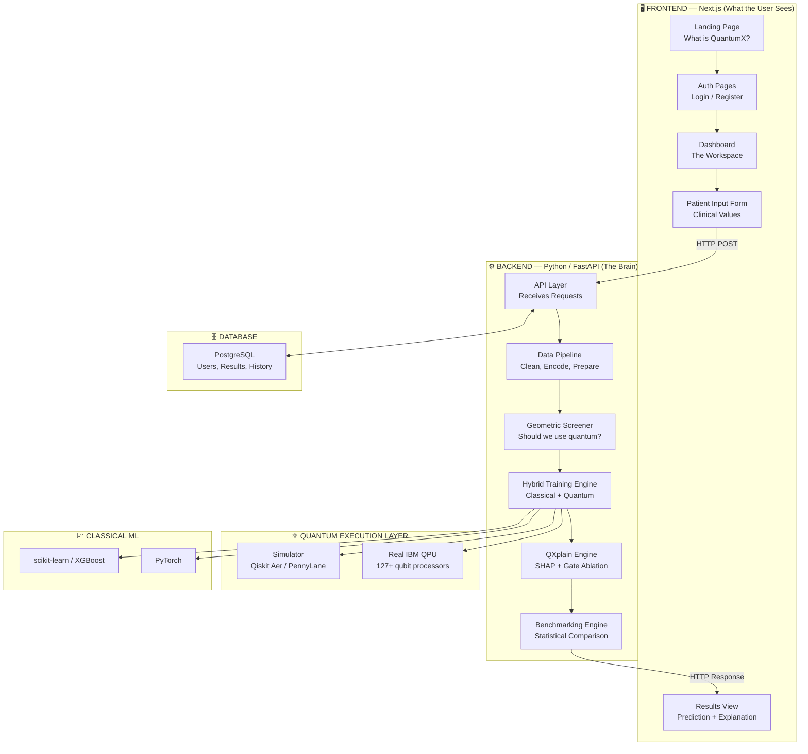
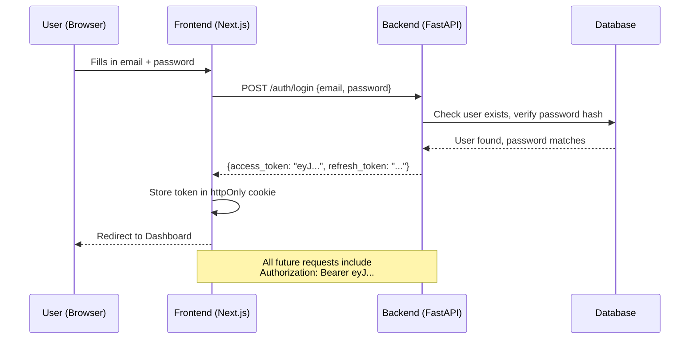
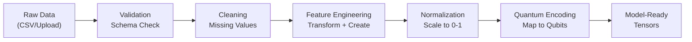
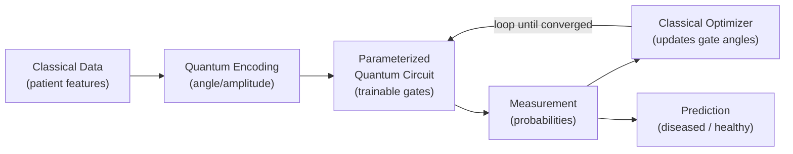
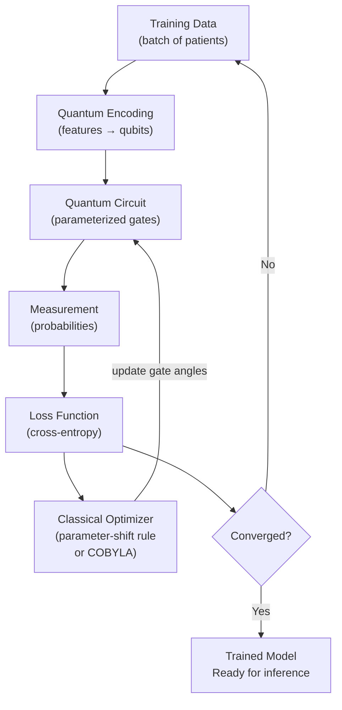
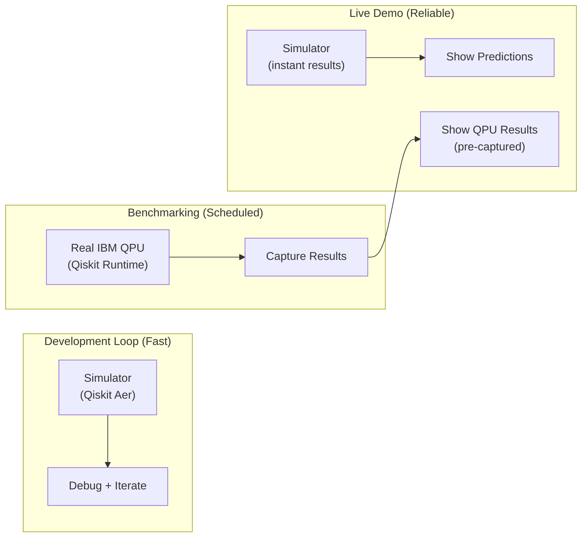

# QuantumX — The Complete Explanation

**Hybrid Quantum-Classical Machine Learning Platform for Early Disease Detection**

*SIH26139 | Team QuantumX | Smart India Hackathon 2026*

---

> **Who is this document for?**
> Every single member of Team QuantumX. If you are on this team, read this document end to end. It assumes zero prior knowledge of quantum computing. Every technical term is defined the first time it appears. By the end, you will understand what we are building, why it matters, how every piece connects, what your role is, and exactly what to do first.

---

## Table of Contents

1. [The Problem — What Exists Today and Why It Fails](#1-the-problem--what-exists-today-and-why-it-fails)
2. [Our Solution — What QuantumX Actually Is](#2-our-solution--what-quantumx-actually-is)
3. [Why Us? — What Makes QuantumX Win Against Other Teams](#3-why-us--what-makes-quantumx-win-against-other-teams)
4. [The Diseases We Are Targeting](#4-the-diseases-we-are-targeting)
5. [The Datasets We Will Use](#5-the-datasets-we-will-use)
6. [The Full System — Bird's Eye View](#6-the-full-system--birds-eye-view)
7. [Part 1: Frontend — What the User Sees](#7-part-1-frontend--what-the-user-sees)
8. [Part 2: Authentication — Who Gets In](#8-part-2-authentication--who-gets-in)
9. [Part 3: The Dashboard — The Workspace](#9-part-3-the-dashboard--the-workspace)
10. [Part 4: User Input — What The User Types In](#10-part-4-user-input--what-the-user-types-in)
11. [Part 5: Backend API — The Bridge](#11-part-5-backend-api--the-bridge)
12. [Part 6: Data Pipeline — Cleaning and Preparing](#12-part-6-data-pipeline--cleaning-and-preparing)
13. [Part 7: The Quantum Layer — Where the Magic Happens](#13-part-7-the-quantum-layer--where-the-magic-happens)
14. [Part 8: The Classical ML Layer — The Benchmark](#14-part-8-the-classical-ml-layer--the-benchmark)
15. [Part 9: The Hybrid Training Engine — Running Both Together](#15-part-9-the-hybrid-training-engine--running-both-together)
16. [Part 10: Explainability — Why Did the Model Say That?](#16-part-10-explainability--why-did-the-model-say-that)
17. [Part 11: Benchmarking — Honest Comparison](#17-part-11-benchmarking--honest-comparison)
18. [Part 12: The Output — What the User Gets Back](#18-part-12-the-output--what-the-user-gets-back)
19. [Part 13: Database — Where Everything Lives](#19-part-13-database--where-everything-lives)
20. [Part 14: Real Quantum Hardware — The IBM QPU Strategy](#20-part-14-real-quantum-hardware--the-ibm-qpu-strategy)
21. [The Simulator vs. Real Hardware Problem — And Our Solution](#21-the-simulator-vs-real-hardware-problem--and-our-solution)
22. [How We Satisfy Every Objective from the Problem Statement](#22-how-we-satisfy-every-objective-from-the-problem-statement)
23. [How We Satisfy the Expected Solution](#23-how-we-satisfy-the-expected-solution)
24. [A Simple End-to-End Example](#24-a-simple-end-to-end-example)
25. [Technology Stack — Full List](#25-technology-stack--full-list)
26. [Repository Folder Structure](#26-repository-folder-structure)
27. [Team Roles](#27-team-roles)
28. [Full Task List — From Day 1 to Submission](#28-full-task-list--from-day-1-to-submission)

---

## 1. The Problem — What Exists Today and Why It Fails

### The Real-World Situation

Every year in India:
- **~14 lakh** new cancer cases are detected. Over 50% are found at Stage III or IV — when survival rates drop below 30%.
- **~54 lakh** people die from cardiovascular disease (heart attacks, strokes). Most could have been predicted and prevented with early detection.
- **~40 lakh** people live with Alzheimer's or dementia. Early biomarker detection could slow progression by years, but today's tools miss it.

> **The data that could save these people already exists.** Hospitals have decades of electronic health records (EHRs). Labs produce genomic profiles. Clinics generate imaging scans. The raw information for early detection is *there*.

**So why are people still dying?**

Because the *patterns* in that data are incredibly complex. A patient's risk of cancer isn't determined by one blood value — it's determined by the *interaction* between dozens of values, across multiple time points, across different data types. The signal is buried in noise, and the feature space (the number of possible combinations) is astronomical.

### What Classical Machine Learning Can Do

**Classical Machine Learning** = the kind of AI/ML you already know. Models like Random Forest, XGBoost, SVMs, and neural networks that run on regular computers (CPUs/GPUs).

These models have done impressive work in medical diagnosis:
- Breast cancer classification: **94-97% accuracy** on standard benchmarks.
- Heart disease prediction: **85-92% accuracy** on standard datasets.
- Skin cancer identification: Deep learning models matching dermatologists.

**But they hit walls when:**

1. **Feature interactions explode.** Genomic data has 20,000+ genes. The number of possible gene-gene interactions is 20,000 × 19,999 / 2 = ~200 million pairs. Classical kernels (the mathematical functions that measure similarity between data points) cannot efficiently explore this space.

2. **The signal is subtle.** Early-stage cancer produces tiny coordinated changes across dozens of biomarkers. No single marker is statistically significant on its own. Classical models optimized for individual feature importance miss this coordinated pattern.

3. **Data is scarce for rare conditions.** Deep learning needs thousands of examples. Rare cancers and rare subtypes may have only 50-200 cases. Classical deep learning overfits (memorizes the training data instead of learning real patterns).

4. **Multi-modal fusion fails.** Combining genomic data + imaging + clinical records into one model is an unsolved problem. Classical concatenation-based fusion (just stacking all the features together) loses the cross-modal interaction information.

### What Quantum Machine Learning Promises

> **Quantum Computing** = computing that uses the laws of quantum physics (superposition, entanglement, interference) to process information in fundamentally different ways than classical computers.

> **Quantum Machine Learning (QML)** = using quantum computing to build machine learning models. The "hybrid" part means we use *both* quantum and classical computers together — classical for the heavy data lifting, quantum for the parts where quantum physics might give us an edge.

Three key quantum properties that matter here:

| Quantum Property | What It Means (Simple) | Why It Matters for Disease Detection |
|---|---|---|
| **Superposition** | A quantum bit (qubit) can be 0, 1, or *both at the same time*. This means a quantum circuit with N qubits can represent 2^N states simultaneously. | With 10 qubits, we can explore 1,024 feature combinations *at once* instead of one at a time. |
| **Entanglement** | Two qubits can be linked so that the state of one instantly depends on the other, no matter the distance. | We can encode *correlations between features* (like the relationship between gene A and gene B) directly into the quantum state — something classical models cannot efficiently represent. |
| **Interference** | Quantum states can amplify correct answers and cancel wrong ones, like waves reinforcing or canceling each other. | The quantum model can amplify the signal of a correct diagnosis while suppressing noise. |

### The Honest Truth

> [!IMPORTANT]
> **Quantum ML does NOT always beat classical ML.** On many standard medical datasets, well-tuned classical models (XGBoost, SVMs) perform *as well as or better than* quantum models. This is the honest research consensus as of 2026. The quantum advantage is **conditional** — it depends on the dataset, the feature encoding, and the circuit architecture. Our platform is built to *find out where quantum helps* — not to blindly claim it always does.

This honesty is itself a competitive advantage. The problem statement (SIH26139) asks us to **benchmark** quantum vs. classical — not to prove quantum is always superior.

---

## 2. Our Solution — What QuantumX Actually Is

QuantumX is **not** a single model. It is a **platform** — an integrated software system with five major engines:


**In one sentence:** QuantumX takes biomedical data, prepares it for quantum processing, trains both classical and quantum models under identical conditions, explains why each model made its prediction, and honestly reports which approach worked better — all through a professional web interface that a clinician or a judge can use.

**What makes it a platform and not just a model:**
- It supports **multiple diseases** (not just one dataset).
- It runs **both quantum AND classical** models on the same data, same splits, same conditions.
- It includes **explainability** — not just "the answer is cancer" but "here is WHY the model thinks it's cancer, and here is which features mattered."
- It benchmarks with **statistical rigor** — not "94.2% vs 93.8%" but "is this difference statistically significant or just random noise?"
- It runs on **real IBM quantum hardware** — not just a simulator pretending to be quantum.

---

## 3. Why Us? — What Makes QuantumX Win Against Other Teams

### What 90% of Teams Will Build

Let's be brutally honest about what most competing teams will submit for SIH26139:

```
The Generic Solution (what everyone else will do):
1. Take Wisconsin Breast Cancer dataset (569 samples, 30 features)
2. Apply PCA to reduce to 4 features
3. Build a basic VQC with 2 layers
4. Train on a simulator
5. Report "93% accuracy"
6. Compare with one SVM
7. Claim "quantum is better" (even when it's not)
8. No explainability
9. No statistical testing
10. Streamlit dashboard with 3 buttons
```

**Why this fails:**
- PCA (a linear dimensionality reduction technique) **destroys the non-linear feature interactions** that quantum models are supposed to exploit. You're removing the quantum advantage *before* the quantum model even sees the data.
- A fixed 2-layer circuit from a Qiskit tutorial was not designed for biomedical data geometry.
- One dataset proves nothing — Wisconsin BC is so well-separated that even a *linear* SVM gets 96%.
- No explainability means clinicians and judges cannot trust the result.
- No statistical testing means reported accuracy differences are meaningless noise.
- A Streamlit app with 3 buttons will not impress judges who see 50 teams all using Streamlit.

### What QuantumX Does Differently — Our 7 Unique Differentiators

| # | Differentiator | What It Means | Why Others Won't Do It |
|---|---|---|---|
| **1** | **Geometric Pre-Screening** | Before training any quantum model, we mathematically compute whether a quantum kernel actually captures *different* structure than the best classical kernel on this specific dataset. If quantum ≈ classical on this data, we honestly say so. | Requires implementing the Huang et al. (2021) geometric difference metric. No library provides this out of the box. Most teams have never heard of it. |
| **2** | **Quantum Circuit Architecture Search (Q-CAS)** | Instead of copying one fixed circuit from a tutorial, we evaluate multiple circuit designs and pick the one best suited to each dataset's geometry. | Requires custom code to measure expressibility, entangling capability, and barren plateau risk. Most teams use whatever the first tutorial shows. |
| **3** | **Non-Linear Feature Preservation** | Instead of PCA (which linearizes data), we use autoencoders (neural network-based compression) that preserve the non-linear structure quantum models need. | Requires understanding *why* PCA hurts quantum models — a subtlety most teams miss entirely. |
| **4** | **Multi-Disease, Multi-Dataset Evaluation** | We don't just classify one disease. We test across breast cancer, cardiovascular disease, and chronic kidney disease — showing where quantum helps and where it doesn't. | Requires building a flexible pipeline, not a one-off notebook. More work, more impressive. |
| **5** | **Quantum-Native Explainability (QXplain)** | Beyond standard SHAP (which treats the quantum model as a black box), we implement gate ablation and entanglement attribution — showing *which quantum operations* drove the prediction. | Original research-level contribution. No existing library does this. |
| **6** | **Real IBM Quantum Hardware Execution** | We run inference and benchmarking on actual IBM QPUs (real superconducting quantum processors), not just simulators. | Most teams won't even try this. We will show verifiable results from real quantum hardware. |
| **7** | **Honest, Statistically Rigorous Benchmarking** | We use McNemar's test and paired t-tests to report *whether the difference between quantum and classical is statistically significant*. | Requires statistical literacy beyond "compare two accuracy numbers." Shows genuine research maturity. |

---

## 4. The Diseases We Are Targeting

### Primary Targets: Three Major Killers

We are targeting **three diseases** — not one — to demonstrate the platform's versatility and to honestly map where quantum helps across different data types:

| Disease | Why This One | Data Type | Impact in India |
|---|---|---|---|
| **Breast Cancer** | Most-studied QML benchmark. We MUST include it for credibility and comparability with published research. Strong datasets available. | Tabular (biopsy features), Imaging (histopathology) | #1 cancer in Indian women. ~2.1 lakh new cases/year. |
| **Cardiovascular Disease** (Heart Attack / Heart Failure risk) | Higher-dimensional feature space (EHR + labs + vitals over time). This is where quantum models have a *better chance* of showing advantage over classical models. | Tabular (clinical features, lab results) | Leading cause of death in India. ~28% of all deaths. |
| **Chronic Kidney Disease (CKD)** | Clean, well-structured dataset with 24 features including blood tests. Excellent for demonstrating the full pipeline. Common comorbidity with diabetes and heart disease. | Tabular (lab results, clinical indicators) | ~17% of Indian population affected. Often detected too late. |

### Why All Three?

> *Question a judge might ask: "Why not just do one disease really well?"*
>
> **Answer:** Because the problem statement specifically says "e.g., cancer, cardiovascular disorders, or neurological conditions" — the "e.g." implies multiple. And more importantly, the *real research question* is "WHERE does quantum ML help?" — you can only answer that by testing across different datasets with different geometries. If quantum beats classical on cardiovascular data but not on breast cancer data, that's a *finding* — a genuinely valuable research contribution.

### Can We Exceed Classical Accuracy on All Three?

Honest answer: **not necessarily, and that's fine.** The problem statement asks us to **benchmark** — to rigorously compare and report. If we find that quantum matches classical on breast cancer (geometric difference is low → both kernel types see the data similarly) but quantum *outperforms* classical on cardiovascular disease (higher-dimensional feature interactions that entanglement captures), that's a more impressive and honest result than falsely claiming quantum wins everywhere.

What we *will* do:
- Ensure our **classical baselines are genuinely well-tuned** (not weak straw-men to make quantum look good).
- Use **non-linear feature engineering** that preserves the structure quantum models exploit.
- Use **Q-CAS** to find the best quantum circuit for each dataset.
- Report **effect sizes** (how much quantum improves, measured in actual percentage points with confidence intervals).

---

## 5. The Datasets We Will Use

### Primary Datasets

| Dataset | Source | Size | Features | Disease | Why This One |
|---|---|---|---|---|---|
| **Wisconsin Breast Cancer (WDBC)** | UCI ML Repository | 569 samples | 30 numeric features from FNA biopsy | Breast Cancer | Industry-standard QML benchmark. Every paper uses it. We MUST include it for credibility. |
| **Cleveland Heart Disease** | UCI ML Repository / Kaggle | 303 samples, 13 features (core) | Age, sex, cholesterol, blood pressure, ECG, etc. | Cardiovascular | Most-cited heart disease benchmark. Clean, well-documented. |
| **Framingham Heart Study** | Kaggle | 4,240 samples, 16 features | Demographics, vitals, labs, lifestyle factors | Cardiovascular (10-year risk) | Larger dataset → more robust evaluation. Includes longitudinal risk factors. |
| **Chronic Kidney Disease** | UCI ML Repository | 400 samples, 24 features | Blood tests (hemoglobin, albumin, etc.), vitals, urinalysis | CKD | Well-structured, multi-feature. Good candidate for quantum feature interaction exploitation. |
| **Diabetes 130-US Hospitals** | UCI ML Repository | 100,000+ encounters | 50+ features from EHR | Type 2 Diabetes / Comorbidity | Stretch dataset. Massive scale shows pipeline handles real-world volume. |

### Stretch / Imaging Dataset

| Dataset | Source | Size | Type | Disease |
|---|---|---|---|---|
| **MedMNIST v2 (BreastMNIST)** | Yang et al. / Kaggle | 780 images (28x28) | Histopathology images | Breast Cancer |

> **Why not start with imaging?** Quantum circuits have a limited number of qubits. Encoding a raw image (even 28×28 = 784 pixels) into a quantum circuit is extremely expensive. The practical approach is: classical CNN extracts features → quantum circuit classifies. Imaging is a stretch goal once the tabular pipeline works.

### The Dataset Mismatch Concern

> *"What if the user inputs data that's different from what we trained on?"*
>
> This is a legitimate concern. Our model is trained on specific datasets with specific feature columns. If a user inputs data with different column names, different scales, different units, or missing columns — the model won't work. **We handle this through:**
>
> 1. **Pre-defined input schemas** — For each disease, we define exactly which clinical values are needed (see Section 10: User Input).
> 2. **Feature normalization** — All inputs are scaled to the same range the model was trained on.
> 3. **Missing value handling** — If a user doesn't have all values, our pipeline uses KNN imputation (filling in missing values based on similar patients in the training data).
> 4. **Clear guidance** — The frontend tells the user exactly what values are needed and what units to use.

---

## 6. The Full System — Bird's Eye View

Here is the complete system, from the moment a user opens our website to the moment they get a prediction with explanation:



**The flow in plain English:**

1. User lands on our website → sees the **Landing Page**.
2. User creates an account or logs in → **Authentication**.
3. User enters the **Dashboard** (their workspace).
4. User selects a disease type and fills in clinical values → **Patient Input Form**.
5. Frontend sends data to the **Backend API** (a POST request over HTTP).
6. Backend runs the **Data Pipeline** — cleans, normalizes, encodes the data.
7. Backend runs **Geometric Screening** — checks if quantum will actually help on this data.
8. Backend runs the **Hybrid Training Engine** — trains both classical and quantum models (or uses pre-trained models for inference).
9. Quantum models execute on a **Simulator** (fast, for live demo) or **Real IBM QPU** (for benchmarking results shown in dashboard).
10. The **Explainability Engine** generates SHAP plots and quantum gate attribution.
11. The **Benchmarking Engine** compares quantum vs. classical with statistical tests.
12. Results flow back to the frontend → user sees **Prediction + Explanation + Comparison**.

---

## 7. Part 1: Frontend — What the User Sees

> **Roles:** `R1-FRONTEND` `R6-LEADER`

### What is the Frontend?

The **frontend** is everything the user interacts with in their browser. It's the visual layer — the website itself. It does NOT process data, train models, or talk to quantum computers. It sends requests to the backend and displays the results beautifully.

### Technology: Next.js 16 + TypeScript + Tailwind CSS

- **Next.js** = A React framework for building modern web applications. React lets you build UIs as reusable "components" (a button is a component, a chart is a component, a form is a component). Next.js adds server-side rendering, routing, and optimization on top of React.
- **TypeScript** = JavaScript with type safety. Instead of "this variable is... something," TypeScript enforces "this variable is a `number`" — catching bugs before they run.
- **Tailwind CSS** = A utility-first CSS framework. Instead of writing `color: red; font-size: 16px;`, you write `className="text-red-500 text-base"` directly in your HTML/JSX.
- **shadcn/ui** = Pre-built, accessible UI components (buttons, modals, data tables) that we own the code for — not a locked npm dependency.

### The Three Route Groups

The frontend is organized into three areas using Next.js Route Groups:

```
Frontend/src/app/
├── (public)/          ← Landing page, anyone can see
├── (auth)/            ← Login, register, forgot password
└── (app)/             ← The main workspace (must be logged in)
```

#### 7a. Landing Page `(public)/`

> *What might the landing page look like?*

The landing page is the **first impression**. Most teams will have a generic Streamlit page or a basic React landing. Ours needs to immediately communicate: "This is a serious, research-grade platform."

**What it will contain:**

| Section | Purpose |
|---|---|
| **Hero Section** | Big headline: "Quantum-Enhanced Disease Detection." Subheadline explaining the hybrid approach. A live-demo button. |
| **Problem** | Brief, visual explanation of why classical ML fails on complex biomedical data. Animated diagrams. |
| **How It Works** | 3-step visual: Data In → Hybrid QML Processing → Explainable Prediction Out. |
| **Live Demo Widget** | An unauthenticated, rate-limited mini-demo. User enters a few clinical values, gets a quick prediction. This alone will blow judges away — most teams won't have this. |
| **Benchmark Results** | Scrolling comparison table: our quantum models vs. classical baselines. Real numbers from real hardware. |
| **Other Details/Features** | Logos and brief descriptions: PennyLane, Qiskit, IBM Quantum, Features and working etc. |
| **Team Section** | Photo + name + role for each team member. |
| **Footer** | SIH26139 reference, Egreen Quanta acknowledgement, GitHub link and Resouces links |

> *Why a live demo widget on the landing page?*
>
> Because judges and visitors should be able to *use* the platform within 10 seconds of landing. No account creation required. This instantly proves the system is real, not a PowerPoint deck. The widget calls a rate-limited backend endpoint that uses a pre-trained model for instant inference.

**Micro-tasks for Landing Page:**
- [ ] `R1-FRONTEND` Design hero section with gradient background + animated headline
- [ ] `R1-FRONTEND` Build "How It Works" 3-step visual section
- [ ] `R1-FRONTEND` Implement live demo widget (input form + result display)
- [ ] `R6-LEADER` Wire live demo widget to backend `/predict/demo` endpoint
- [ ] `R5-DOCS` Write landing page copy (headlines, descriptions, team bios)

---

## 8. Part 2: Authentication — Who Gets In

> **Roles:** `R2-BACKEND` `R1-FRONTEND` `R6-LEADER`

### What is Authentication?
- **Authentication** = verifying that a user is who they claim to be (login). 
- **Authorization** = determining what a logged-in user is allowed to do.

### How It Works
We use **JWT-based authentication** (JSON Web Tokens):



> **JWT (JSON Web Token)** = A compact, encrypted token that the backend gives the user after successful login. The frontend stores this token and sends it with every subsequent request to prove "I am logged in." The backend verifies the token without needing to query the database every time.

### Auth Pages

| Page | What It Does |
|---|---|
| `/auth/login` | Email + password form. "Forgot password?" link. Google/GitHub OAuth optional. |
| `/auth/register` | Name, email, password, confirm password. Basic validation. |
| `/auth/forgot-password` | Email input → sends reset link. |
| `/auth/reset-password` | New password form (accessed via reset link). |

### Security

- Passwords are **hashed** (converted to an irreversible scramble) using bcrypt before storage. We never store plain-text passwords.
- JWTs expire after 1 hour. Refresh tokens allow getting new access tokens without re-logging.
- Rate limiting on login attempts to prevent brute-force attacks.

**Micro-tasks:**
- [ ] `R2-BACKEND` Implement `/auth/register`, `/auth/login`, `/auth/refresh` endpoints
- [ ] `R2-BACKEND` Set up bcrypt password hashing + JWT generation
- [ ] `R1-FRONTEND` Build login and register forms with validation
- [ ] `R1-FRONTEND` Integrate JWT interceptors in Axios client
- [ ] `R6-LEADER` Test Auth
- [ ] `R5-DOCS` Test and Documenet Auth
---

## 9. Part 3: The Dashboard — The Workspace

> **Roles:** `R1-FRONTEND` `R6-LEADER`

### What Does the Dashboard Look Like?

Once logged in, the user enters the **Dashboard** — their personal workspace. This is NOT a cluttered admin panel with 50 buttons. It is a clean, focused workspace with clear paths.

> *What might this look like?*

Think of it as having **four main tabs/sections:**

```
┌─────────────────────────────────────────────────────────────┐
│  QUANTUMX Dashboard                     [Profile] [Logout]  │
├──────┬──────────────────────────────────────────────────────┤
│      │                                                      │
│  📊  │   Welcome back, Dr. Sharma                           │
│ Home │                                                      │
│      │   ┌─────────┐  ┌──────────┐  ┌───────────┐          │
│  🔬  │   │ New      │  │ View     │  │ Training  │          │
│Predict│   │Prediction│  │ History  │  │ Results   │          │
│      │   └─────────┘  └──────────┘  └───────────┘          │
│  📈  │                                                      │
│Bench │   Recent Predictions:                                │
│      │   ┌──────────────────────────────────────────┐       │
│  📄  │   │ Patient #1042 | Breast Cancer | Low Risk │       │
│Reports│   │ Patient #1043 | Heart Disease | High Risk│       │
│      │   └──────────────────────────────────────────┘       │
│      │                                                      │
│  ⚙️  │   Model Performance Summary:                         │
│Settings│   Quantum VQC: 96.5% | XGBoost: 97.2%              │
│      │                                                      │
└──────┴──────────────────────────────────────────────────────┘
```

### Dashboard Sections

| Section | What It Contains |
|---|---|
| **Home** | Welcome message, quick stats (total predictions, recent activity), summary cards for model performance. |
| **New Prediction** | The patient input form (see Part 4). Select disease type → fill in clinical values → get prediction. |
| **Prediction History** | Table of all past predictions with results, confidence, timestamps. Click any to see the full explainability report. |
| **Benchmarking** | Side-by-side comparison of all models (quantum vs. classical). Interactive charts: ROC curves, confusion matrices, SHAP plots. Real hardware results vs. simulator results. |
| **Reports** | Auto-generated benchmark reports (PDF/HTML). Downloadable. |
| **Settings** | Profile, quantum backend selection (simulator vs. real hardware), notification preferences. |

**Micro-tasks:**
- [ ] `R1-FRONTEND` Build dashboard layout with sidebar navigation
- [ ] `R1-FRONTEND` Create home page with summary cards and recent predictions
- [ ] `R1-FRONTEND` Build prediction history table with click-to-expand detail view
- [ ] `R1-FRONTEND` Build benchmarking page with Recharts integration
- [ ] `R2-BACKEND` Define API contract between dashboard and backend
- [ ] `R5-DOCS` Test and document dashboard
---

## 10. Part 4: User Input — What The User Types In

> **Roles:** `R1-FRONTEND` `R2-BACKEND` `R3-ML` `R6-LEADER`

### The Critical Design Question

> *"I do not want my frontend to be some shitty dashboard which asks for huge amounts of data which the user might not have access to."*

This is a real concern. Here is how we solve it:

### Approach: Disease-Specific Smart Forms

Instead of one massive form asking for 50 fields, we have **disease-specific forms** with smart defaults:

#### Breast Cancer Prediction — Input Fields

These are the 10 most important features from the Wisconsin BC dataset (determined by SHAP analysis of our trained model), presented in a user-friendly way:

| Field | What It Is (Simple) | Unit | Example Value | Required? |
|---|---|---|---|---|
| Mean Radius | Average size of the cell nucleus | μm | 14.5 | ✅ Yes |
| Mean Texture | Average grayscale variation in the cell image | Unitless (0-40) | 19.2 | ✅ Yes |
| Mean Perimeter | Average boundary length of nucleus | μm | 92.0 | ✅ Yes |
| Mean Area | Average area of nucleus | μm² | 655.0 | ✅ Yes |
| Mean Smoothness | How smooth the nucleus boundary is | Unitless (0-0.2) | 0.096 | ✅ Yes |
| Mean Concavity | Severity of concave portions of nucleus boundary | Unitless (0-0.5) | 0.05 | ⭕ Optional |
| Mean Concave Points | Number of concave portions | Unitless (0-0.2) | 0.03 | ⭕ Optional |
| Worst Radius | Largest nucleus size in the sample | μm | 16.8 | ⭕ Optional |
| Worst Perimeter | Largest perimeter measurement | μm | 107.0 | ⭕ Optional |
| Worst Concave Points | Worst concave portions measurement | Unitless (0-0.3) | 0.07 | ⭕ Optional |

> **Where does a user get these values?** From a **Fine Needle Aspiration (FNA) biopsy report** — a standard pathology lab output. Any pathology lab that performs FNA biopsies produces these measurements. The user doesn't need to calculate anything; they copy values from their lab report.

#### Heart Disease Prediction — Input Fields

| Field | What It Is (Simple) | Unit / Values | Example | Required? |
|---|---|---|---|---|
| Age | Patient's age | Years | 52 | ✅ Yes |
| Sex | Biological sex | Male / Female | Male | ✅ Yes |
| Chest Pain Type | Type of chest pain experienced | Typical Angina / Atypical / Non-anginal / Asymptomatic | Atypical | ✅ Yes |
| Resting Blood Pressure | Blood pressure at rest | mmHg | 135 | ✅ Yes |
| Serum Cholesterol | Cholesterol level in blood | mg/dL | 220 | ✅ Yes |
| Fasting Blood Sugar | Blood sugar after fasting | > 120 mg/dL? Yes/No | No | ✅ Yes |
| Resting ECG | Electrocardiogram result | Normal / ST-T abnormality / LVH | Normal | ⭕ Optional |
| Max Heart Rate | Maximum heart rate achieved during exercise | bpm | 165 | ⭕ Optional |
| Exercise-Induced Angina | Chest pain during exercise? | Yes / No | No | ⭕ Optional |
| ST Depression | Depression of the ST segment on ECG during exercise | mm | 1.4 | ⭕ Optional |

> **Where does a user get these values?** From a **basic medical check-up report**. Blood pressure, cholesterol, blood sugar — these are standard blood test results any clinic provides. Most people have these from their last health check-up.

#### CKD Prediction — Input Fields

| Field | What It Is (Simple) | Unit | Example | Required? |
|---|---|---|---|---|
| Age | Patient's age | Years | 55 | ✅ Yes |
| Blood Pressure | Resting blood pressure | mmHg | 80 | ✅ Yes |
| Specific Gravity | Urine density | 1.005-1.025 | 1.020 | ✅ Yes |
| Albumin | Protein in urine | 0-5 (scale) | 1 | ✅ Yes |
| Blood Sugar | Blood sugar level | Random, mg/dL | 120 | ✅ Yes |
| Hemoglobin | Blood hemoglobin level | g/dL | 14.5 | ✅ Yes |
| Serum Creatinine | Kidney function marker | mg/dL | 1.2 | ✅ Yes |
| Sodium | Blood sodium level | mEq/L | 140 | ⭕ Optional |
| Potassium | Blood potassium level | mEq/L | 4.5 | ⭕ Optional |

### How Missing Values Are Handled

If a user leaves optional fields blank:
1. The frontend shows a warning: "Optional fields left blank. Prediction will use estimated values based on similar patients."
2. The backend uses **KNN Imputation** — it finds the K most similar patients in the training data and averages their values for the missing fields.
3. The explainability output clearly marks which values were imputed vs. user-provided.

### The Data Mismatch Safeguard

> *"The data from medical analysis may differ from which we trained our model on."*

We handle this through:
1. **Input validation** — the backend checks if values are within the expected range (e.g., cholesterol between 100-400 mg/dL). If a value is outside the range, the system flags it and asks the user to confirm.
2. **Feature normalization** — all inputs are scaled using the *same scaler* that was fitted on the training data. This ensures consistent mapping.
3. **Confidence calibration** — the model outputs a calibrated confidence score. If the input is very different from training data (high uncertainty), the system displays a warning: "This patient's profile is unusual compared to training data. Prediction confidence is low."
4. **No fake outputs** — if the model cannot make a reliable prediction, it says so. No made-up numbers.

**Micro-tasks:**
- [ ] `R1-FRONTEND` Build disease selection dropdown + dynamic form renderer
- [ ] `R1-FRONTEND` Build smart form components with validation, tooltips, and unit indicators
- [ ] `R2-BACKEND` Define Pydantic input schemas for each disease
- [ ] `R2-BACKEND` Implement input validation + range checking + KNN imputation
- [ ] `R3-ML` Determine top SHAP features for each disease to decide which fields are required vs. optional
- [ ] `R6-LEADER` Design input → prediction → output flow

---

## 11. Part 5: Backend API — The Bridge

> **Roles:** `R2-BACKEND` `R6-LEADER`

### What is the Backend?

The **backend** is the server-side code that the user never sees. It receives requests from the frontend, processes data, runs models, and sends results back. Think of it as the kitchen in a restaurant — the user (customer) sees the menu and gets the food, but the cooking (computation) happens in the kitchen (backend).

### Technology: Python + FastAPI

- **FastAPI** = a modern Python web framework. It automatically generates API documentation (Swagger/OpenAPI), handles request validation, and supports asynchronous operations (doing multiple things at once without blocking).

### API Endpoints (the "menu" of available operations)

> **API Endpoint** = a specific URL that the frontend can call to do something. Like `POST /predict` means "send patient data and get a prediction back."

| Endpoint | Method | What It Does | Who Calls It |
|---|---|---|---|
| `POST /auth/register` | POST | Create new user account | Auth page |
| `POST /auth/login` | POST | Login, get JWT token | Auth page |
| `POST /auth/refresh` | POST | Refresh expired token | Frontend automatically |
| `GET /datasets` | GET | List available datasets | Dashboard |
| `POST /datasets/upload` | POST | Upload custom dataset | Dashboard |
| `POST /predict` | POST | Single-patient prediction with explainability | Predict page |
| `POST /predict/demo` | POST | Rate-limited demo prediction (no auth needed) | Landing page widget |
| `POST /training/runs` | POST | Start a full training run (classical + quantum) | Dashboard |
| `GET /training/runs/{id}` | GET | Check training run status/results | Dashboard |
| `GET /benchmarks/{id}` | GET | Get benchmark comparison results | Benchmarking page |
| `GET /benchmarks/hardware` | GET | Get real QPU benchmark results | Benchmarking page |
| `GET /quantum/backends` | GET | List available quantum backends + status | Settings |
| `GET /reports/{id}` | GET | Download auto-generated report | Reports page |

### How the API Works (Example)

When the user clicks "Predict" on the frontend:

```
Frontend:
  1. User fills in: Age=52, Cholesterol=220, BP=135, ...
  2. Frontend calls: POST /predict
     Body: { "disease": "cardiovascular", "features": { "age": 52, "cholesterol": 220, "bp": 135, ... } }

Backend (/predict endpoint):
  3. Validates input (range checking, type checking)
  4. Normalizes values (StandardScaler fitted on training data)
  5. Imputes missing values (KNN imputer)
  6. Runs classical model inference (XGBoost → prediction)
  7. Runs quantum model inference (VQC → prediction)
  8. Runs SHAP explainability on both models
  9. Returns response:
     {
       "prediction": {
         "classical": { "label": "High Risk", "confidence": 0.87, "model": "XGBoost" },
         "quantum":   { "label": "High Risk", "confidence": 0.91, "model": "VQC-8q" }
       },
       "explainability": {
         "classical_shap": { "cholesterol": 0.23, "age": 0.18, "bp": 0.15, ... },
         "quantum_shap": { "cholesterol": 0.19, "age": 0.21, "bp": 0.17, ... },
         "quantum_gate_attribution": { "entangling_gate_q2_q5": 0.31, ... }
       },
       "agreement": true,
       "confidence_warning": null
     }

Frontend:
  10. Displays prediction cards, SHAP waterfall plots, quantum gate heatmaps
```

**Micro-tasks:**
- [ ] `R2-BACKEND` Set up FastAPI project structure with app/, api/, core/, schemas/
- [ ] `R2-BACKEND` Implement all auth endpoints with JWT
- [ ] `R2-BACKEND` Implement `/predict` endpoint with input validation
- [ ] `R2-BACKEND` Implement `/training/runs` for training orchestration
- [ ] `R2-BACKEND` Implement `/benchmarks` endpoints
- [ ] `R6-LEADER` Define Pydantic schemas for all request/response models

---

## 12. Part 6: Data Pipeline — Cleaning and Preparing

> **Roles:** `R3-ML` `R6-LEADER`

### What is a Data Pipeline?

A **data pipeline** is a series of automated steps that transform raw data into clean, model-ready data. Like an assembly line in a factory — raw materials go in, finished products come out.

### Our Pipeline Steps



#### Step 1: Data Validation
- Check column names match expected schema.
- Check data types (numbers should be numbers, categories should be categories).
- Flag obviously wrong values (negative age, cholesterol = 0).

#### Step 2: Cleaning
- **Missing values:** KNN imputation (fill in based on similar patients).
- **Outliers:** Clip extreme values to the 1st-99th percentile range.
- **Categorical encoding:** Convert text categories (Male/Female, Chest Pain Type) to numbers.

#### Step 3: Feature Engineering
- **Non-linear dimensionality reduction:** Instead of PCA (which destroys non-linear structure), we use an autoencoder.

> **Autoencoder** = a neural network that compresses data into a smaller representation and then tries to reconstruct the original. The compressed representation (the "bottleneck") preserves the most important *non-linear* patterns in the data.

- **Feature interaction creation:** Create explicit interaction features (e.g., cholesterol × age, BP × BMI) for the classical models. The quantum models don't need this because entanglement captures interactions natively.

#### Step 4: Normalization
- StandardScaler: transform each feature to have mean=0, standard deviation=1.
- This is critical for quantum encoding — quantum gates are sensitive to input scales.

#### Step 5: Quantum Encoding

> **Quantum Encoding** = mapping classical data (numbers) into quantum states (qubit configurations). This is the bridge between the classical data world and the quantum computing world.

Three encoding strategies:

| Strategy | How It Works | When We Use It |
|---|---|---|
| **Angle Encoding** | Each feature value becomes the rotation angle of a qubit. 1 qubit per feature. | ≤12 features. Simple, interpretable. |
| **Amplitude Encoding** | All feature values are encoded into the probability amplitudes of a quantum state. Can encode 2^N features with N qubits. | >12 features. Efficient but requires deeper circuits. |
| **Data Re-uploading** | Features are encoded multiple times in successive layers of the circuit. Each layer sees the data again. | When we need maximum expressibility with few qubits. |

Our pipeline **automatically selects** the encoding strategy based on the number of features and available qubit budget.

**Micro-tasks:**
- [ ] `R3-ML` Build data validation module (schema checking, type checking)
- [ ] `R3-ML` Build cleaning module (KNN imputer, outlier clipping, categorical encoding)
- [ ] `R3-ML` Build autoencoder for non-linear dimensionality reduction
- [ ] `R3-ML` Implement StandardScaler fitting and transform pipeline
- [ ] `R6-LEADER` Build quantum encoding module (angle, amplitude, data re-uploading)
- [ ] `R6-LEADER` Build automatic encoding strategy selector

---

## 13. Part 7: The Quantum Layer — Where the Magic Happens

> **Roles:** `R6-LEADER` (primary), `R3-ML` (assist)

### What is a Quantum Circuit?

A **quantum circuit** is a sequence of operations (called **gates**) applied to qubits. Think of it like a recipe:
1. Start with qubits in a known state (all zeros).
2. Apply gates that rotate, flip, and entangle qubits.
3. Measure the final state to get an answer.

```
Example: A simple 4-qubit circuit

q0: ──[RY(θ₁)]──●──────────── M
                  │
q1: ──[RY(θ₂)]──X──●───────── M
                     │
q2: ──[RY(θ₃)]─────X──●────── M
                        │
q3: ──[RY(θ₄)]────────X────── M

Where:
- RY(θ) = rotation gate (encodes a feature value as a rotation angle)
- ● and X = CNOT gate (entangles two qubits)
- M = measurement (read out the qubit state: 0 or 1)
```

### Our Three Quantum Models

#### Model 1: Quantum Kernel SVM (QK-SVM)

> **Kernel** = a mathematical function that measures the similarity between two data points. Instead of a classical RBF kernel, we use a *quantum* kernel — compute similarity using quantum states.

**How it works:**
1. Encode patient A's features into a quantum circuit → get quantum state |ψ_A⟩
2. Encode patient B's features into a quantum circuit → get quantum state |ψ_B⟩
3. Compute the overlap (inner product) between |ψ_A⟩ and |ψ_B⟩ → this is the quantum kernel value
4. Use this quantum kernel matrix with a classical SVM

**Why it's powerful:** The quantum kernel maps data into a Hilbert space (an exponentially large mathematical space) where data points that are tangled together in classical space may become linearly separable.

#### Model 2: Variational Quantum Classifier (VQC)

> **VQC** = a quantum circuit with trainable parameters. Like a neural network, but instead of adjusting weights of neurons, we adjust rotation angles of quantum gates.

**How it works:**
1. Encode patient's features into the first layer of the circuit.
2. Apply layers of parameterized gates (rotations with trainable angles).
3. The gates include entangling operations (CNOT gates that create quantum correlations between features).
4. Measure the output qubits → the measurement probabilities give the classification (e.g., >0.5 = diseased, ≤0.5 = healthy).
5. Compare with the true label → compute loss → use a classical optimizer to update the gate angles.
6. Repeat until the model converges.



#### Model 3: Hybrid Transfer Learning (Stretch Goal)

- Use a **pre-trained classical CNN** (like ResNet-18) to extract features from medical images.
- Feed the extracted features (a small vector) into a quantum circuit for final classification.
- This bridges imaging and quantum — the CNN handles the pixel-heavy lifting, the quantum circuit handles the classification from extracted features.

### What is Q-CAS (Quantum Circuit Architecture Search)?

> **Q-CAS** = Our custom system that picks the best quantum circuit design for each dataset.

Most teams use a fixed circuit from a tutorial. We evaluate multiple circuit architectures and pick the best one:

| Metric | What It Measures | Why It Matters |
|---|---|---|
| **Expressibility** | How much of the quantum state space the circuit can reach. | A circuit that can only reach a small part of the space can't learn complex patterns. |
| **Entangling Capability** | How much entanglement the circuit creates between qubits. | More entanglement = better ability to capture feature interactions. |
| **Barren Plateau Risk** | Whether the gradient of the loss function vanishes (goes to zero) as the circuit gets bigger. | If gradients vanish, the optimizer can't learn — the training gets stuck. |

> **Barren Plateau** = A notorious problem in quantum ML. As you add more qubits and layers, the gradients (signals that tell the optimizer which direction to improve) can become exponentially small. It's like trying to navigate a perfectly flat landscape — you can't tell which direction is downhill. Our Q-CAS checks for this *before* committing to training.

**Micro-tasks:**
- [ ] `R6-LEADER` Implement ZZFeatureMap and angle encoding circuits in PennyLane
- [ ] `R6-LEADER` Implement QK-SVM with quantum kernel computation
- [ ] `R6-LEADER` Implement VQC with parameterized layers and classical optimizer loop
- [ ] `R6-LEADER` Build Q-CAS: expressibility, entangling capability, BP risk assessment
- [ ] `R3-ML` Assist with optimizer selection (COBYLA, Adam, L-BFGS-B)
- [ ] `R6-LEADER` Build hybrid transfer learning model (CNN backbone → quantum head)

---

## 14. Part 8: The Classical ML Layer — The Benchmark

> **Roles:** `R3-ML` `R6-LEADER`

### Why Classical Models Matter

The quantum models are only impressive *in comparison* to strong classical baselines. If we use a weak classical model and our quantum model barely beats it, judges will see through it. Our classical baselines must be **genuinely well-tuned**.

### Our Classical Models

| Model | What It Is | Strengths | Typical Accuracy |
|---|---|---|---|
| **SVM (RBF Kernel)** | Support Vector Machine with a Radial Basis Function kernel. Finds the best boundary between classes in a high-dimensional space. | Great for small datasets. Mathematically elegant. The most direct comparison to quantum kernel methods. | 94-97% (breast cancer) |
| **Random Forest** | An ensemble of hundreds of decision trees, each trained on a random subset of data. Final prediction is the majority vote. | Resistant to overfitting. Handles missing data. Feature importance built-in. | 93-96% (breast cancer) |
| **XGBoost** | Extreme Gradient Boosting. Builds decision trees sequentially, each correcting the errors of the previous one. | Currently the #1 algorithm on tabular medical data. Very hard to beat. | 95-98% (breast cancer) |
| **Feed-Forward Neural Network** | A simple multi-layer perceptron (3-4 layers). | Captures non-linear patterns. Good comparison to VQC (which is structurally similar). | 93-96% (breast cancer) |

### Hyperparameter Tuning

> **Hyperparameters** = settings you choose *before* training (like "how many trees in the forest" or "what learning rate to use"). Unlike parameters the model learns during training, hyperparameters are set by the engineer.

We use **GridSearchCV** (or **Optuna**) to systematically search for the best hyperparameters for each classical model. This ensures our baselines are the *best they can be* — no weak straw-men.

**Micro-tasks:**
- [ ] `R3-ML` Implement SVM, Random Forest, XGBoost, and NN baselines using scikit-learn/PyTorch
- [ ] `R3-ML` Implement hyperparameter tuning with GridSearchCV/Optuna
- [ ] `R3-ML` Implement stratified k-fold cross-validation (k=5, 10 repeats)
- [ ] `R3-ML` Generate classical baseline benchmark results for all three disease datasets
- [ ] `R6-LEADER` Ensure classical and quantum models use identical data splits

---

## 15. Part 9: The Hybrid Training Engine — Running Both Together

> **Roles:** `R3-ML` `R6-LEADER`

### What Makes Training "Hybrid"?

"Hybrid" means the training loop involves both classical and quantum components:

1. **Forward pass (quantum):** Patient data is encoded into a quantum circuit. The circuit runs (on simulator or real hardware). The output (measurement probabilities) comes back as classical numbers.
2. **Loss computation (classical):** Compare the quantum model's prediction with the true label. Compute the error (loss function).
3. **Backward pass (classical):** Use a classical optimizer to compute how to update the quantum gate parameters to reduce the error.
4. **Parameter update (classical):** Adjust the gate angles.
5. **Repeat** until the model converges.



### Training Protocol (Ensuring Fair Comparison)

To ensure the comparison between quantum and classical is fair:

1. **Same data splits:** We use stratified k-fold cross-validation (k=5) — the data is split into 5 folds, and each fold takes a turn being the test set. Both quantum and classical models use the *exact same* splits.
2. **Same preprocessing:** Both models receive the same preprocessed features.
3. **Repeated trials:** Each experiment is repeated 10 times with different random seeds. This gives us 50 total evaluations (5 folds × 10 repeats) per model.
4. **Same evaluation metrics:** Both are evaluated on the same metrics (accuracy, precision, recall, F1, AUC-ROC, specificity, sensitivity).

**Micro-tasks:**
- [ ] `R6-LEADER` Build training orchestrator that runs classical and quantum in parallel
- [ ] `R3-ML` Implement stratified k-fold cross-validation with fixed seed management
- [ ] `R6-LEADER` Implement parameter-shift rule gradient computation for VQC
- [ ] `R6-LEADER` Implement training loop with early stopping
- [ ] `R3-ML` Build model checkpointing (save/load trained models)

---

## 16. Part 10: Explainability — Why Did the Model Say That?

> **Roles:** `R3-ML` `R6-LEADER`

### Why Explainability Matters

A model that says "this patient has cancer" is useless if it can't explain *why*. Clinicians won't trust it. Judges won't be impressed. Regulators won't approve it. **Explainability is not optional — it's a core requirement of the problem statement.**

### SHAP — The Classical Explainability Standard

> **SHAP (SHapley Additive exPlanations)** = a method that assigns each feature a score representing how much it contributed to the prediction.

**Example:** For a heart disease prediction:
```
Prediction: High Risk (87% confidence)

Feature Contributions (SHAP values):
  Cholesterol:  +0.23  ← Pushed prediction TOWARD "High Risk"
  Age:          +0.18  ← Pushed prediction TOWARD "High Risk"
  Blood Pressure: +0.15 ← Pushed prediction TOWARD "High Risk"
  Max Heart Rate: -0.12 ← Pushed prediction TOWARD "Low Risk"
  Fasting Blood Sugar: +0.08 ← Slight push toward "High Risk"
```

The SHAP values show that the patient's high cholesterol was the single biggest factor in the "High Risk" prediction.

### SHAP Visualizations We Will Display

| Visualization | What It Shows |
|---|---|
| **Waterfall Plot** | Bar chart showing each feature's push toward or away from the prediction. Most intuitive for clinicians. |
| **Summary Plot** | For all patients, which features matter most overall. Good for understanding the model's general behavior. |
| **Force Plot** | A single prediction broken down into feature contributions, visualized as forces pushing the prediction left (healthy) or right (diseased). |
| **Dependence Plot** | How a single feature's value affects the prediction across all patients. Reveals non-linear relationships. |

### Quantum-Native Explainability — Our Secret Weapon (QXplain)

Standard SHAP treats the quantum model as a **black box** — it doesn't know or care that there's a quantum circuit inside. Our QXplain engine goes deeper:

#### Gate Ablation Attribution

**What it does:** Systematically removes or replaces individual quantum gates one at a time and measures how much the prediction changes.

```
Original circuit prediction: 91% malignant

Remove gate RY on qubit 3: prediction changes to 88% → Impact: 3%
Remove CNOT between qubit 2-5: prediction changes to 72% → Impact: 19%  ← HIGH IMPACT!
Remove gate RZ on qubit 1: prediction changes to 90% → Impact: 1%

Insight: The entangling gate between qubit 2 (worst_radius) and qubit 5 
(worst_concavity) is the most critical quantum operation for this prediction.
This suggests the model relies on the INTERACTION between tumor radius and 
concavity — a cross-feature correlation the classical model might miss.
```

#### Entanglement Attribution

For the quantum kernel, we compute how much each pair of qubits contributes to the kernel value. This reveals which feature *pairs* the quantum model considers most important — information that goes beyond single-feature SHAP analysis.

### Comparative Explainability — Side by Side

The most powerful display: show classical SHAP and quantum attribution *next to each other*:

```
CLASSICAL MODEL (XGBoost) says:           QUANTUM MODEL (VQC) says:
Most important:                            Most important:
  1. worst_concave_points (0.31)             1. entangling(radius, concavity) (0.28)
  2. worst_radius (0.22)                     2. worst_concave_points (0.19)
  3. mean_concavity (0.15)                   3. mean_perimeter (0.16)

AGREEMENT: Both models agree this is malignant.
DIFFERENCE: Quantum model weights the radius-concavity INTERACTION more heavily.
            Classical model weights individual features more heavily.
            
CLINICAL INSIGHT: The quantum model has identified a cross-feature correlation 
between tumor radius and concavity that may represent a distinct morphological 
pattern. This interaction is not captured by the classical model's individual 
feature analysis.
```

**Micro-tasks:**
- [ ] `R3-ML` Implement KernelSHAP wrapper for quantum models
- [ ] `R3-ML` Implement TreeSHAP for classical models (Random Forest, XGBoost)
- [ ] `R6-LEADER` Build quantum gate ablation attribution module
- [ ] `R6-LEADER` Build entanglement attribution module
- [ ] `R1-FRONTEND` Build SHAP waterfall plot component using Recharts
- [ ] `R1-FRONTEND` Build quantum gate heatmap visualization
- [ ] `R1-FRONTEND` Build side-by-side comparative explainability view
- [ ] `R5-DOCS` Write clinical interpretation guides for each disease type

---

## 17. Part 11: Benchmarking — Honest Comparison

> **Roles:** `R3-ML` `R6-LEADER`

### Metrics We Track

| Metric | What It Measures | Why It Matters |
|---|---|---|
| **Accuracy** | % of correct predictions overall | Basic performance measure. |
| **Precision** | Of those predicted "diseased," what % actually are? | Matters when false alarms are costly (unnecessary surgery). |
| **Recall (Sensitivity)** | Of those actually diseased, what % did we catch? | Matters when missing a disease is dangerous (cancer going undetected). |
| **Specificity** | Of those actually healthy, what % did we correctly identify as healthy? | Matters for reducing unnecessary tests. |
| **F1 Score** | Harmonic mean of precision and recall. | Balanced metric when data is imbalanced. |
| **AUC-ROC** | Area Under the ROC Curve. Measures the model's ability to distinguish between classes across all thresholds. | Best overall discriminative performance metric. |
| **MCC (Matthews Correlation Coefficient)** | Balanced measure that accounts for true/false positives/negatives. | Most robust metric for imbalanced datasets. |

### Statistical Significance Testing

> *"94.2% quantum vs 93.8% classical — is that actually meaningful?"*

No — not without a statistical test. We use:

| Test | What It Tests | When We Use It |
|---|---|---|
| **McNemar's Test** | Whether two models make *different* mistakes on the same patients | Comparing quantum vs. classical on the same test set |
| **Paired t-test** | Whether the mean accuracy difference across folds is statistically significant | Comparing across k-fold cross-validation results |
| **Cohen's d** | Effect size — how *big* is the difference, not just whether it exists | Always reported alongside p-values |

If p-value < 0.05, the difference is statistically significant. If p-value ≥ 0.05, we honestly report: "No statistically significant difference was found between the quantum and classical models on this dataset."

### Benchmarking Visualizations

- **ROC Curves:** All models overlaid on the same plot. The model with the curve closest to the top-left corner is best.
- **Confusion Matrices:** 2×2 grids showing true positives, false positives, true negatives, false negatives for each model.
- **Learning Curves:** How accuracy changes as we use more training data. Reveals whether quantum helps more with small datasets.
- **Gradient Variance Plots:** Shows whether the quantum model's training gradients are healthy (no barren plateau).
- **Kernel PCA Visualization:** Shows how quantum and classical kernels see the data differently in their respective feature spaces.

**Micro-tasks:**
- [ ] `R3-ML` Implement all metrics calculation (accuracy, precision, recall, F1, AUC-ROC, MCC)
- [ ] `R3-ML` Implement McNemar's test and paired t-test
- [ ] `R3-ML` Implement Cohen's d effect size calculation
- [ ] `R1-FRONTEND` Build interactive ROC curve overlay component
- [ ] `R1-FRONTEND` Build confusion matrix component
- [ ] `R1-FRONTEND` Build learning curve chart component
- [ ] `R6-LEADER` Build gradient variance analysis for barren plateau detection
- [ ] `R6-LEADER` Build kernel PCA visualization for quantum vs. classical

---

## 18. Part 12: The Output — What the User Gets Back

> **Roles:** `R1-FRONTEND` `R6-LEADER`

### The Prediction Results Page

When a user submits patient data, the results page displays:

```
┌──────────────────────────────────────────────────────────────┐
│                    PREDICTION RESULTS                        │
│                    Patient ID: P-20260827-042                │
│                    Disease: Cardiovascular                    │
├──────────────────────────────────────────────────────────────┤
│                                                              │
│  ┌─────────────────────┐  ┌──────────────────────┐          │
│  │  QUANTUM MODEL       │  │  CLASSICAL MODEL     │          │
│  │  VQC (8-qubit)       │  │  XGBoost             │          │
│  │                      │  │                      │          │
│  │  🔴 HIGH RISK        │  │  🔴 HIGH RISK        │          │
│  │  Confidence: 91%     │  │  Confidence: 87%     │          │
│  │                      │  │                      │          │
│  │  [See Explanation]   │  │  [See Explanation]   │          │
│  └─────────────────────┘  └──────────────────────┘          │
│                                                              │
│  ✅ Models AGREE on prediction                               │
│                                                              │
│  ──── FEATURE IMPORTANCE (SHAP) ────                         │
│                                                              │
│  Classical:              Quantum:                             │
│  Cholesterol ████████ 0.23   Cholesterol ██████ 0.19         │
│  Age ██████ 0.18           Age ███████ 0.21                  │
│  BP █████ 0.15             BP ██████ 0.17                    │
│  Max HR ████ -0.12          Max HR ████ -0.10                │
│                                                              │
│  ──── QUANTUM GATE ATTRIBUTION ────                          │
│                                                              │
│  [Heatmap showing which quantum gates/qubits                 │
│   contributed most to the prediction]                        │
│                                                              │
│  ──── CLINICAL NOTES ────                                    │
│  • High cholesterol (220 mg/dL) and age (52) are the         │
│    primary risk factors identified by both models.            │
│  • Quantum model identified additional interaction between    │
│    BP and cholesterol that classical model did not weight.    │
│  • Recommendation: Consult cardiologist for detailed eval.   │
│                                                              │
│  [📥 Download Full Report]  [🔄 Run Again]  [📋 Save]       │
│                                                              │
└──────────────────────────────────────────────────────────────┘
```

### What Makes This Output Special

1. **Dual-model comparison** — not just one prediction, but quantum AND classical side by side.
2. **Agreement indicator** — tells the user whether both models agree. Disagreements are flagged as areas for careful clinical review.
3. **Explainability is front and center** — not hidden behind a tab. The SHAP values and gate attributions are on the main results page.
4. **Clinical notes** — auto-generated text summarizing what the models found in plain language.
5. **Downloadable report** — PDF with all results, charts, and explanations.
6. **No fake numbers** — every value comes from actual model inference. Nothing is hardcoded.

**Micro-tasks:**
- [ ] `R1-FRONTEND` Build the prediction results page layout
- [ ] `R1-FRONTEND` Build dual-model comparison cards
- [ ] `R1-FRONTEND` Build SHAP waterfall side-by-side component
- [ ] `R1-FRONTEND` Build quantum gate attribution heatmap
- [ ] `R2-BACKEND` Implement auto-generated clinical notes (template-based from SHAP values)
- [ ] `R2-BACKEND` Implement PDF report generation (Jinja2 + WeasyPrint)

---

## 19. Part 13: Database — Where Everything Lives

> **Roles:** `R2-BACKEND` `R6-LEADER`

### What We Store

| Table | What It Contains |
|---|---|
| `users` | User accounts: id, name, email, hashed password, role, created_at |
| `predictions` | Every prediction made: id, user_id, disease_type, input_features, quantum_result, classical_result, shap_values, timestamp |
| `training_runs` | Training experiment records: id, dataset_name, models_trained, metrics, parameters, timestamp |
| `benchmark_results` | Benchmark comparisons: id, training_run_id, quantum_metrics, classical_metrics, statistical_tests, hardware_type (simulator/QPU) |
| `datasets` | Uploaded dataset metadata: id, user_id, name, disease_type, row_count, column_count, file_path |

### Technology: PostgreSQL

> **PostgreSQL** = a powerful, open-source relational database. Data is stored in tables with rows and columns, connected by relationships (e.g., each prediction belongs to a user).

**Why PostgreSQL over SQLite/MongoDB?**
- Production-grade. Handles concurrent access from multiple users.
- Strong data integrity (constraints, foreign keys, transactions).
- Good JSON support for storing flexible data like SHAP value objects.

### ORM: SQLAlchemy

> **ORM (Object-Relational Mapping)** = a library that lets you interact with the database using Python objects instead of writing raw SQL queries.

```python
# Instead of: "INSERT INTO users (name, email) VALUES ('Dr. Sharma', 'sharma@hospital.com')"
# We write:
user = User(name="Dr. Sharma", email="sharma@hospital.com")
db.add(user)
db.commit()
```

**Micro-tasks:**
- [ ] `R2-BACKEND` Design database schema (all tables, relationships, indexes)
- [ ] `R2-BACKEND` Set up PostgreSQL + SQLAlchemy models
- [ ] `R2-BACKEND` Implement database migration system (Alembic)
- [ ] `R2-BACKEND` Build CRUD operations for all tables

---

## 20. Part 14: Real Quantum Hardware — The IBM QPU Strategy

> **Roles:** `R6-LEADER` (primary), `R4-INTEGRATION`

### Why Real Hardware Matters

> **This is our ultimate differentiator.** Most teams will stop at a simulator. We will show verifiable results from a real IBM quantum processor.

### IBM Quantum Access

- **IBM Quantum Open Plan** — free, no credit card. Real QPU access (127+ qubit processors). Monthly runtime allowance.
- **IBM Quantum Classroom Accounts** — free for student teams (up to 100 seats). Better runtime ceiling. Apply as a team.

### How We Use Real Hardware



1. **Development + training:** Use simulators. Fast, deterministic, no queue times.
2. **Real hardware benchmarking:** Run the *same models* on IBM QPUs. Capture results (metrics, timing, noise impact).
3. **Live demo:** Use simulators for interactive predictions (instant response). Show pre-captured QPU results in the benchmarking dashboard.

### Why Not Train on Real Hardware?

> *"If we train on simulator and deploy on quantum, we're doomed. So what do we do?"*

This is the right question. Here is the nuanced answer:

**The distinction is between training and inference:**

- **Training** = running the model thousands of times to learn parameters. Each iteration requires running the quantum circuit, measuring, computing gradients, updating parameters, repeating. On a simulator this takes minutes. On real hardware this could take *hours to days* due to queue times, shot overhead, and hardware availability.

- **Inference** = running the *already-trained* model once to make a prediction. This requires one circuit execution.

**Our strategy:**

1. **Primary training on simulator.** This is standard practice in the field. Even IBM recommends this.
2. **Validation on real hardware.** After training, we run the trained model on real hardware to verify that the predictions hold up under real quantum noise. We use Qiskit Runtime's **EstimatorV2** with built-in error mitigation.
3. **Noise-aware training.** We train on a *noisy simulator* (Qiskit Aer with a noise model that mimics the target IBM processor). This bridges the gap between ideal simulation and noisy hardware. The model learns parameters that are robust to real-world noise.
4. **Real hardware benchmark results.** We run inference on real QPUs for a batch of test patients. These results are saved, versioned, and shown in the dashboard alongside simulator results. Judges can see: "Here is the prediction on a simulator, and here is the same prediction on a real IBM processor."

**The key insight:** The *circuit design* and *gate parameters* are the same whether running on a simulator or real hardware. What changes is the *noise*. By training with a noise model, we prepare the model for real hardware without needing to train on it directly.

**Micro-tasks:**
- [ ] `R6-LEADER` Set up IBM Quantum account (Open Plan or Classroom)
- [ ] `R6-LEADER` Configure Qiskit Runtime with EstimatorV2 for real hardware execution
- [ ] `R6-LEADER` Build noise model matching target IBM processor
- [ ] `R6-LEADER` Implement noise-aware training pipeline
- [ ] `R4-INTEGRATION` Run real hardware inference on test set, capture and version results
- [ ] `R4-INTEGRATION` Build dashboard component showing simulator vs. QPU comparison

---

## 21. The Simulator vs. Real Hardware Problem — And Our Solution

This is important enough to address separately because it's the question judges will ask.

### The Problem

| Scenario | Issue |
|---|---|
| "We trained and tested on a simulator only" | Then you haven't used quantum computing at all. You've used a classical computer simulating quantum computing. |
| "We trained on a simulator and tested on real hardware" | The noise characteristics of real hardware may degrade predictions. Parameters optimized for noiseless simulation may not be optimal for noisy hardware. |
| "We trained and tested on real hardware" | Impractical. Training requires thousands of circuit executions. Queue times + limited runtime = days of training time. |

### Our Solution: The Three-Layer Approach

```
Layer 1: NOISELESS SIMULATOR (Development)
├── Purpose: Rapid prototyping, debugging, architecture search
├── When: During development + for interactive live demos
└── Value: Fast, deterministic, perfect for iterating

Layer 2: NOISY SIMULATOR (Bridging)
├── Purpose: Simulate real hardware noise during training
├── When: Final training runs before hardware validation
├── How: Qiskit Aer with NoiseModel matching IBM hardware
└── Value: Models learn noise-robust parameters

Layer 3: REAL IBM QPU (Validation)
├── Purpose: Prove it works on real quantum hardware
├── When: Pre-demo benchmark runs (not live)
├── How: Qiskit Runtime EstimatorV2 with error mitigation
└── Value: Verifiable proof of real quantum execution
```

**What we show judges:**
1. "Here is the model's performance on a noiseless simulator: 96.5%"
2. "Here is the same model on a noisy simulator mimicking IBM hardware: 94.2%"
3. "Here is the same model on an actual IBM QPU: 93.8%"
4. "The performance drop from noiseless to real hardware is 2.7 percentage points, which is consistent with the expected noise impact. The model is noise-robust."

This is *far* more impressive than a team that only shows "we got 95% on a simulator" because we're showing the full picture — including the hard parts.

---

## 22. How We Satisfy Every Objective from the Problem Statement

| SIH26139 Objective | How QuantumX Achieves It |
|---|---|
| **Design a hybrid quantum-classical ML architecture** | ✅ Five-engine architecture: Data Pipeline → Geometric Screening → Hybrid Training → Explainability → Benchmarking. Quantum and classical models train in parallel. |
| **Develop quantum-enhanced models that process high-dimensional biomedical data** | ✅ QK-SVM, VQC, and Hybrid Transfer Learning models. Non-linear autoencoder preserves high-dimensional structure. Data re-uploading encodes more features than qubits. |
| **Improve detection accuracy, sensitivity, specificity vs. classical baselines** | ✅ Rigorous benchmarking with statistical significance testing. Geometric pre-screening identifies datasets where quantum genuinely helps. Where quantum doesn't help, we honestly report it. |
| **Ensure platform is scalable, interpretable, compatible with near-term hardware** | ✅ Modular architecture supports new diseases/datasets. QXplain engine provides interpretability. Runs on simulators AND real IBM QPUs. |
| **Incorporate data pre-processing, feature selection, model explainability** | ✅ Full data pipeline with quantum-aware preprocessing. SHAP + quantum gate ablation + entanglement attribution. |
| **Benchmark hybrid approach against classical models** | ✅ Same data splits, same metrics, statistical significance tests, effect size reporting. Honest reporting of where quantum helps and where it doesn't. |

---

## 23. How We Satisfy the Expected Solution

> **Expected Solution (SIH26139):** "A fully functional hybrid quantum machine learning software platform capable of performing early disease detection on real or benchmark biomedical datasets."

| Requirement | QuantumX Delivers |
|---|---|
| **Data handling pipelines** | ✅ Multi-format ingestion (CSV, upload), validation, cleaning, quantum-aware encoding |
| **Hybrid quantum-classical model implementation** | ✅ QK-SVM, VQC, Hybrid Transfer Learning + SVM, RF, XGBoost, NN baselines |
| **Training and inference workflows** | ✅ Full training pipeline with k-fold CV + single-patient real-time inference |
| **Performance evaluation** | ✅ 7+ metrics, statistical significance testing, honest quantum advantage assessment |
| **Explainability features** | ✅ SHAP (classical) + Gate Ablation + Entanglement Attribution (quantum-native) |
| **Comprehensive documentation** | ✅ This document + README + Backend docs + Frontend docs + auto-generated reports |

---

## 24. A Simple End-to-End Example

Here is the *entire journey* of a single patient through QuantumX, step by step:

---

**Meet Rajesh.** He's 52 years old. His doctor just gave him a routine check-up report. He wants to know his heart disease risk.

**Step 1: Rajesh opens QuantumX** (https://quantumx.example.com)

He sees the landing page. The hero says "Quantum-Enhanced Disease Detection." He clicks "Try Live Demo."

**Step 2: The Live Demo Widget**

A compact form appears. It asks for: Age, Cholesterol, Blood Pressure, and Chest Pain Type. Rajesh enters:
- Age: 52
- Cholesterol: 220 mg/dL
- Blood Pressure: 135 mmHg
- Chest Pain: Atypical

He clicks "Predict."

**Step 3: Behind the Scenes (Backend)**

The frontend sends: `POST /predict/demo { disease: "cardiovascular", features: { age: 52, cholesterol: 220, bp: 135, chest_pain: "atypical" } }`

The backend:
1. Validates the input (all values within expected ranges ✅).
2. The demo endpoint uses a pre-trained model (no training happens here — it was trained offline).
3. Normalizes values: age → 0.72, cholesterol → 0.65, bp → 0.68 (scaled to 0-1).
4. Imputes missing values (Max HR, ECG, etc.) using KNN from training data.
5. Runs XGBoost inference → prediction: 78% risk.
6. Runs VQC inference (8-qubit circuit, on simulator) → prediction: 83% risk.
7. Computes SHAP values for both models.
8. Returns the result.

**Step 4: Rajesh Sees the Result**

The widget displays:
```
⚠️ MODERATE-HIGH RISK
Both our quantum (83%) and classical (78%) models indicate elevated 
cardiovascular risk.

Top factors: High cholesterol (220 mg/dL), Age (52)

For a detailed analysis with full explainability, create a free account.
```

**Step 5: Rajesh Creates an Account**

He registers, logs in, and enters the full Dashboard.

**Step 6: Full Prediction**

In the Dashboard, Rajesh goes to "New Prediction" → "Cardiovascular." This time, the form has more fields. He fills in everything from his check-up report:
- Age: 52, Sex: Male, Chest Pain: Atypical
- Resting BP: 135, Cholesterol: 220
- Fasting Blood Sugar: No (< 120 mg/dL)
- Resting ECG: Normal
- Max Heart Rate: 165
- Exercise Angina: No
- ST Depression: 1.4

He clicks "Predict."

**Step 7: Full Results**

The results page shows:
- **Quantum VQC:** HIGH RISK (91% confidence)
- **Classical XGBoost:** HIGH RISK (87% confidence)
- **Models AGREE** ✅
- **SHAP analysis:** Cholesterol (+0.23), ST Depression (+0.19), Age (+0.18) are top risk factors.
- **Quantum Gate Attribution:** The entangling gate between qubit 2 (cholesterol) and qubit 7 (ST Depression) has the highest ablation impact — the quantum model found a *correlation* between cholesterol and ST depression that the classical model didn't weight as heavily.
- **Clinical Note:** "Both models identify elevated cardiovascular risk. The quantum model additionally detected a significant interaction between cholesterol and exercise-induced ST depression, suggesting compounded risk. Recommend immediate cardiology consultation."

**Step 8: Rajesh Downloads the Report**

He clicks "Download Full Report." A PDF is generated with all charts, SHAP plots, the quantum circuit diagram, and the comparison table. He takes it to his cardiologist.

---

## 25. Technology Stack — Full List

> *Note: This stack may evolve as the pipeline develops. The core choices (PennyLane, Qiskit, FastAPI, Next.js) are firm. Supporting tools may change based on practical needs.*

### Frontend

| Technology | Purpose | Version |
|---|---|---|
| **Next.js** | React framework, App Router, SSR | 16.x |
| **TypeScript** | Type-safe JavaScript | 5.x |
| **Tailwind CSS** | Utility-first styling | 4.x |
| **shadcn/ui** | Base component library | Latest |
| **Recharts** | Charts and data visualization | 2.x |
| **Framer Motion** | Micro-animations | 11.x |
| **Axios** | HTTP client with JWT interceptors | 1.x |
| **Lucide React** | Icon library | Latest |

### Backend

| Technology | Purpose | Version |
|---|---|---|
| **Python** | Core language for entire backend + ML + quantum | 3.12+ |
| **FastAPI** | Web API framework | 0.115+ |
| **SQLAlchemy** | ORM for database access | 2.x |
| **Alembic** | Database migrations | 1.x |
| **PostgreSQL** | Relational database | 16+ |
| **Pydantic** | Request/response validation | 2.x |
| **bcrypt** | Password hashing | Latest |
| **python-jose** | JWT token generation/verification | Latest |

### Quantum

| Technology | Purpose | Version |
|---|---|---|
| **PennyLane** | Primary QML framework (PyTorch integration, hardware-agnostic) | 0.40+ |
| **Qiskit** | IBM hardware access, quantum kernels | 2.x |
| **Qiskit Runtime** | Real QPU execution with error mitigation | Latest |
| **pennylane-qiskit** | Plugin connecting PennyLane to IBM backends | Latest |
| **Qiskit Aer** | Simulators (statevector, qasm, noise models) | Latest |

### Classical ML

| Technology | Purpose | Version |
|---|---|---|
| **scikit-learn** | SVM, Random Forest, preprocessing, evaluation | 1.5+ |
| **XGBoost** | Gradient-boosted decision trees | 2.x |
| **PyTorch** | Neural networks, autoencoder, PennyLane integration | 2.x |

### Explainability + Analysis

| Technology | Purpose | Version |
|---|---|---|
| **SHAP** | Feature importance (TreeSHAP, KernelSHAP) | 0.46+ |
| **SciPy** | Statistical tests (McNemar, t-test) | 1.x |
| **Plotly** | Interactive charts (backend-generated) | 5.x |
| **Matplotlib + Seaborn** | Static plots for reports | Latest |
| **Jinja2 + WeasyPrint** | PDF report generation | Latest |

### Data

| Technology | Purpose | Version |
|---|---|---|
| **pandas** | Data manipulation | 2.x |
| **NumPy** | Numerical computation | 2.x |

---

## 26. Repository Folder Structure

```
QuantumX/
├── .agents/                  # AI agent instructions (DO NOT MODIFY manually)
│   ├── AGENT.md               # Mandatory reading for any AI agent
│   ├── CLAUDE.md              # Claude-specific instructions
│   └── LOGS.md                # Append-only log of all agent tasks
│
├── Frontend/                 # 🖥️ Next.js application [R1-FRONTEND, R6-LEADER]
│   ├── src/
│   │   ├── app/
│   │   │   ├── (public)/     # Landing page, live demo widget
│   │   │   ├── (auth)/       # Login, register, forgot password
│   │   │   ├── (app)/        # Main workspace (dashboard, predict, bench)
│   │   │   ├── globals.css   # Core Tailwind + theme variables
│   │   │   └── layout.tsx    # Root layout
│   │   ├── components/
│   │   │   ├── auth/         # Auth form components
│   │   │   ├── landing/      # Hero, demo widget, feature sections
│   │   │   ├── workspace/    # Dashboard, data tables, quantum config
│   │   │   ├── charts/       # SHAP plots, ROC curves, confusion matrices
│   │   │   └── ui/           # Base shadcn/ui primitives
│   │   └── lib/
│   │       ├── api.ts        # Axios client + JWT interceptors
│   │       └── utils.ts      # Utility functions
│   ├── public/               # Static assets
│   ├── package.json
│   └── README-Frontend.md
│
├── Backend/                  # ⚙️ Python backend [R2-BACKEND, R6-LEADER]
│   ├── app/
│   │   ├── api/              # FastAPI route handlers
│   │   │   ├── auth.py       # /auth endpoints [R2-BACKEND]
│   │   │   ├── predict.py    # /predict endpoints [R6-LEADER]
│   │   │   ├── training.py   # /training endpoints [R6-LEADER]
│   │   │   ├── benchmarks.py # /benchmarks endpoints [R3-ML]
│   │   │   └── datasets.py   # /datasets endpoints [R2-BACKEND]
│   │   ├── core/             # Settings, config, security [R2-BACKEND]
│   │   │   ├── config.py     # Environment variables, settings
│   │   │   ├── security.py   # JWT, password hashing
│   │   │   └── database.py   # SQLAlchemy setup, session management
│   │   ├── quantum/          # ⚛️ Quantum layer [R6-LEADER]
│   │   │   ├── encoding.py   # Feature encoding (angle, amplitude, re-uploading)
│   │   │   ├── circuits.py   # Quantum circuit definitions
│   │   │   ├── qksvm.py      # Quantum Kernel SVM
│   │   │   ├── vqc.py        # Variational Quantum Classifier
│   │   │   ├── qcas.py       # Quantum Circuit Architecture Search
│   │   │   └── hardware.py   # IBM QPU connection and management
│   │   ├── classical/        # 📈 Classical ML [R3-ML]
│   │   │   ├── baselines.py  # SVM, Random Forest, XGBoost, NN
│   │   │   └── tuning.py     # Hyperparameter optimization
│   │   ├── pipelines/        # 🔬 Data pipeline [R3-ML, R6-LEADER]
│   │   │   ├── ingestion.py  # Data loading, validation
│   │   │   ├── preprocessing.py # Cleaning, imputation, encoding
│   │   │   ├── feature_eng.py   # Autoencoder, feature interaction
│   │   │   └── training.py      # Training orchestration
│   │   ├── explainability/   # 🧠 Explainability [R3-ML, R6-LEADER]
│   │   │   ├── shap_engine.py    # TreeSHAP + KernelSHAP wrappers
│   │   │   ├── gate_ablation.py  # Quantum gate ablation attribution
│   │   │   ├── entanglement.py   # Entanglement contribution analysis
│   │   │   └── comparative.py    # Side-by-side comparison engine
│   │   ├── benchmarking/     # 📊 Benchmarking [R3-ML]
│   │   │   ├── metrics.py    # All metric calculations
│   │   │   ├── statistics.py # McNemar, paired t-test, Cohen's d
│   │   │   └── reporting.py  # Auto-generated PDF/HTML reports
│   │   ├── schemas/          # Pydantic models [R2-BACKEND]
│   │   │   ├── auth.py       # Auth request/response schemas
│   │   │   ├── predict.py    # Prediction schemas
│   │   │   └── benchmarks.py # Benchmark schemas
│   │   ├── models/           # SQLAlchemy ORM models [R2-BACKEND]
│   │   │   ├── user.py
│   │   │   ├── prediction.py
│   │   │   └── training_run.py
│   │   ├── services/         # Business logic [R2-BACKEND, R6-LEADER]
│   │   └── main.py           # FastAPI app entrypoint
│   ├── tests/                # pytest [ALL ROLES]
│   ├── requirements.txt
│   ├── .env.example
│   └── README-Backend.md
│
├── Models/                   # 💾 Model experiments [R6-LEADER, R3-ML]
│   ├── breast_cancer/        # Saved models for breast cancer
│   ├── cardiovascular/       # Saved models for cardiovascular
│   ├── ckd/                  # Saved models for CKD
│   └── README.md             # Model experiment tracking
│
├── Plan/                     # 📋 Project planning [R5-DOCS, R6-LEADER]
│   ├── Queue/                # Planned tasks
│   ├── Working/              # In-progress tasks + SIH26139 problem statement
│   ├── Complete/             # Completed tasks
│   └── Notes (Personal)/    # Personal project notes
│
├── Explain.md                # THIS FILE — Full project explanation
├── Explain-Hinglish.md       # Hinglish version of this file
├── PROBLEM.md                # Personal problem log
├── SCRATCHPAD.md             # Shared problem-solving log
├── SETUP.md                  # Full environment setup guide
├── README.md                 # Project overview
├── SKILL.md                  # AI agent skill definition
└── .gitignore                # Git ignore rules
```

---

## 27. Team Roles

### Role Assignment Table

| Role ID | Role Name | Person | Has Laptop? | Primary Responsibility |
|---|---|---|---|---|
| `R1-FRONTEND` | Frontend Developer | Member 1 | ✅ Yes | Next.js UI, components, charts, styling |
| `R2-BACKEND` | Backend Developer | Member 2 | ✅ Yes | FastAPI, database, auth, API endpoints |
| `R3-ML` | ML Engineer | Member 3 | ✅ Yes | Classical ML, data pipeline, SHAP, metrics |
| `R4-INTEGRATION` | Integration & QA Tester | Member 4 | ✅ Yes | E2E testing, hardware validation, deployment |
| `R5-DOCS` | Documentation, Research & Presentation Lead | Member 5 | ❌ No Laptop | All documentation, SIH submission, PPT, pitch, research |
| `R6-LEADER` | Team Lead + Quantum ML Architect | Anshul (Leader) | ✅ Yes | Entire quantum pipeline, core architecture, integration of all parts |

---

### Role R1-FRONTEND — Frontend Developer

**Has Laptop: ✅ Yes**

**What You Own:**
Everything the user sees in the browser. You are responsible for the entire Next.js application inside the `Frontend/` folder.

**Your Tech Stack:**
- Next.js 16 (App Router) + TypeScript
- Tailwind CSS + shadcn/ui
- Recharts (charts/graphs)
- Framer Motion (animations)
- Axios (HTTP client)

**Your Detailed Tasks:**

| Phase | Task | Depends On |
|---|---|---|
| **Week 1** | Set up Next.js project (already initialized). Learn the route group structure `(public)`, `(auth)`, `(app)`. | Understanding this document |
| **Week 1** | Design and build the **Landing Page** — hero section, "How It Works," technology badges, team section. | None |
| **Week 2** | Build the **Live Demo Widget** on the landing page — compact input form + result display. | `R2-BACKEND` `/predict/demo` endpoint |
| **Week 2** | Build **Auth pages** — login, register, forgot password forms. Connect to backend auth API. | `R2-BACKEND` auth endpoints |
| **Week 2-3** | Build the **Dashboard layout** — sidebar nav, top bar, home page with summary cards. | `R2-BACKEND` `/datasets` + `/training/runs` APIs |
| **Week 3** | Build the **Prediction Form** — disease selector, dynamic form with validation, submit flow. | `R2-BACKEND` `/predict` endpoint schema |
| **Week 3-4** | Build the **Results Page** — dual-model prediction cards, agreement indicator, clinical notes display. | `R2-BACKEND` `/predict` response format |
| **Week 4** | Build **SHAP visualization components** — waterfall plot, summary plot (using Recharts). | `R3-ML` SHAP output format |
| **Week 4** | Build **Quantum Gate Attribution heatmap** component. | `R6-LEADER` gate ablation output format |
| **Week 5** | Build **Benchmarking page** — ROC curves overlay, confusion matrices, learning curves. | `R3-ML` benchmark data format |
| **Week 5** | Build **Prediction History** table with click-to-expand detail view. | `R2-BACKEND` predictions API |
| **Week 6** | Polish — micro-animations, responsive design, dark mode refinement, loading states. | All above complete |
| **Week 6** | Cross-browser testing + performance optimization. | All above complete |

**What You Do NOT Touch:**
- Anything in `Backend/`.
- Any Python code.
- Any quantum circuit code.
- Data processing logic.

**Your Interface with Others:**
- You receive **API endpoint definitions** (URL + request/response format) from `R2-BACKEND`.
- You receive **visualization data formats** (SHAP values, benchmark metrics) from `R3-ML` and `R6-LEADER`.
- You give **UI feedback** to `R5-DOCS` for the presentation.

---

### Role R2-BACKEND — Backend Developer

**Has Laptop: ✅ Yes**

**What You Own:**
The Python backend: FastAPI application, database, authentication, API endpoints, and all server-side infrastructure. Everything in `Backend/app/api/`, `Backend/app/core/`, `Backend/app/models/`, `Backend/app/schemas/`, and `Backend/app/services/`.

**Your Tech Stack:**
- Python 3.12+
- FastAPI
- SQLAlchemy + Alembic
- PostgreSQL
- Pydantic
- bcrypt + python-jose (JWT)

**Your Detailed Tasks:**

| Phase | Task | Depends On |
|---|---|---|
| **Week 1** | Set up FastAPI project structure. Create `app/`, `api/`, `core/`, `schemas/`, `models/`, `services/` directories. Set up `.env.example`. | Understanding this document |
| **Week 1** | Set up PostgreSQL database. Create SQLAlchemy models (User, Prediction, TrainingRun, Benchmark). Run initial migration with Alembic. | None |
| **Week 1-2** | Implement **authentication** — `/auth/register`, `/auth/login`, `/auth/refresh`. Password hashing with bcrypt. JWT generation + verification. | Database setup |
| **Week 2** | Define all **Pydantic schemas** (request/response models) for every endpoint. Share with `R1-FRONTEND`. | API design with `R6-LEADER` |
| **Week 2** | Implement `/datasets` endpoints — list available datasets, upload custom CSV. | Database setup |
| **Week 3** | Implement `/predict` endpoint — receives patient data, validates, calls ML pipeline, returns result. | `R3-ML` + `R6-LEADER` inference pipeline |
| **Week 3** | Implement `/predict/demo` — rate-limited, no auth required, uses pre-trained model. | Pre-trained model from `R6-LEADER` |
| **Week 4** | Implement `/training/runs` — kick off training, track status, return results. | `R3-ML` + `R6-LEADER` training pipeline |
| **Week 4** | Implement `/benchmarks` endpoints — return comparison metrics, statistical tests. | `R3-ML` benchmarking engine |
| **Week 5** | Implement **PDF report generation** — Jinja2 templates + WeasyPrint. | All metrics + SHAP data available |
| **Week 5** | Implement `/quantum/backends` — list available quantum backends and their status. | `R6-LEADER` hardware manager |
| **Week 6** | Security hardening — rate limiting, input sanitization, CORS config. | All endpoints working |
| **Week 6** | API documentation review — ensure Swagger/OpenAPI docs are complete and accurate. | All endpoints working |

**What You Do NOT Touch:**
- Quantum circuit code (`Backend/app/quantum/`).
- Classical ML model implementation (`Backend/app/classical/`).
- Frontend code (`Frontend/`).

**Your Interface with Others:**
- You receive **inference functions** from `R3-ML` and `R6-LEADER` (you call their code, not implement ML yourself).
- You provide **API specs** (endpoint URLs, request/response schemas) to `R1-FRONTEND`.
- You coordinate with `R6-LEADER` on data flow architecture.

---

### Role R3-ML — Machine Learning Engineer

**Has Laptop: ✅ Yes**

**What You Own:**
The data pipeline, classical ML models, SHAP explainability, and benchmarking metrics. Everything in `Backend/app/classical/`, `Backend/app/pipelines/`, `Backend/app/explainability/shap_engine.py`, and `Backend/app/benchmarking/`.

**Your Tech Stack:**
- Python 3.12+
- scikit-learn, XGBoost, PyTorch
- pandas, NumPy
- SHAP
- SciPy (statistical tests)

**Your Detailed Tasks:**

| Phase | Task | Depends On |
|---|---|---|
| **Week 1** | Download and explore all three primary datasets (WDBC, Cleveland Heart Disease, CKD). Understand features, distributions, class balance. | Understanding this document |
| **Week 1** | Build **data validation module** — schema checking, type checking, range validation. | Dataset exploration |
| **Week 2** | Build **data cleaning pipeline** — KNN imputation, outlier clipping, categorical encoding, StandardScaler. | Validation module |
| **Week 2** | Build **autoencoder** for non-linear dimensionality reduction. Train on each dataset. Save encoder weights. | Cleaning pipeline |
| **Week 3** | Implement **classical baselines** — SVM (RBF), Random Forest, XGBoost, Feed-Forward NN. | Data pipeline |
| **Week 3** | Implement **hyperparameter tuning** — GridSearchCV or Optuna for each model. | Classical baselines |
| **Week 3** | Implement **stratified k-fold cross-validation** (k=5, 10 repeats). | All models |
| **Week 4** | Run full classical benchmark — all models × all datasets. Record all metrics. | Tuning complete |
| **Week 4** | Implement **SHAP** — TreeSHAP for RF/XGBoost, KernelSHAP for SVM and quantum models. | All models trained |
| **Week 4-5** | Implement **benchmarking engine** — metric calculation, McNemar's test, paired t-test, Cohen's d. | All benchmarks run |
| **Week 5** | Implement **learning curves** — accuracy vs. training data size for each model. | All models |
| **Week 5** | Generate publication-quality plots — ROC curves, confusion matrices, SHAP summary plots. | All metrics |
| **Week 6** | Final benchmark run including quantum models — full statistical comparison. | `R6-LEADER` quantum models trained |
| **Week 6** | Validate SHAP explanations align with known clinical patterns. | All SHAP computed |

**What You Do NOT Touch:**
- Quantum circuit code (that's `R6-LEADER`).
- Frontend code.
- API endpoint logic (that's `R2-BACKEND`).

**Your Interface with Others:**
- You provide **trained classical models** and **inference functions** to `R2-BACKEND`.
- You provide **SHAP output format specs** to `R1-FRONTEND` (so they know how to visualize).
- You work closely with `R6-LEADER` on ensuring quantum and classical use the same data splits.

---

### Role R4-INTEGRATION — Integration & QA Tester

**Has Laptop: ✅ Yes**

**What You Own:**
End-to-end integration testing, real hardware validation runs, deployment pipeline, and overall quality assurance. You are the bridge between all the pieces.

**Your Tech Stack:**
- Python (for test scripts)
- pytest + testing tools
- Docker (containerization)
- IBM Quantum account (for hardware runs)

**Your Detailed Tasks:**

| Phase | Task | Depends On |
|---|---|---|
| **Week 1** | Set up your development environment following SETUP.md. Verify both frontend and backend start. | SETUP.md |
| **Week 1-2** | Create **integration test plan** — document every user journey that needs testing. | Understanding this document |
| **Week 2** | Set up **IBM Quantum account** (Open Plan or Classroom). Get API token. Test connection. | `R6-LEADER` guidance |
| **Week 3** | Write **API integration tests** — test each endpoint (auth, predict, benchmarks) with real requests. | `R2-BACKEND` endpoints ready |
| **Week 3** | Write **data pipeline tests** — verify cleaning, imputation, and encoding produce expected outputs. | `R3-ML` pipeline ready |
| **Week 4** | Run **quantum correctness tests** — verify small circuits against hand-calculated results. | `R6-LEADER` circuits ready |
| **Week 4** | Run **noise model tests** — compare noiseless vs. noisy simulation. | `R6-LEADER` noise model ready |
| **Week 5** | Execute **real IBM QPU validation runs** — inference on test sets. Capture and version results. | Models trained |
| **Week 5** | Compare QPU results with simulator results. Document noise impact. | QPU runs complete |
| **Week 5** | **Dockerize** the entire application (frontend + backend) for portable deployment. | All components working |
| **Week 6** | Full **end-to-end testing** — landing → auth → predict → results → download report. | All components integrated |
| **Week 6** | **Performance testing** — measure prediction latency, identify bottlenecks. | All components integrated |
| **Week 6** | **Demo rehearsal** — simulate judge interaction. Identify failure points. | Everything ready |

**What You Do NOT Touch:**
- Core ML/quantum model implementation (you test it, not build it).
- Frontend component design.

**Your Interface with Others:**
- You receive **testable components** from all other roles.
- You report **bugs and issues** to the responsible role.
- You provide **test results and reports** to `R5-DOCS` for the presentation.
- You work with `R6-LEADER` on real hardware runs.

---

### Role R5-DOCS — Documentation, Research & Presentation Lead

**Has Laptop: ❌ No Laptop Required**

> This role is specifically designed for the team member who does not have a laptop. All tasks can be done on a phone, tablet, borrowed computer, or collaboratively.

**What You Own:**
All written documentation, the SIH submission document, research literature summaries, the final presentation (PPT), and the pitch/demo script.

**Your Tools:**
- Google Docs / Notion / Canva (accessible on phone/tablet)
- Google Slides / Canva for presentations
- A shared folder (Google Drive) for all documents
- Voice notes app for recording ideas/research
- Phone for recording demo videos

**Your Detailed Tasks:**

| Phase | Task | Depends On |
|---|---|---|
| **Week 1** | **Read and fully understand** this document (Explain.md). Ask questions. | This document |
| **Week 1** | **Research literature** — find and summarize 10-15 key papers on quantum ML in healthcare. Create a "Research Summary" doc. | Web access (phone OK) |
| **Week 1** | Write the **SIH Idea Submission** (due September 20, 2026). Problem understanding, proposed approach, innovation, feasibility. | Understanding this document |
| **Week 2** | Create the **Project Overview Poster** — a one-page visual summary of QuantumX. | Understanding system architecture |
| **Week 2** | Write **landing page copy** — hero text, section descriptions, team bios. Share with `R1-FRONTEND`. | Landing page design |
| **Week 3** | Create the **SIH Grand Finale Presentation** (PPT) — problem, solution, architecture, demo plan, results (placeholder). | System architecture understood |
| **Week 3** | Write **clinical interpretation guides** for each disease — what do the SHAP values mean in medical terms? | Consult medical literature |
| **Week 4** | Write **User Guide** — how to use the QuantumX platform (screenshots will be added later). | Dashboard design finalized |
| **Week 4** | Prepare the **Demo Script** — exactly what to show, in what order, what to say at each step. | Demo flow agreed with `R6-LEADER` |
| **Week 5** | Update **presentation with real results** — replace placeholders with actual benchmark numbers and screenshots. | `R3-ML` + `R6-LEADER` results available |
| **Week 5** | Write the **Comparison Section** — how QuantumX differs from generic approaches. What makes us unique. | Research + actual results |
| **Week 6** | **Practice the pitch.** Time it. Rehearse Q&A. | Demo rehearsal |
| **Week 6** | Final review of ALL documentation — README, Explain.md, user guide, presentation. | All docs written |

**What You Do NOT Touch:**
- Code of any kind.
- GitHub commits (though you can review documents on GitHub via browser).

**Your Interface with Others:**
- You receive **technical details** from all roles to convert into accessible documentation.
- You provide **written content** to `R1-FRONTEND` (landing page copy).
- You provide **the presentation** that the team will use for demos and judging.
- You are the team's **communication officer** — you translate technical jargon into judge-friendly language.

---

### Role R6-LEADER — Team Lead + Quantum ML Architect (Anshul)

**Has Laptop: ✅ Yes**

**What You Own:**
Everything. But specifically: the entire quantum pipeline (all files in `Backend/app/quantum/`), the core hybrid architecture design, integration of all components, and oversight of every other role's work.

**Your Unique Responsibilities:**

1. **Quantum Pipeline** — You are the *only* person who writes quantum circuit code. This includes encoding, QK-SVM, VQC, Q-CAS, gate ablation, entanglement attribution, and real hardware execution.
2. **Architecture Decisions** — You decide how components connect, what data formats are used between modules, and how the training pipeline is orchestrated.
3. **Integration** — You ensure all five engines (data pipeline, geometric screening, hybrid training, explainability, benchmarking) work together end-to-end.
4. **Code Review** — You review every pull request before it merges.
5. **Unblocking** — When any team member is stuck, you help them get unstuck.
6. **Real Hardware** — You manage the IBM Quantum connection and ensure real QPU results are captured.

**Your tasks are distributed throughout every section of this document, marked with `R6-LEADER`.**

---

## 28. Full Task List — From Day 1 to Submission

### Phase 0: Foundation (Day 1-2)

| # | Task | Role | Status |
|---|---|---|---|
| 0.1 | Read this entire document (Explain.md) thoroughly | ALL | ☐ |
| 0.2 | Clone the repository: `git clone https://github.com/Anshul-A7/QuantumX.git` | R1, R2, R3, R4, R6 | ☐ |
| 0.3 | Set up development environment following SETUP.md | R1, R2, R3, R4, R6 | ☐ |
| 0.4 | Read the Explain-Hinglish.md version if preferred | ALL | ☐ |
| 0.5 | Create shared Google Drive folder for R5-DOCS collaboration | R5, R6 | ☐ |
| 0.6 | Set up IBM Quantum accounts (Open Plan or Classroom) | R4, R6 | ☐ |

### Phase 1: Core Infrastructure (Week 1)

| # | Task | Role | Status |
|---|---|---|---|
| 1.1 | FastAPI project structure setup (app/, api/, core/, etc.) | R2 | ☐ |
| 1.2 | PostgreSQL database setup + SQLAlchemy models + first Alembic migration | R2 | ☐ |
| 1.3 | Authentication endpoints (register, login, refresh, JWT) | R2 | ☐ |
| 1.4 | Next.js route group structure `(public)`, `(auth)`, `(app)` | R1 | ☐ |
| 1.5 | Landing page — hero section, "How It Works," team section | R1 | ☐ |
| 1.6 | Download and explore all three primary datasets | R3 | ☐ |
| 1.7 | Data validation module (schema check, type check) | R3 | ☐ |
| 1.8 | SIH Idea Submission document (first draft) | R5 | ☐ |
| 1.9 | Research literature summary (10-15 papers) | R5 | ☐ |
| 1.10 | Design overall system architecture diagram | R6 | ☐ |
| 1.11 | Implement quantum encoding module (angle, amplitude, re-uploading) | R6 | ☐ |
| 1.12 | Set up development environment verification | R4 | ☐ |

### Phase 2: Data + Auth + Landing (Week 2)

| # | Task | Role | Status |
|---|---|---|---|
| 2.1 | Data cleaning pipeline (KNN imputer, outlier clipping, StandardScaler) | R3 | ☐ |
| 2.2 | Autoencoder for non-linear dimensionality reduction | R3 | ☐ |
| 2.3 | Auth pages (login, register, forgot password) | R1 | ☐ |
| 2.4 | Live demo widget on landing page | R1 | ☐ |
| 2.5 | Pydantic schemas for all endpoints | R2 | ☐ |
| 2.6 | /datasets endpoints (list, upload) | R2 | ☐ |
| 2.7 | IBM Quantum account setup + test connection | R4 | ☐ |
| 2.8 | Landing page copy + SIH submission (final draft) | R5 | ☐ |
| 2.9 | QK-SVM implementation (quantum kernel computation) | R6 | ☐ |
| 2.10 | VQC implementation (parameterized circuit + training loop) | R6 | ☐ |

### Phase 3: Models + Dashboard (Week 3)

| # | Task | Role | Status |
|---|---|---|---|
| 3.1 | Classical baselines (SVM, RF, XGBoost, NN) | R3 | ☐ |
| 3.2 | Hyperparameter tuning for all classical models | R3 | ☐ |
| 3.3 | Stratified k-fold cross-validation implementation | R3 | ☐ |
| 3.4 | Dashboard layout with sidebar navigation | R1 | ☐ |
| 3.5 | Prediction form (disease selector, dynamic form, validation) | R1 | ☐ |
| 3.6 | /predict endpoint implementation | R2 | ☐ |
| 3.7 | /predict/demo endpoint (rate-limited, no auth) | R2 | ☐ |
| 3.8 | API integration tests (auth, predict) | R4 | ☐ |
| 3.9 | Presentation first draft (PPT) | R5 | ☐ |
| 3.10 | Q-CAS (expressibility, entangling capability, BP risk) | R6 | ☐ |
| 3.11 | Geometric pre-screening module | R6 | ☐ |
| 3.12 | Hybrid training orchestrator | R6 | ☐ |

### Phase 4: Explainability + Training (Week 4)

| # | Task | Role | Status |
|---|---|---|---|
| 4.1 | Full classical benchmark run (all models × all datasets) | R3 | ☐ |
| 4.2 | SHAP implementation (TreeSHAP + KernelSHAP) | R3 | ☐ |
| 4.3 | Results page (dual-model cards, agreement indicator) | R1 | ☐ |
| 4.4 | SHAP waterfall plot component | R1 | ☐ |
| 4.5 | /training/runs endpoints | R2 | ☐ |
| 4.6 | /benchmarks endpoints | R2 | ☐ |
| 4.7 | Quantum correctness tests (small circuits) | R4 | ☐ |
| 4.8 | Noise model tests | R4 | ☐ |
| 4.9 | User guide (first draft) | R5 | ☐ |
| 4.10 | Gate ablation attribution module | R6 | ☐ |
| 4.11 | Entanglement attribution module | R6 | ☐ |
| 4.12 | Noise-aware training pipeline | R6 | ☐ |

### Phase 5: Hardware + Benchmarking (Week 5)

| # | Task | Role | Status |
|---|---|---|---|
| 5.1 | Benchmarking engine (metrics, McNemar, t-test, Cohen's d) | R3 | ☐ |
| 5.2 | Learning curves for all models | R3 | ☐ |
| 5.3 | Benchmarking page (ROC curves, confusion matrices) | R1 | ☐ |
| 5.4 | Quantum gate attribution heatmap component | R1 | ☐ |
| 5.5 | PDF report generation (Jinja2 + WeasyPrint) | R2 | ☐ |
| 5.6 | Real IBM QPU validation runs | R4, R6 | ☐ |
| 5.7 | Capture and version QPU results | R4 | ☐ |
| 5.8 | Dockerize full application | R4 | ☐ |
| 5.9 | Update presentation with real results | R5 | ☐ |
| 5.10 | Demo script preparation | R5 | ☐ |
| 5.11 | Comparative explainability (side-by-side quantum vs classical) | R6 | ☐ |
| 5.12 | Final quantum benchmark with real hardware comparison | R6 | ☐ |

### Phase 6: Polish + Demo (Week 6)

| # | Task | Role | Status |
|---|---|---|---|
| 6.1 | Final benchmark with quantum models included | R3 | ☐ |
| 6.2 | SHAP validation (do explanations match clinical knowledge?) | R3 | ☐ |
| 6.3 | UI polish — animations, responsive design, loading states, dark mode | R1 | ☐ |
| 6.4 | Cross-browser testing | R1 | ☐ |
| 6.5 | Security hardening (rate limiting, CORS, input sanitization) | R2 | ☐ |
| 6.6 | API documentation final review | R2 | ☐ |
| 6.7 | Full end-to-end testing (landing → auth → predict → results → report) | R4 | ☐ |
| 6.8 | Performance testing (latency, bottlenecks) | R4 | ☐ |
| 6.9 | Demo rehearsal (simulate judge interaction) | R4, ALL | ☐ |
| 6.10 | Final presentation + pitch practice | R5, ALL | ☐ |
| 6.11 | Final documentation review | R5 | ☐ |
| 6.12 | Final integration test + sign-off | R6 | ☐ |
| 6.13 | SIH submission | R5, R6 | ☐ |

---

## Final Words

QuantumX is not just another hackathon project. It is a platform that honestly investigates the most important question at the intersection of quantum computing and healthcare: **where does quantum machine learning actually help in disease detection?**

We don't claim quantum is always better. We build the tools to find out — rigorously, honestly, and with the transparency that both clinicians and competition judges respect.

The team that treats the quantum advantage question as a *research problem to investigate* — rather than a marketing claim to make — is the team that will win.

**That team is us.**

---

*Document authored for Team QuantumX | SIH26139 | Smart India Hackathon 2026*
*Last updated: August 2026*
]]>
